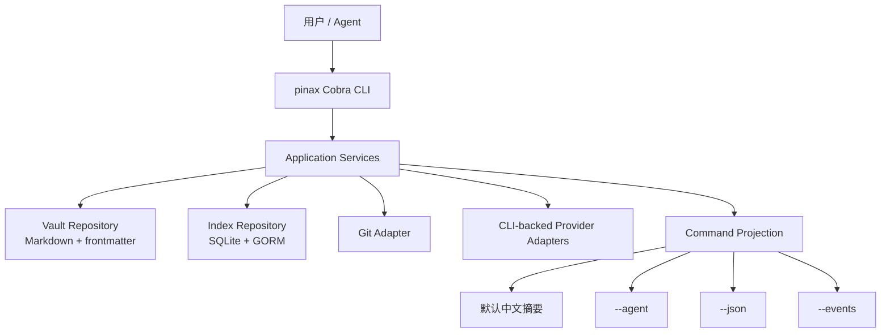

# 架构边界

边界规则：

- `cmd/pinax` 只做 CLI 接线、flags、参数校验和输出模式选择。
- `internal/app` 负责编排 use case。
- `internal/domain` 保存稳定领域模型和 projection。
- `internal/output` 从同一个 projection 渲染人类和机器输出。
- `internal/redaction` 集中处理 secret、token、raw payload 和 trace 脱敏。
- repository、索引和持久化必须通过 adapter/repository 包实现，Go 关系型访问默认使用 GORM。

