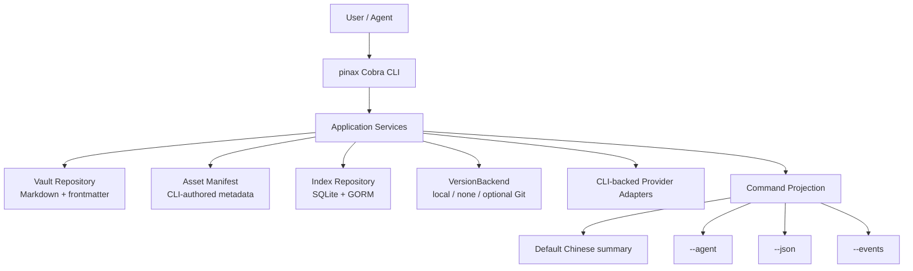

# Architecture Boundaries

Boundary rules:

- `cmd/pinax` only handles CLI wiring, flags, argument validation, and output mode selection.
- `internal/cli` owns Cobra command builders and may call `internal/app`, but it must not call app capability packages directly.
- `internal/app` is the CLI-facing Service facade. It owns constructors, shared dependency wiring, compatibility shims, and request/response types used directly by CLI code.
- New or moved app-layer business logic belongs in a capability package under `internal/app/*ops`, behind the `app.Service` facade.
- `internal/domain` holds stable domain models and projections.
- `internal/output` renders human and machine output from the same projection.
- `internal/redaction` centrally handles redaction of secrets, tokens, raw payloads, and traces.
- Repositories, indexes, and persistence must be implemented through adapter/repository packages. Relational access in Go uses GORM by default.
- `internal/version` only provides capability-driven version evidence; the user-visible entry point is `pinax version`, and Git is only an optional backend or hidden compatibility alias.
- `internal/assets` manages the asset manifest and vault-local file facts; the manifest is CLI-authored metadata, not the source of truth for binary payloads.

## App Capability Packages

| Package | Command family | Responsibility | Prohibited dependencies | Focused tests |
| --- | --- | --- | --- | --- |
| `internal/app/noteops` | note, folder, metadata, import, export, attachment | Note CRUD, metadata, tags, folders, imports, exports, attachments. | `internal/cli`, `internal/output`, direct stdout/stderr writes, provider token handling. | `go test ./internal/app ./cmd/pinax -run 'Note|Folder|Metadata|Import|Export|Attachment|Record' -count=1` |
| `internal/app/searchops` | list, search, query, database views | App-level list/search/query orchestration and database view use cases. | `internal/cli`, `internal/output`, Cobra parsing, direct renderer calls. | `go test ./internal/app ./internal/index ./cmd/pinax -run 'Search|Query|Database|List' -count=1` |
| `internal/app/vaultops` | init, validate, project, storage, stats, doctor, repair, organize | Vault setup, validation, maintenance, repair planning, repair apply, organization. | `internal/cli`, `internal/output`, cloud sync protocol ownership, direct user-visible rendering. | `go test ./internal/app ./cmd/pinax -run 'Vault|Init|Validate|Project|Storage|Stats|Doctor|Repair|Organize' -count=1` |
| `internal/app/templateops` | template, journal, render run, index page | Template resolution, journal creation, render run orchestration, index page generation. | `internal/cli`, `internal/output`, version backend implementation, direct stdout/stderr writes. | `go test ./internal/app ./internal/templateengine ./cmd/pinax ./tests/e2e -run 'Template|Journal|Render|IndexPage' -count=1` |
| `internal/app/syncops` | cloud, sync, backend, conflict, sync log | Sync push/pull/diff orchestration, backend provider coordination, sync logs, conflicts. | `internal/cli`, `internal/output`, real credentials in tests, direct stdout/stderr writes. | `go test ./internal/app ./internal/cloudsync ./internal/cloudclient ./cmd/pinax ./tests/e2e -run 'Cloud|Sync|Conflict|Backend|Redaction' -count=1` |
| `internal/app/versionops` | version, record history | Version-control use case orchestration and facade-facing version operation results. | `internal/cli`, `internal/output`, Git porcelain parsing in command code, direct renderer calls. | `go test ./internal/app ./internal/version ./cmd/pinax -run 'Version|Record|History|Rollback' -count=1` |
| `internal/app/briefingops` | briefing, provider-backed research summary | Briefing use case orchestration, provider adapter dispatch, redacted evidence handoff. | `internal/cli`, `internal/output`, raw provider payload output, provider token persistence. | `go test ./internal/app ./cmd/pinax -run 'Briefing|Provider|Research|Redaction' -count=1` |
| `internal/app/planningops` | plan, planning workflows | Planning workflow orchestration, plan state transitions, facade-facing planning results. | `internal/cli`, `internal/output`, root OpenSpec governance ownership, direct stdout/stderr writes. | `go test ./internal/app ./cmd/pinax -run 'Plan|Planning|Task|Decision' -count=1` |

Each app capability package must keep a `doc.go` with the same ownership fields. The architecture guard in `internal/architecture` verifies the docs and import boundaries.

## Current Facade Extractions

`app.Service` remains the CLI-facing compatibility facade. Current extracted logic includes:

- `noteops`: note list predicate and tag/date filter helpers used by list/query flows.
- `searchops`: search request validation, result shaping, link-target filtering, fallback search filtering, and Pinax SQL parse/execute helpers.
- `vaultops`: vault stats aggregation and index freshness classification.
- `templateops`: query-result Markdown rendering for query-backed template blocks.
- `syncops`: sync path policy normalization, sync plan redaction, and cloud sync string sanitization.
- `versionops`: vault-relative version object path validation.
- `briefingops`: briefing recipe projection shaping.
- `planningops`: planning period parsing, capacity risk rules, preview extraction, and TaskBridge action draft construction.

New use-case logic should extend the relevant capability package first, then expose or preserve the facade method needed by CLI callers. Existing facade methods may keep IO, persistence, event append, and compatibility glue while pure business rules and projection shaping move into capability packages.

## Architecture Guard

`go test ./internal/architecture -count=1` enforces these boundaries:

- `internal/cli` and `cmd/pinax` must not import `internal/app/*ops`; they call `internal/app` facade methods.
- `internal/app/*ops` must not import `internal/cli` or `internal/output`.
- Every required capability package must declare command family, responsibility, prohibited dependencies, and focused tests in `doc.go`.

The guard intentionally starts with dependency ownership, not file-length thresholds. File size limits can be added after the first extraction slices establish realistic targets.

## Relationship Graph Boundaries

- The Markdown vault is the source of truth for bidirectional relationships; SQLite/GORM only stores reconstructable projections such as `LinkRecord`.
- Asset files in the vault are the source of truth for files; the asset manifest stores vault-relative paths, hashes, media facts, and link facts, while SQLite/GORM only stores reconstructable projections.
- The version backend is the evidence source for snapshots, revisions, changed paths, and restore plans. It does not own Markdown bodies, asset bytes, the record ledger, or index projections.
- `pinax note links`, `pinax note backlinks`, `pinax note orphans`, `search --link-target`, doctor, repair, organize, dashboard, and MCP must reuse the application service's relationship parsing/target resolution logic and must not maintain a parallel parser.
- broken, ambiguous, orphan, asset_missing, asset_hash_changed, link_resolution, and link_rewrite may only enter the manual review plan; `--dry-run` and read-only MCP do not write Markdown, `.pinax/`, version backend, provider, or remote state.
- The MCP relationship surface only returns bounded facts, candidate summaries, and runnable next steps, such as `pinax note links <ref> --vault <vault> --json`; it does not return the full note body.
