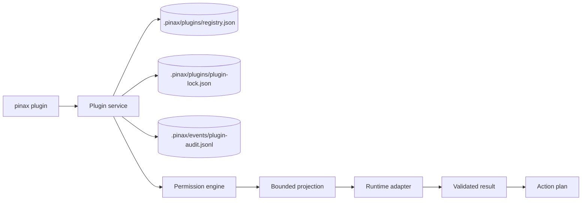

# Plugin Runtime Architecture

Pinax dynamic plugins are manifest-driven, permission-scoped, and runner-isolated. The local Markdown vault remains the source of truth, while plugins compute bounded projections or reviewable action plans.

## Boundaries

- Registry, lock, audit, and permission grants are written only by `pinax plugin` service methods.
- Plugin input uses `pinax.plugin.call.v1`; result output uses `pinax.plugin.result.v1`.
- WASM defaults to no network, no env, and no host filesystem.
- JavaScript, Python, and process runners are external trusted runners. They receive input on stdin, run in a Pinax-managed temp cwd, and get a minimal environment.
- Direct vault writes are denied. Write-like plugins must return an action plan requiring existing approval and snapshot gates.

## Current Runtime Status

The MVP fixes the contracts and local control plane first:

- Manifest validation and secret rejection are implemented.
- Registry, lock, audit events, enable/disable, uninstall, and permission grant/revoke are implemented.
- WASM call/result/budget/sandbox contracts are implemented with a fake adapter for tests; a real WASM engine can be added behind the same contract later.
- JS/Python/process external runner contracts are implemented with explicit executable probing and limited environment handling.
- CLI `plugin run` is dry-run/read-only and returns stable errors such as `plugin_disabled`, `plugin_permission_denied`, or `plugin_runner_unavailable` when execution cannot proceed.

## Safety Rules

Do not store real credentials in plugin manifests, registry, lock, audit events, docs, fixtures, stdout, stderr, or integration evidence. Use a user-level secret store, user-level local config, or environment variables for CI and temporary shell overrides.

Do not hand-edit `.pinax/plugins/*.json` or `.pinax/events/plugin-audit.jsonl`. Use `pinax plugin install`, `pinax plugin permissions grant`, `pinax plugin disable`, or `pinax plugin uninstall`.
