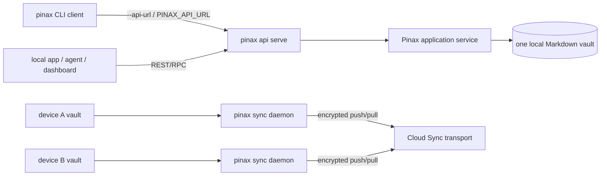

# 客户端 CLI 覆盖和实时同步说明

本文说明 Pinax 客户端如何覆盖 CLI 能力，以及它和实时 Cloud Sync 的关系。这里的“客户端”包含三类入口：本地 CLI、通过 `--api-url` 转发到 `pinax api serve` 的远程 CLI 模式，以及直接调用 localhost REST/RPC 的本地工具、dashboard、agent 或轻量 SDK。

## 目标

Pinax 的长期目标是：用户在 CLI 能做的笔记管理、检索、整理、项目工作区、模板、资产、发布、插件、proof loop、Cloud Sync 和维护操作，客户端也能以同一套 projection、权限门禁、脱敏规则和可发现能力调用。

这个目标不等于把所有命令都变成 public Internet API。Pinax 保持 local-first：

- `pinax api serve` 面向本机或受控局域网工具，默认 loopback、默认只读。
- `pinax --api-url ... <command>` 让 CLI 客户端复用服务端 vault 的 application service。
- `pinax sync daemon` 负责多设备实时同步，每台设备仍保留自己的本地 vault。
- Cloud Sync 后端只协调加密 revision、encrypted manifest 和 encrypted blob，不接收明文 note，也不执行本地 CLI。

## 两条不同链路



Remote API Mode 是“一个客户端操作一个服务端本地 vault”。Cloud Sync 是“多个设备各有本地 vault，通过加密 revision 收敛”。两者可以同时使用，但不能混为一个写面。

## 当前覆盖

当前可通过 `pinax api routes --vault ./my-notes --json` 发现已暴露能力。现阶段覆盖重点是可被客户端安全复用的 note/project/workspace/task/database/graph/folder/inbox/draft/sync 核心路径：

| 能力组 | 当前客户端覆盖 | 说明 |
| --- | --- | --- |
| discovery/schema | REST/RPC | `pinax api routes` 和 `pinax api schema export` 从同一 registry 生成。 |
| notes | RPC + 部分 REST | `note list/read/show` 走 bounded `NoteDisplay`；完整正文只在显式 `display=body` 时返回。 |
| folder | REST/RPC/remote CLI | list/show/create/rename/move/delete/adopt/repair 复用 CLI service。 |
| project workspace/board | REST/RPC/remote CLI | project/subproject list/show/create、board show、project item plan 复用项目工作区 projection。 |
| task adoption | REST/RPC/MCP | `task.adopt.plan` 只读预览 inferred checklist adoption；apply 仍是本地受控写命令。 |
| database saved views | REST/RPC/MCP/dashboard/remote CLI | `database.view.render` 返回 CLI JSON 同名 bounded `database_view`/`database_tab` projection；client 不解析 `.pinax/views.json` 或 Markdown fences。 |
| graph summary | REST/RPC/MCP/dashboard | link graph read projection，repair 仍是 plan-first。 |
| inbox/draft | REST/RPC/remote CLI | capture/create/promote/archive/discard 受 `--allow-write` 和 `yes=true` 门禁保护。 |
| sync push/pull | RPC | 用于受控客户端触发显式同步；实时同步仍应使用 `pinax sync daemon`。 |

没有出现在 registry 里的命令必须返回 `remote_command_unsupported`，不能在 remote mode 下悄悄回退到本地执行。

## 全 CLI 覆盖路线

客户端全 CLI 覆盖按能力包推进，而不是一次性增加一个万能远程 shell：

1. **发现优先**：每个新客户端能力先进入 `RemoteCapabilities()` 和 `RemoteRoutes()`，并出现在 `pinax api routes --json` / OpenAPI 输出中。
2. **读路径优先**：list/show/status/doctor/plan/search/query/dataview 先支持只读或 plan/dry-run projection。
3. **写路径受控**：写操作必须复用 application service，默认在 `pinax api serve --readonly` 下返回 `write_disabled`；启用 `--allow-write` 后仍要求 `yes=true` 或 `dry_run=true`。
4. **高风险写入要 snapshot**：rename/move/delete/archive/repair/apply/organize/apply/publish/deploy 等需要沿用 CLI 的 snapshot、approval 和 receipt 规则。
5. **本地控制命令保持本地**：`config`、`api`、`token`、`profile`、`vault`、`cloud`、`sync daemon` 等控制运行环境的命令，不能被持久化的 `remote.api_url` 意外劫持。
6. **不可远程化命令明确拒绝**：交互编辑器、completion、dashboard foreground server、daemon foreground runner、纯本机诊断等命令应返回稳定 unsupported 或 local-only 说明。

Dashboard 和 MCP 默认只读。Dashboard 的 active tab selection 是 client-local 状态，不写 `.pinax/**` layout registry；MCP 工具返回 bounded projection，不提供 apply/write 工具。

推荐按下列阶段补齐：

| 阶段 | 范围 | 退出条件 |
| --- | --- | --- |
| Phase 1 | note/search/kb/index/query/dataview/database/view | 客户端能完成阅读、检索和视图管理。 |
| Phase 2 | template/asset/prompt/collection/graph/import/export | 客户端能完成内容生产和资产管理，写操作具备 dry-run/yes 门禁。 |
| Phase 3 | repair/metadata/organize/proof/version | 客户端能完成维护计划、snapshot、apply 和恢复闭环。 |
| Phase 4 | publish/plugin/mcp/backend/storage/cloud | 集成面全部可发现；危险操作默认 plan 或 dry-run。 |
| Phase 5 | CLI command parity audit | `pinax --help` 可见命令与 registry 覆盖矩阵一致，local-only 命令有显式拒绝策略。 |

## 实时同步使用方式

Cloud Sync 配置完成后，每台设备启动本地 daemon：

```bash
pinax sync daemon run --target cloud --vault ./my-notes --yes
```

自动化或 supervisor 可以读取事件流：

```bash
pinax sync daemon run --target cloud --vault ./my-notes --yes --events
```

查看状态和日志：

```bash
pinax sync daemon status --vault ./my-notes --json
pinax sync daemon logs --vault ./my-notes --limit 20 --json
pinax sync daemon stop --vault ./my-notes
```

daemon 启动后先执行一轮 pull-before-push，然后监听本地 vault 变化并轮询远端 head。它复用 `pinax sync pull` / `pinax sync push` 的同步引擎；如果产生冲突，会进入 `conflict_required`，不会自动覆盖或删除用户内容。

## 客户端接入建议

只读客户端从 discovery 开始：

```bash
pinax api serve --vault ./my-notes --readonly --port 8787
pinax api routes --vault ./my-notes --json
pinax api schema export --format openapi --vault ./my-notes --json
pinax --api-url http://127.0.0.1:8787 note list --status active --limit 20 --json
```

受控写客户端必须显式启用 write mode，并先 dry-run 或 plan：

```bash
pinax api serve --vault ./my-notes --allow-write --port 8787 --token-file ~/.config/pinax/local-agent.token
pinax --api-url http://127.0.0.1:8787 --api-token-file ~/.config/pinax/local-agent.token inbox capture "Idea" --body "Draft note" --dry-run --json
pinax --api-url http://127.0.0.1:8787 --api-token-file ~/.config/pinax/local-agent.token inbox capture "Idea" --body "Draft note" --yes --json
```

客户端不要直接写 `.pinax/**`、SQLite index、sync state、token 文件、provider 配置或 receipt。需要变更这些资产时，必须调用对应 Pinax command 或 application service。

## 验证命令

实现或扩展客户端能力后，至少运行：

```bash
go test ./internal/app -run 'Remote|API' -count=1
go test ./internal/api -run 'LocalAPI|RPC|Route|Schema|Auth' -count=1
go test ./internal/cli -run 'RemoteMode' -count=1
go test ./cmd/pinax -run 'CLIRemoteMode|APIRoutes|SyncDaemon' -count=1
openspec validate pinax-client-cli-parity-realtime-sync --strict
```

如果改动涉及 sync daemon，还要补跑：

```bash
go test ./internal/app -run 'TestSyncDaemon' -count=1
go test ./tests/e2e -run TestSyncDaemon -count=1
```
