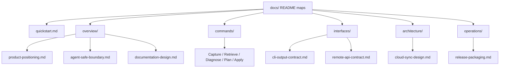

# Pinax Documentation Design

This document defines how Pinax documentation is organized, what each section owns, and how contributors should decide where new product, design, command, protocol, operation, and release content belongs.

Pinax documentation has one job: help a user or agent understand and operate the local-first proof loop without confusing the source of truth, write boundaries, or cloud boundary. The docs should keep repeating the same three concepts in different levels of detail:

1. The Markdown vault is the source of truth.
2. The Proof Loop protects every agent write.
3. Sync is a transport surface, not a source: Cloud Sync coordinates ciphertext only.

## Reader Paths

| Reader | First stop | Next stop | Success condition |
| --- | --- | --- | --- |
| New user | [Quick Start](../quickstart.md) | [Command Manual](../commands/README.md) | Can create a vault, add a note, run proof-loop preview, save a plan, snapshot, apply, and restore. |
| Agent integrator | [Agent-Safe Boundary](./agent-safe-boundary.md) | [CLI Output Contract](../interfaces/cli-output-contract.md), [Local REST/RPC Contract](../interfaces/remote-api-contract.md) | Understands bounded projections, output modes, read-only MCP/API surfaces, and write gates. |
| Contributor | [Architecture Boundaries](../architecture/architecture-boundaries.md) | [Local Development](../operations/local-development.md), local `openspec/` | Knows where CLI, service, domain, adapter, output, and redaction changes belong. |
| Operator or releaser | [Release Packaging](../operations/release-packaging.md) | [Local Development](../operations/local-development.md) | Can run release checks, package validation, and smoke tests without publishing. |
| Cloud Sync reviewer | [Cloud Sync Architecture](../architecture/cloud-sync-design.md) | [Agent-Safe Boundary](./agent-safe-boundary.md) | Can verify no-plaintext and no-exec invariants. |

## Information Architecture

## Section Ownership

| Section | Owns | Does not own |
| --- | --- | --- |
| `docs/README.md` and `docs/README.zh-CN.md` | Documentation map, status snapshot, recommended entry points, validation entry points. | Full command reference, implementation plans, release notes. |
| `docs/quickstart.md` | One short local path from install to proof-loop validation. | Advanced Cloud Sync, MCP, templates, project board, provider workflows. |
| `docs/overview/` | Product positioning, safety model, documentation design, high-level user value. | Command flags, endpoint schemas, release packaging steps. |
| `docs/commands/` | Human command manual grouped by workflow and command family. | Source-level architecture or long protocol contracts. |
| `docs/interfaces/` | Stable CLI/API contracts, output modes, auth/cache expectations, agent-facing envelopes. | Tutorial prose or product positioning. |
| `docs/architecture/` | Boundaries, Cloud Sync design, Go development ecosystem, non-obvious system decisions. | Step-by-step user workflow docs. |
| `docs/operations/` | Local development, release packaging, verification commands, operator procedures. | Product scope and command reference. |
| `openspec/` | Change proposals, implementation tasks, verification evidence, archive records. | Permanent product docs after closeout. |

## Core Narrative

Every major document should preserve the same layered explanation:

1. **What Pinax is**: an agent-safe knowledge control plane for a Markdown vault.
2. **What stays local**: Markdown content, SQLite/GORM projection, version evidence, CLI-authored metadata, and local tool execution.
3. **What agents can see**: bounded projections by default; full bodies only through explicit local display mode.
4. **How writes happen**: plan -> snapshot -> apply -> receipt -> restore.
5. **What cloud sync does**: synchronize encrypted revisions and blobs; never replace the local vault as source of truth, store plaintext notes, or execute local tools on the server.

Avoid describing Pinax as a general notes app, publishing platform, plugin runtime, hosted collaboration workspace, cloud notebook, web editor, briefing product, or provider-specific automation product. Those descriptions blur the boundary that makes Pinax useful.

## Command Documentation Pattern

Each command page under `docs/commands/` should follow this shape:

1. Purpose: what the command family manages.
2. Common commands: real commands a user can run directly.
3. Safety and write behavior: whether it reads, saves plans, writes Markdown, writes `.pinax/`, uses version snapshots, or touches remotes.
4. Output behavior: supported `--json`, `--agent`, `--events`, and `--explain` expectations when relevant.
5. Related docs: links to adjacent command pages, contracts, or architecture docs.

Command examples must show real `pinax` commands, not local wrappers or agent-only execution prefixes.

## Language and Contract Rules

- User-facing Pinax docs may provide Chinese and English entry maps. Command names, flags, JSON keys, event types, error codes, provider IDs, schema fields, paths, and standard protocol names remain stable English.
- Do not include raw prompts, hidden system prompts, provider payloads, unredacted tokens, Authorization headers, Cookie values, webhook URLs, or full chain-of-thought in docs, examples, fixtures, receipts, or explanations.
- Structured assets such as `.pinax/*.json`, `.pinax/*.yaml`, run receipts, event logs, profile mappings, and sync metadata are CLI-authored. Docs should tell users which `pinax` command creates or updates them; docs should not instruct users to hand-edit those files.
- Cloud Sync docs must preserve the no-plaintext and no-exec invariants.

## Maintenance Checklist

Before landing documentation changes, check:

- The new content has one clear owner section from the table above.
- New commands are linked from [Command Manual](../commands/README.md) when they are user-facing.
- New output, RPC, auth, cache, event, or `--agent` behavior is reflected in `docs/interfaces/`.
- New architecture, Cloud Sync, provider, storage, version, or safety-boundary decisions are reflected in `docs/architecture/` or `docs/overview/`.
- Permanent docs are not duplicated into the root repository docs; root should only link or summarize cross-project governance.
- Documentation-only changes normally do not need Go tests. If code behavior changed, run `task check` from the Pinax subproject.
