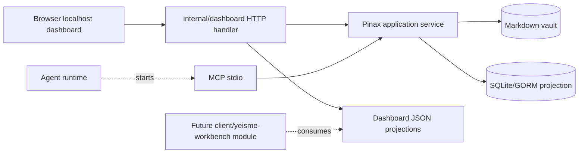

# Pinax Dashboard PRD

本文定义 `pinax vault dashboard` 的产品目标、边界、接口、验收标准和后续 Workbench 模块迁移关系。Dashboard 是 Pinax CLI 内置的本地只读控制台，不是真源、不替代 Markdown vault，也不是未来完整 UI 的代码归属。

## 1. 背景和问题

Pinax 已经有 publish preview、Local REST/RPC、MCP stdio、vault doctor、graph summary、repair plan、database view 等能力，但用户在本地调试 vault 时缺少一个直接可见的控制台：

- `publish preview` 只展示发布输出，无法回答“哪些笔记没有被发布、为什么没有被发布”。
- `note list`、`publish plan`、`vault doctor` 等 CLI 输出分散，用户需要手动拼命令理解 vault 状态。
- 未来内部 UI 应进入 `client/yeisme-workbench` Pinax 模块，不应把完整客户端提前塞进 `cli/pinax`。
- MCP stdio 是 agent 接入口，用户需要在 Web 页面看到它的状态和可运行命令，但浏览器页面不应直接拥有 stdio 会话。

## 2. 目标用户

| 用户 | 任务 | 当前痛点 |
| --- | --- | --- |
| Pinax 单机用户 | 查看本地 vault 全部笔记、公开/私有状态、健康问题 | CLI 信息分散，publish preview 空列表时不清楚原因。 |
| Agent operator | 启动本地 vault 后确认 agent 可读边界、MCP/REST 能力、proof gate 状态 | 需要同时查看多个命令和 projection。 |
| 未来 Workbench 模块开发者 | 复用 Pinax 本地 API/projection 构建模块 | 需要明确哪些接口由 Pinax 拥有，哪些 UI 由 `client/yeisme-workbench` 拥有。 |

## 3. 产品定位

Dashboard 是 **Pinax 内置 local console**：

- 默认 loopback，只读，短生命周期进程。
- 直接复用 Pinax application service projection。
- 只展示 bounded facts 和可复制命令，不展示完整 note body、token、provider payload、raw prompt 或隐藏系统提示。
- 作为 Workbench 模块的 API/projection 先导，而不是最终前端。

未来内部 UI 是 **Workbench 模块**：

- 消费 `pinax api serve`、dashboard projection 或同源 Local REST/RPC。
- 拥有完整编辑器、阅读、发布控制台、Agent 侧栏、MCP 状态、同步状态和设置 UI。
- 不直接读写 `.pinax/**`、SQLite/GORM index、token 文件、sync state 或 publish receipts。

## 4. MVP 范围

### 4.1 必须有

- `pinax vault dashboard --vault <vault> --port <port>` 启动 localhost 只读 Web 控制台。
- 首页显示：vault stats、index status、全部笔记列表、公开/私有/内部状态、link graph 摘要、doctor issues、repair plans、只读 API 链接。
- `GET /api/notes` 返回全部笔记摘要，至少包含 `id`、`title`、`path`、`kind`、`status`、`tags`、`publish`、`privacy`、`visibility`。
- `visibility` 规则：`privacy: private|secret` 为 `private`；`publish: public` 且非私有为 `public`；其它为 `internal`。
- 页面和 API 不返回完整 `body` 字段。
- 页面展示真实可运行命令，例如：

```bash
pinax vault dashboard --vault ./my-notes --port 4180
pinax note list --vault ./my-notes --json
pinax publish plan --profile public --target local --vault ./my-notes --json
pinax mcp serve --vault ./my-notes
```

### 4.2 不在 MVP

- 不做浏览器端 Markdown 编辑器。
- 不做 dashboard 写操作、批量改 publish/privacy、批量 repair apply。
- 不把 MCP stdio 直接嵌入浏览器进程。
- 不做公网分享、CORS、多用户登录、OAuth、团队权限。
- 不做完整 Workbench module 路由、主题系统、插件市场或长期 daemon。

## 5. 用户工作流

### 5.1 本地查看全部笔记

```bash
pinax vault dashboard --vault ./my-notes --port 4180
```

用户打开 `http://127.0.0.1:4180/` 后应看到：

1. vault 总笔记数、tag 数、frontmatter 覆盖率、index 状态。
2. `All notes` 表格，能扫描每篇 note 的 `public/private/internal` 状态。
3. 健康问题和推荐下一步命令。
4. JSON API 链接，便于复制给 agent 或调试脚本。

### 5.2 排查发布预览为空

用户发现 publish preview 首页为空时，Dashboard 应帮助定位：

1. `All notes` 表格显示大多数 note 是 `internal` 或 `private`。
2. `GET /api/notes` 显示 `public=0`。
3. 页面提供下一步：

```bash
pinax publish plan --profile public --target local --vault ./my-notes --json
```

后续增强可以在 dashboard 中展示 selected/skipped/blocking counts，但 MVP 只要求通过 notes visibility 解释最常见空列表问题。

### 5.3 Agent/MCP 状态查看

Dashboard 可以显示 MCP stdio 的启动命令和只读边界：

```bash
pinax mcp serve --vault ./my-notes
```

浏览器页面只展示 command、capability summary、body exposure policy 和 copy command。MCP stdio 会话仍由 agent runtime 启动，Dashboard 不直接创建、代理或持久化 stdio 会话。

## 6. 状态和可见性模型

Dashboard 只做展示级分类，不改写 note frontmatter。

| 输入 frontmatter | Dashboard visibility | 说明 |
| --- | --- | --- |
| `publish: public` | `public` | 允许发布候选；仍需 publish profile status/kind/privacy 过滤。 |
| `publish: public` + `privacy: private` | `private` | private 优先级高于 publish。 |
| `privacy: secret` | `private` | secret 按私有处理。 |
| 未设置 `publish` | `internal` | 默认内部，不发布。 |
| `status: draft` | `internal` 或已有 privacy 结果 | status 影响 publish plan，不单独决定 dashboard visibility。 |

Dashboard visibility 不是完整 publish eligibility。真正发布仍以 `pinax publish plan` 为准。

## 7. 接口合同

### 7.1 Dashboard 本地接口

| Path | 方法 | 只读 | 用途 |
| --- | --- | --- | --- |
| `/` | GET | 是 | HTML 控制台首页。 |
| `/api/overview` | GET | 是 | vault stats、doctor、graph summary 聚合 projection。 |
| `/api/notes` | GET | 是 | 全部 note 摘要和 visibility 计数。 |
| `/api/graph-summary` | GET | 是 | link graph 摘要。 |
| `/api/repair-plans` | GET | 是 | 已保存 repair plans。 |
| `/api/note-display/<ref>` | GET | 是 | bounded note display；不允许 `display=body`。 |
| `/api/database-tabs/<view>` | GET | 是 | saved database view render。 |

所有非 GET 方法返回 `405`，不得写 vault、`.pinax/**`、Git、provider、sync 或 remote state。

### 7.2 `/api/notes` shape

```json
{
  "spec_version": "1.0",
  "mode": "json",
  "command": "dashboard.notes",
  "status": "success",
  "facts": {
    "notes": "16",
    "public": "0",
    "private": "0",
    "internal": "16"
  },
  "data": {
    "notes": [
      {
        "id": "note_example",
        "title": "Example",
        "path": "notes/example.md",
        "kind": "concept",
        "status": "active",
        "tags": ["pinax"],
        "publish": "public",
        "visibility": "public"
      }
    ],
    "total": 1
  }
}
```

禁止字段：`body`、`raw_body`、provider payload、Authorization/Cookie、token、raw prompt、hidden system prompt、private tool arguments。

## 8. UI 要求

- 第一屏是控制台，不是 landing page。
- 信息密度偏工作台：状态条、表格、问题列表、API 链接。
- 卡片圆角不超过 8px，不做装饰渐变、hero、插画或营销布局。
- 桌面优先展示表格；移动端表格折叠为单列行，不允许文字重叠。
- 状态颜色：public 用 success，private 用 danger，internal 用 muted。
- 链接和按钮只展示明确命令或 API，不出现假按钮。

## 9. 架构



实现原则：

- `internal/dashboard` 只做 HTTP handler、HTML render、projection JSON serialization。
- 笔记列表、doctor、graph、database view、repair plans 必须调用 `internal/app` service。
- Dashboard 不直接解析 `.pinax/**`，不直接查询 SQLite，不直接拼 provider 状态。
- 未来 Workbench module 通过正式 Local REST/RPC 或同源 projection 复用数据，不复制 dashboard 业务逻辑。

## 10. 验收标准

### 10.1 功能验收

- 给定包含 public/private/internal 三类 note 的 vault，`GET /api/notes` 返回 3 条摘要，`facts.public=1`、`facts.private=1`、`facts.internal=1`。
- `GET /api/notes` 和 dashboard 首页不包含完整 note body。
- `POST /api/notes` 返回 `405`。
- 首页包含 `All notes`、`/api/notes`、note title、visibility 标签和 vault status。

### 10.2 回归测试

```bash
go test ./internal/dashboard -run NotesWithPublishVisibility -count=1
go test ./internal/dashboard -count=1
go test ./cmd/pinax -run Dashboard -count=1
```

预期：全部通过；dashboard command 仍不向 stdout 写运行日志，URL 只进入 stderr。

### 10.3 人工 smoke

```bash
pinax vault dashboard --vault ./my-notes --port 4180
curl http://127.0.0.1:4180/api/notes
```

预期：浏览器可见 `All notes` 表格；curl 返回 `dashboard.notes` JSON envelope。

## 11. Trace、审计和证据要求

- Dashboard 默认不写审计日志，因为它是只读本地控制台。
- 如果后续接入 `pinax api serve` 的审计层，日志只能记录 path、method、status、duration、route group，不记录 response body、Authorization、Cookie、token、raw query secrets 或 note body。
- 集成测试如果升级为 e2e/component 层，必须写入 `temp/integration-test-runs/<run-id>/`，并保留 redacted `summary.json`、`command.txt`、`stdout.log`、`stderr.log`、`env.json` 和 `artifacts/`。

## 12. 风险和开放决策

| 风险 | 处理 |
| --- | --- |
| 用户把 dashboard visibility 当成 publish eligibility | UI 和文档明确说明 publish eligibility 以 `pinax publish plan` 为准。 |
| Dashboard 逐步膨胀成完整客户端 | 保持只读 local console；编辑器、完整 Agent sidebar、跨设备 sync UI 进入 `client/yeisme-workbench` Pinax 模块。 |
| 暴露完整正文或敏感字段 | API 使用 summary shape；测试递归扫描 `body` 和 sentinel。 |
| MCP stdio 与 Web 页面边界混淆 | Dashboard 只展示 `pinax mcp serve` 命令和 capability 状态，不代理 stdio。 |
| 后续写操作绕过 proof gate | 任何写入都必须迁移到 `pinax api serve --allow-write` 和 app service gate，不进 dashboard 默认面。 |

开放决策：

- Pinax 模块 owner 是 `client/yeisme-workbench`；不把完整 React/Electron client 放入 `cli/pinax`。
- Dashboard 是否需要单独 `pinax dashboard` 顶层可见命令；当前推荐继续主推 `pinax vault dashboard`。
- 是否增加 publish profile selector 和 skipped reason 列表；建议作为下一阶段。

## 13. OpenSpec 建议

当前 `All notes` 和 `/api/notes` 属于可逆、只读、本地 dashboard 扩展，已适合作为小型实现切片。若继续做以下任一项，应创建 Pinax 子项目 OpenSpec change：

- 稳定 `/api/notes` 为 Workbench 模块合同。
- 增加 publish profile selector、skipped/blocking reason、preview approval 状态。
- 增加 MCP capability/status 面板。
- 引入任意写操作、长期服务模式、token/auth、跨进程 Workbench integration。

建议 change id：

```bash
openspec new change pinax-dashboard-studio-console
```

该 change 的 `design.md` 必须包含 Dashboard、Local REST/RPC、MCP stdio、Future Workbench module 的数据流图；`tasks.md` 应按 API、HTML UI、publish diagnostics、MCP status、tests、docs 分 lane。
