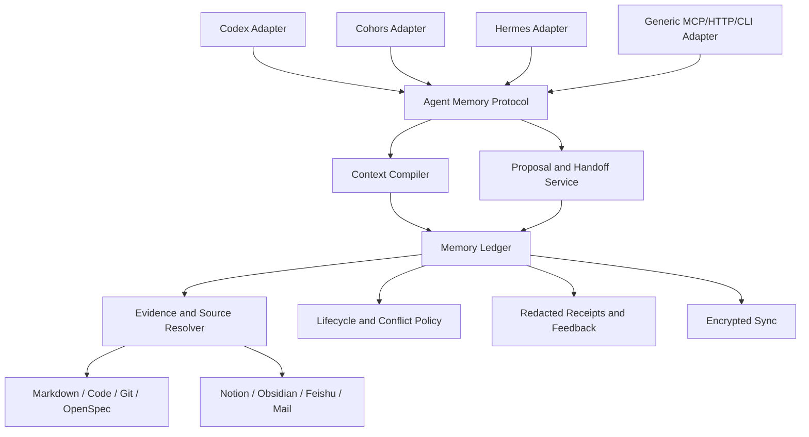
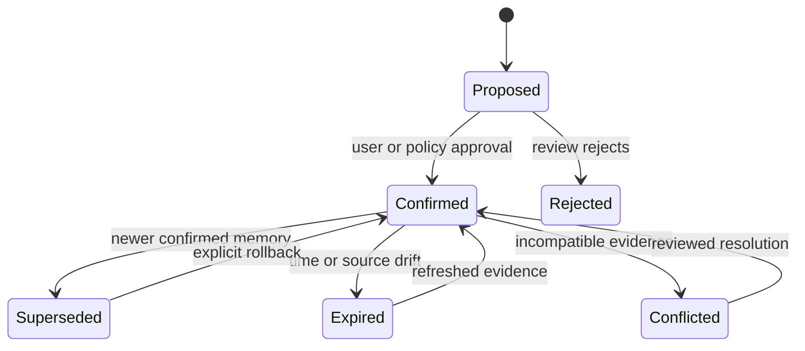

# Pinax 通用 Agent 记忆系统 PRD

## 1. 决策摘要

Pinax 后续定位为 **本地优先、供应商无关、可审计的通用 Agent 记忆系统**。它不隶属于 Codex、Claude Code、Cohors、Hermes 或任何单一 Agent runtime；这些系统都通过 adapter 使用同一套记忆、上下文、handoff、反馈和审批合同。

一句话目标：

> Pinax 让不同 Agent 在不共享完整会话、不泄露原始私密内容、不直接污染长期知识的前提下，持续获得正确上下文，并沉淀有来源、可维护、可撤销的长期记忆。

Codex 可以是第一个参考 adapter 和 dogfooding 客户端，但不能进入核心 schema、领域类型、存储路径、生命周期状态或 API 命名。

本 PRD 是探索性产品与架构方案，不新增当前可运行命令。所有 planned command、schema、tool 和 adapter 必须在后续 OpenSpec 中完成合同评审后才能实现和发布。

## 2. 用户与问题

### 2.1 目标用户

首要用户是拥有多个 Agent、多个项目和长期自动化工作流的单一知识资产所有者。直接消费者包括：

- 编码 Agent，例如 Codex、Claude Code；
- 多 Agent runtime，例如 Cohors；
- 通信与协作 Agent，例如 Hermes；
- 研究、创作、运营等领域 Agent；
- 任何能调用 CLI、MCP、HTTP/RPC 或 SDK 的自定义 Agent。

### 2.2 核心失败模式

- 每个 Agent 和每次 session 都重新询问相同背景。
- Agent A 的发现无法安全传递给 Agent B。
- 长期事实、偏好、决策、任务和失败经验散落在聊天、代码、文档与模型内部 memory 中。
- Agent 自动总结缺少来源，错误内容可能被当成事实反复传播。
- 上下文检索只追求语义相似，没有考虑权限、时效、置信度、任务意图和历史冲突。
- Agent 直接修改长期知识，缺少 proposal、审批、receipt、supersede 和 restore。
- 更换 Agent provider 或 runtime 后，长期记忆不能迁移。

### 2.3 Pinax 替代什么

Pinax 替代的是每个 Agent 各自维护孤立 memory、手工复制背景、保存完整 transcript、直接写笔记和依赖供应商内部状态的方式。

Pinax 不替代 Agent runtime、模型、Git、OpenSpec、Notion、Obsidian、飞书或正式项目文档。

## 3. 产品边界

### 3.1 核心所有权

Pinax 核心拥有：

- canonical memory records；
- source/evidence references；
- memory lifecycle、conflict 和 supersession；
- principal、workspace、project、session 和 task scope；
- context compilation 和 token/character budget；
- memory proposal、review、approval 和 receipt；
- Agent-to-Agent handoff；
- feedback、recall evidence 和 maintenance plan；
- local-first persistence、redaction 和 encrypted sync policy。

### 3.2 Adapter 所有权

每个 Agent adapter 只拥有：

- runtime capability discovery；
- runtime event 到 Pinax protocol 的转换；
- Pinax context pack 到 runtime 可消费格式的渲染；
- runtime-specific installation、authentication 和 lifecycle wiring；
- runtime-specific failure recovery。

Adapter 不新增自己的 memory database，不重定义 lifecycle，不直接修改 Pinax structured assets。

### 3.3 Source 与 memory 的真源分离

通用 Agent 记忆系统需要区分两类真源：

- **Source artifact truth**：Markdown、代码、Git、OpenSpec、issue、外部文档仍是原始内容和正式决策的真源。
- **Memory state truth**：Pinax memory ledger 是 Agent 记忆记录、状态、scope、confidence、supersession、conflict 和 recall feedback 的真源。

SQLite/GORM memory ledger 可以持有结构化 memory state，但不能复制完整私密 source body。Source artifact 的摘要、引用和 hash 是可重建证据，不代替原文。

## 4. 总体架构



核心依赖方向必须是 adapter → protocol → application service → domain/store。核心包不得 import Codex、Claude、Hermes、Cohors 或其他 runtime-specific 类型。

## 5. 通用 Agent Memory Protocol

### 5.1 Agent identity

每次请求必须携带明确 actor 和 scope，不允许依赖进程名推断身份。

Planned `pinax.agent.principal.v1`：

```json
{
  "principal_id": "agent:codex:local-primary",
  "runtime": "codex",
  "agent_id": "local-primary",
  "owner_id": "user:yeisme",
  "workspace_id": "workspace:yeisme",
  "capabilities": ["context.read", "memory.propose", "handoff.write"],
  "trust_level": "local_trusted"
}
```

`runtime` 是 adapter descriptor，不参与 memory 主键。相同 memory 可以被多个 runtime 使用。

### 5.2 Scope model

Scope 从宽到窄：

```text
owner -> workspace -> project -> repository -> session -> task
```

默认只召回当前 scope 和显式继承的上层 scope。跨 workspace、跨 owner 或 private source 的召回必须有明确 permission context。

Global preference 必须显式标记为 owner scope；不得因为某次 session 使用了某个偏好就自动提升为全局事实。

### 5.3 Memory record

Planned `pinax.agent_memory.record.v1`：

```json
{
  "memory_id": "mem_...",
  "kind": "decision",
  "subject": "pinax",
  "predicate": "memory_runtime_boundary",
  "object": "core protocol is provider-neutral",
  "scope": {},
  "status": "confirmed",
  "confidence": "high",
  "source_refs": [],
  "supersedes": [],
  "conflicts_with": [],
  "created_by": {},
  "created_at": "2026-07-11T00:00:00Z",
  "updated_at": "2026-07-11T00:00:00Z",
  "expires_at": null
}
```

MVP memory kinds：

- `fact`：稳定事实和已验证约束；
- `decision`：产品、架构和执行决策；
- `preference`：用户明确表达的偏好；
- `procedure`：可复用工作流和恢复步骤；
- `event`：release、incident、外部状态变化；
- `task`：承诺、follow-up 和 blocker；
- `failure`：已证伪方案、失败原因和避免重复的证据。

### 5.4 Lifecycle



Adapter 默认只能创建 `proposed` memory。只有用户批准或显式 policy 允许的高可信 evidence 才能 promotion 为 `confirmed`。

### 5.5 Source reference

Source ref 至少包含：

- source kind；
- stable URI 或 object ID；
- optional path/span；
- content hash 或 revision；
- visibility/permission；
- observed_at；
- resolver hint。

Pinax 不保存 raw provider payload、Authorization/Cookie、完整 transcript、hidden system prompt、private tool arguments 或 full chain-of-thought。

## 6. 核心工作流

### 6.1 Context request

任何 Agent 都可以提交 planned `pinax.agent_context.request.v1`：

```json
{
  "principal": {},
  "scope": {},
  "task": "continue the Pinax memory runtime design",
  "intent": "plan",
  "entities": ["pinax", "agent-memory"],
  "include_kinds": ["decision", "task", "failure", "preference"],
  "budget": {"max_chars": 12000, "max_items": 20},
  "freshness": {"max_age_days": 90},
  "body_exposure": "bounded_projection"
}
```

Context compiler 按以下顺序处理：

1. permission 和 scope filter；
2. lifecycle filter；
3. exact entity/project/repository match；
4. source authority、confidence 和 freshness；
5. task fitness 和 semantic/keyword recall；
6. conflict grouping；
7. budget truncation；
8. next actions 和 source drill-down。

### 6.2 Context pack

Planned `pinax.agent_context.pack.v1`：

```json
{
  "context_id": "ctx_...",
  "scope": {},
  "facts": [],
  "decisions": [],
  "preferences": [],
  "procedures": [],
  "open_tasks": [],
  "failed_attempts": [],
  "conflicts": [],
  "source_refs": [],
  "freshness": {},
  "next_actions": [],
  "truncated": false
}
```

Context pack 是核心产品输出。不同 adapter 可以渲染为 MCP result、CLI `--agent`、JSON、developer context、system prompt supplement 或 runtime-native object，但不得改变事实和证据语义。

### 6.3 Memory proposal

Agent 不能默认直接写 confirmed memory。它提交 planned `pinax.agent_memory.proposal.v1`：

```json
{
  "proposal_id": "proposal_...",
  "principal": {},
  "scope": {},
  "memories": [],
  "source_refs": [],
  "reason": "task closeout",
  "risk": "medium",
  "requested_status": "confirmed"
}
```

Application service 执行去重、source validation、conflict detection、scope check 和 policy evaluation，返回 `draft_saved`、`approval_required`、`conflict_required` 或 `rejected`。

### 6.4 Handoff

Agent handoff 不是 transcript 转发，而是 bounded working-state package：

- objective；
- current state；
- decisions；
- completed work；
- blockers；
- verification；
- follow-ups；
- source refs；
- requested next capability。

Handoff 可以被另一个 Agent 读取，也可以产生 memory proposals；它本身不自动成为 confirmed memory。

### 6.5 Feedback

Agent 或用户可以反馈：

- recalled memory 有用或无关；
- source 已过期；
- fact 不正确；
- context 缺失；
- task 已完成；
- preference scope 过宽。

Feedback 进入独立 ledger，用于 ranking 和 maintenance，不静默修改 confirmed content。

## 7. 接入面与 Adapter SDK

### 7.1 稳定接入面

核心能力必须同时支持以下 transport，但共享同一 application service：

- CLI：human、`--agent`、`--json`、`--events`、`--explain`；
- MCP：tools、resources 和 server instructions；
- localhost REST/RPC；
- Go SDK；
- provider-neutral event/receipt schema。

### 7.2 Generic MCP adapter

MVP 优先提供通用 MCP tools：

| Planned tool | 作用 | 默认副作用 |
| --- | --- | --- |
| `pinax.agent.context` | 编译 context pack | 只读 |
| `pinax.agent.memory_recall` | 查询 memory records | 只读 |
| `pinax.agent.sources` | 检查来源和 freshness | 只读 |
| `pinax.agent.handoff_read` | 读取 bounded handoff | 只读 |
| `pinax.agent.memory_propose` | 保存 proposal | 写 draft，需要能力声明 |
| `pinax.agent.feedback` | 写 recall feedback | 写 feedback receipt |

写工具必须声明副作用、scope 和 approval requirement；不提供直接 confirmed-memory mutation tool。

### 7.3 Runtime adapters

- **Codex adapter**：映射 `AGENTS.md`、skill、MCP、hooks 和 local memories 边界。
- **Cohors adapter**：映射 team run、agent role、trace、handoff 和 shared task state。
- **Hermes adapter**：把 provider-neutral conversation event、message reference 和 delivery receipt 转为 source/handoff，不嵌入聊天 provider SDK。
- **Generic CLI adapter**：任何 Agent 通过 stdin/stdout JSON 调用。
- **HTTP adapter**：未来远程 Agent 通过 scoped token 使用，不属于本地 MVP 必需项。

Adapter capability descriptor 必须声明 runtime、version、supported transports、read/write capabilities、hook/event support、max context size 和 failure behavior。

### 7.4 Connector 与 adapter 的区别

- Agent adapter 连接 Agent runtime，负责消费和提交记忆。
- Source connector 连接 Notion、Obsidian、飞书、Git、邮件等资料源，负责 source discovery、引用和受控回写。

两者不得混成一个插件。Notion/Obsidian 插件是可选 connector 或 UI，不是内核前置条件。

## 8. 安装和配置原则

用户不应手写 Pinax structured metadata。Pinax CLI 负责注册 principal、workspace、adapter、policy 和 source connector。

Planned 通用命令：

```bash
pinax agent runtime register --id codex-local --runtime codex --capability context.read,memory.propose,handoff.write --json
pinax agent runtime list --json
pinax agent context "continue Pinax memory design" --runtime codex-local --scope project:pinax --agent
pinax agent memory proposals --scope project:pinax --json
pinax agent memory approve <proposal-id> --yes --json
```

Runtime-specific installer 属于 adapter 子命令或独立 adapter package，例如 planned `pinax adapter codex install`，不能污染核心 `pinax agent` 合同。

## 9. MVP 范围

### 9.1 必须有

1. Provider-neutral principal、scope、memory、source、context、proposal、handoff 和 feedback schema。
2. Memory lifecycle、conflict、supersession、expiration 和 review。
3. Context compiler 的 permission、freshness、confidence、task fitness 和 budget。
4. Generic CLI 和 MCP adapter。
5. 至少两个不同 runtime 的 reference adapter，以证明内核没有 Codex 假设。
6. Redacted receipts 和 integration evidence。
7. Local-first operation；Agent adapter 不可用时不破坏 memory ledger。
8. 真实跨 Agent handoff dogfooding。

推荐 reference adapters：Codex + Cohors。Codex 验证通用外部 Agent 接入，Cohors 验证 Yeisme 自有多 Agent runtime。

### 9.2 明确不做

- 不把任何 Agent provider/runtime 作为 canonical owner。
- 不读取或修改供应商内部 memory store。
- 不保存完整 conversation transcript 或 chain-of-thought。
- 不允许 adapter 绕过 proposal/review 直接写 confirmed memory。
- 不在 MVP 做完整 Notion/Obsidian UI 插件。
- 不把向量数据库作为 memory truth；vector/semantic index 只是可重建 recall projection。
- 不建设团队 SaaS、组织 ACL 后端和公网 HTTP 服务。
- 不同时适配所有 Agent；先证明两个异构 runtime 使用同一合同。

## 10. 验收与指标

### 10.1 合同验收

- 同一个 context request 通过 CLI、MCP 和 SDK 返回语义一致的 context pack。
- Codex 和 Cohors adapter 不修改核心 schema 即可消费 context、提交 proposal 和交换 handoff。
- Adapter-specific 字段只能出现在 descriptor/metadata extension，不能成为 memory 主键或 lifecycle 条件。
- 未经批准的 proposal 不进入默认 confirmed recall。
- Conflicting memories 同时返回并标记，不由 ranking 静默覆盖。
- Source permission 缺失时返回 `permission_unknown` 或 `insufficient_scope`。
- Pinax 不可用时 adapter 可降级，不阻塞 Agent 的基础能力。
- 输出和 evidence 不包含 secret、raw prompt、provider payload、private tool arguments 或 full chain-of-thought。

### 10.2 产品指标

| 指标 | MVP 目标 |
| --- | --- |
| 有历史依赖任务的正确召回率 | ≥ 80% |
| Context precision | ≥ 80% |
| Source resolvability | ≥ 95% |
| 跨 Agent handoff 可继续率 | ≥ 80% |
| 重复背景说明次数 | 相比基线下降 50% |
| 错误 confirmed memory | 0 个静默 promotion |
| Proposal 有效性 | ≥ 60% 获批准或小改后批准 |
| Runtime portability | 两个 adapter 共用 100% 核心 schema |
| 故障隔离 | 单个 adapter 失败不损坏 ledger 或阻塞其他 Agent |

北极星指标：

> 不同 Agent 无需用户重复解释背景，即可基于同一份有来源长期记忆正确延续任务的比例。

## 11. 测试与证据

### 11.1 合同测试

- schema validation 和 backward compatibility；
- scope inheritance 和 permission denial；
- lifecycle、dedupe、supersede、expire、conflict；
- context budget、truncation 和 deterministic ranking；
- proposal/review/approval/reject；
- handoff producer/consumer compatibility；
- adapter capability negotiation；
- redaction recursive scan；
- transport parity。

### 11.2 场景矩阵

| 场景 | Producer | Consumer | 验证 |
| --- | --- | --- | --- |
| 编码任务继续 | Codex | Codex | 跨 session 召回 decision/task/failure |
| 多 Agent 实现交接 | Cohors worker | Codex reviewer | handoff 可继续且 evidence 可定位 |
| 用户偏好共享 | Hermes | Codex/Cohors | owner scope 正确，不泄漏原消息 |
| 冲突事实 | 任意 Agent | 任意 Agent | 返回 conflict，不静默覆盖 |
| 过期来源 | Source connector | Context compiler | freshness 降级并建议重新验证 |
| Adapter 故障 | Codex adapter | Cohors | Cohors 仍可正常读写 proposal |

Integration、component、system 和 e2e 证据写入 `temp/integration-test-runs/<run-id>/`，保留 `summary.json`、`command.txt`、`stdout.log`、`stderr.log`、`env.json` 和 `artifacts/`。

## 12. 路线图

### Phase 0：合同与基线，一周

- 收集 20 个真实跨 session/跨 Agent 任务。
- 定义 principal、scope、memory、source、context、proposal 和 handoff schema。
- 建立无 Pinax 的重复解释、错误召回和 handoff 失败基线。

### Phase 1：通用 Read Path，两周

- 实现 context compiler v1。
- 提供 generic CLI、MCP 和 Go SDK read path。
- 复用现有 memory、search、KB、graph、query 和 receipt projection。
- 不接任何 runtime lifecycle hook。

### Phase 2：Proposal 与 Lifecycle，两周

- 实现 memory proposal、review、approval、reject、supersede、expire 和 conflict。
- 实现 feedback ledger 和 maintenance preview。
- 所有写入保持 application service owned。

### Phase 3：两个 Reference Adapter，两周

- 实现 Codex adapter。
- 实现 Cohors adapter。
- 验证两者不修改核心 schema 即可互相 handoff。

### Phase 4：真实 Dogfooding，四周

- 在 Pinax、Cohors、Hermes 和至少一个 Agent 子项目持续使用。
- 每周审查 recall、precision、conflict、proposal 和 adapter failures。
- 指标达到目标后再决定 Hermes adapter、source connectors 和 plugin 分发。

## 13. 风险与开放决策

| 风险 | 处理 |
| --- | --- |
| 为了通用而过度抽象 | 只以 Codex + Cohors 两个真实 adapter 验证扩展点，不先设计十种 runtime。 |
| Memory ledger 与 Markdown 真源冲突 | 明确 source artifact truth 与 memory state truth 的分工。 |
| 自动记忆污染 | Adapter 默认只能 propose；confirmed 需要 evidence 和 approval policy。 |
| Context rot | task-aware retrieval、固定 budget、conflict/freshness 明示。 |
| Adapter 泄漏供应商语义 | runtime-specific 字段隔离在 descriptor extension。 |
| 跨 Agent 权限泄漏 | principal + scope + source permission 在检索前执行。 |
| 通用协议难演进 | schema version、capability negotiation 和兼容测试。 |

实施前需要决定：

1. 通用内核继续归属 `cli/pinax`，还是未来拆成独立 `agent/pinax-memory`/service owner；
2. MVP 第二个 reference adapter 是否确定为 Cohors；
3. memory ledger 是否升级为 Pinax memory state 的 canonical truth；
4. 哪些 evidence policy 允许自动 promotion；
5. 跨设备 memory sync 是否进入 MVP，还是先保持单机。

## 14. OpenSpec Owner 建议

该方案涉及跨 Agent 合同和 Pinax 实现，应分两层：

1. 根仓库创建跨项目架构与 handoff change：

```bash
openspec new change general-agent-memory-platform
```

2. `cli/pinax` 创建核心运行时 implementation change：

```bash
openspec new change pinax-agent-memory-runtime
```

根 change 定义 provider-neutral protocol、owner 边界和 adapter handoff；Pinax change 实现 memory domain、context compiler、CLI/MCP/SDK、proposal lifecycle、evidence 和 dogfooding。Codex、Cohors、Hermes adapter 的具体实现分别进入对应 owner，不把所有 runtime 代码塞进 `cli/pinax`。
