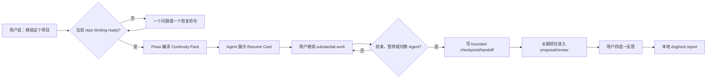

# 可信 Agent 工作连续性 PRD

状态：**Personal dogfood / Experimental**

首轮窗口：**2026-08-29 至 2026-10-10**

产品 owner：`cli/pinax` 负责 canonical continuity state；根仓库 operator Skill 负责 Codex/Claude Code 自然语言体验。

## 1. 决策摘要

Pinax 未来六周只推进一条公司级产品主线：**Agent work continuity**。

核心价值时刻不是“又多一个笔记命令”，而是用户在 Codex 或 Claude Code 中说：

> 继续这个项目。

随后得到上次目标、当前进度、关键决定、阻塞/冲突、一个推荐下一步，以及可以打开和核验的来源；用户不需要重新解释项目背景，也不需要理解 `agent`、`memory`、`brain`、handoff、scope 等底层概念。

产品姿态是 **personal-first, future-public**：当前只为 Yeisme 的真实工作建立可信闭环，但领域合同保持 provider-neutral、local-first 和可迁移，为未来公开产品保留边界。当前不建设账号、团队、定价、公共 SaaS 或跨平台客户端。

## 2. 用户与替代现状

### 2.1 首要用户

同时使用多个 coding Agent、长期推进多个复杂任务、希望保留本地 Markdown/Git/OpenSpec 证据的个人开发者。

首个真实组合：

- Codex；
- Claude Code；
- Pinax repository；
- `yeisme-notes` vault 中的 `project:pinax` scope。

### 2.2 被替代的现状

- 每次新 session 都重新描述“我们做到哪里了”。
- 在 Codex 与 Claude Code 之间手工复制上下文。
- 从 Git diff、OpenSpec、聊天记录、笔记和脑内状态中拼接下一步。
- 不知道 Agent 召回的决定是否已过期、来源是否还能打开。
- Agent 自动总结“记忆”，但用户不知道它是否进入了长期事实。
- 待审 proposal 越积越多，review 变成一项额外负担。

Pinax 不替代代码、Git、OpenSpec 或正式项目文档。Repository 文档和证据仍是原始真源；Pinax 保存 bounded handoff、memory lifecycle、scope、source reference 和 review state。

## 3. 产品承诺

一句话承诺：

> Pinax 让下一个 Agent 在不读取完整会话、不猜项目、不静默写入长期记忆的前提下，可信地继续上一项工作。

产品必须同时满足五件事：

1. **自动但不猜测**：已显式绑定的 Git worktree 自动解析；缺失或歧义时只问一个关键问题。
2. **简洁但不隐藏风险**：首屏是一张 Resume Card；stale、conflict、missing 不能被折叠成“看起来都正常”。
3. **连续但不传 transcript**：handoff 只包含 bounded working state 和来源。
4. **会记但不擅自确认**：durable decision、preference、lesson 只能进入 proposal/review。
5. **可衡量但不监控内容**：只记录枚举、计数、时间和 digest，不保存任务正文、prompt 或对话。

## 4. 核心体验



### 4.1 日常入口

用户不需要先运行 CLI。默认入口是 Agent 对话中的自然语言，例如：

- “继续这个项目”；
- “接着做 Pinax”；
- “恢复上次进度”；
- “我换到 Claude 继续”；
- “先暂停，留个 handoff”。

根仓库 `pinax-continuity-operator` Skill 负责识别这些意图并调用 Pinax machine contract。CLI 保留为 setup、binding、status、diagnose、recovery、review 和报告控制面。

### 4.2 Resume Card

默认首屏固定为一张紧凑卡片：

```text
┌─ Resume: Pinax ───────────────────────────────────┐
│ Objective       完成可信 Agent 连续性 dogfood      │
│ Last state      OpenSpec 已通过，尚未开始实现       │
│ Key decisions   CLI + shared Skill；no silent write│
│ Blockers        project:pinax 尚未建立/绑定         │
│ Next action     建立 scope 和 repository binding    │
│ Evidence        PARTIAL · 3/4 sources · 1 stale     │
└─────────────────────────────────────────────────────┘
```

规则：

- 永远只突出一个 recommended next action。
- 没有 handoff 时显示 `Handoff: missing`，降级为 context-only，而不是编造进度。
- 有可信内容也有缺失来源时返回 partial trustworthy result。
- 相关 pending review item 只有在会改变当前下一步时才 inline 提示，最多一项。
- 完整 bounded details、source refs 和其他 actions 放在 drill-down/JSON，不塞满首屏。

### 4.3 不确定性与错误状态

| 状态 | 产品行为 | 不允许的行为 |
| --- | --- | --- |
| Binding missing | 保留既有 default 行为，显示一个 bind action | 搜索所有 vault、按目录名猜 project |
| Binding ambiguous | fail closed，只问一个选择问题 | 任意选最近或第一个候选 |
| Handoff missing | 返回 context-only partial pack | 声称知道“上次做到哪里” |
| Source stale | 显示真实 evidence time 和 refresh/review action | 用本次生成时间冒充 freshness |
| Source missing | 保留其他可核验内容并标缺失数 | 整包失败或伪造替代来源 |
| Decision conflict | 同时展示冲突和 review action | ranking 静默选边 |
| Pinax unavailable | 报告安装/版本/调用 blocker | 用 Agent 自己的聊天记忆伪装 Pinax continuity |

## 5. Setup 与 Binding

Binding 是一个 user-level、CLI-authored mapping：

```text
canonical Git worktree -> registered vault -> bounded scope
```

第一 slice 使用 exact canonical worktree root。用户明确建立 binding 后，Pinax 才允许该 repository 的无参数 resume 自动使用对应 vault/scope。

解析优先级：

1. 调用者显式提供的 vault/scope；
2. 当前 worktree 的唯一 enabled exact binding；
3. 没有 binding 时保留既有 `workspace:default` fallback，并提示 setup；
4. 多个 exact active records 或损坏 registry 时 fail closed。

Binding registry 只保存在 user-level local config，由 Pinax service 写入；不进入 repository、vault note 或 Git。默认 machine output 只返回 bounded ID/digest，不泄漏完整 home path。

当前已经可运行的底层 fallback 是显式调用：

```bash
pinax continue --vault <vault-path> --scope project:pinax --task "继续 Pinax" --json
pinax agent handoff create --vault <vault-path> --scope project:pinax --objective "继续 Pinax" --current-state "..." --to-runtime codex --json
pinax review --vault <vault-path> --scope project:pinax --action list --json
```

新的 `continue bind/status/checkpoint/feedback/report` 属于本 PRD 对应 OpenSpec 的目标合同，在实现完成和 contract tests 通过前不得写成当前已发布能力。

## 6. Closeout 与长期记忆

### 6.1 何时 checkpoint

仅在 substantial session 的结束、暂停或 Agent 切换时创建 checkpoint。Substantial 至少包含以下一类真实状态变化：

- implementation/debugging；
- product/spec/docs；
- release/operations。

普通问答、只读查询、setup 前失败或无状态变化的短对话不强制 checkpoint，也不弹反馈。

### 6.2 Checkpoint 内容

- objective；
- current state；
- decisions；
- completed work；
- blockers；
- verification；
- follow-ups；
- source refs；
- receiving runtime/capability。

每个 section 必须有 item/character cap。Checkpoint 不接收 transcript file、raw prompt、provider payload、完整日志或自由 JSON dump。

### 6.3 Durable memory 边界

Handoff 不是 confirmed memory。若 Agent 识别到值得长期保留的决定、偏好或经验：

1. 显示 bounded proposal；
2. 调用 Pinax canonical proposal service；
3. 保持 `proposed`；
4. 只有用户通过 review 明确批准后才进入 `confirmed`。

Silent confirmed memory write 必须始终为 0，也是任何 Go 决策的硬门槛。

## 7. Review 体验

Review 分两层：

- **Inline**：只提示会改变当前 objective、decision、blocker、conflict 或 recommended next action 的一项。
- **Weekly**：其余 pending/conflict/stale/expired items 进入 bounded inbox，目标五分钟内完成。

Approve/reject 继续使用 Pinax lifecycle/proof service、显式确认、stale check、receipt 和 restore/supersession hint。Resume Card 不展开完整 proposal body，不提供假按钮或绕过写入门禁的 bulk action。

## 8. 用户反馈与北极星

每个 recorded substantial loop 结束时，用户只需选择一个结果：

| Outcome | 含义 |
| --- | --- |
| `trusted` | 无需重新解释，内容与下一步可直接依赖 |
| `corrected` | 项目正确，但用户需要纠正重要事实或下一步 |
| `wrong_project` | 解析到了错误 repository/scope/project |
| `insufficient` | 信息不足，仍需要重新解释或自行查找 |

Outcome 必须由用户明确提交。Agent 不得因为任务完成、用户没有反驳或语气积极而自动记录 `trusted`。

北极星指标：

```text
trusted_continuation_loops
```

它表示用户恢复 substantial work 时无需重新解释、来源可解析、没有 wrong project/scope、没有 silent durable write 的闭环数。

## 9. 六周 Dogfood Gate

首轮只使用 Pinax repository，但同时覆盖 Codex、Claude Code 和三类任务。

| Gate | Go 条件 |
| --- | --- |
| Sample | 至少 30 个真实 completed continuity loops |
| Runtime coverage | Codex 与 Claude Code 均有 completed loop |
| Task coverage | 三类任务均有 completed loop |
| Trust | `trusted / all valid outcomes ≥ 80%` |
| Source | `resolved / total ≥ 95%`，且 total > 0 |
| Review burden | 每个 weekly review 总用时 ≤5 分钟 |
| Safety | silent confirmed writes = 0 |
| Bias | 报告必须显示 single-operator、single-repository 和 missing-feedback bias |
| Routing claim | 固定显示 `cross_project_routing=unvalidated` |

决策规则：

- **Go**：全部门槛达到；下一 change 只允许 onboarding、source quality、recovery、contract hardening 和第二 repository routing validation。
- **Iterate**：安全门槛满足，且主要失败集中在最多两个可修复类别；下一 change 只修这些失败。
- **Stop**：样本未形成真实依赖、价值信号弱、失败分散或安全边界无法满足；停止扩大 facade，保留底层 runtime 和兼容读取面。

无论结果如何，都不能自动解冻团队、provider、Web、公共 SaaS 或通用平台扩张。

## 10. 六周范围冻结

允许：

- continuity UX；
- repository binding；
- source quality/freshness；
- review efficiency；
- install/diagnose/recovery；
- compatibility；
- blocking bugs；
- 真实 vault safety。

暂停：

- 新的顶层 note/platform commands；
- Feishu/task/provider integration；
- 稳定 `intent=action_capture`；
- 团队 workspace、ACL、公共 onboarding/pricing；
- Web/桌面/跨平台 client；
- 新的 MCP/Gateway/daemon，仅为 personal continuity dogfood 服务。

现有 action-capture canary 不立即中止：它继续完成 2026-08-23 至 2026-09-05 固定观察窗口，生成唯一 Go/Iterate/Stop receipt 后归档。它不能继续扩张或替代 continuity 主线。

## 11. Owner 与产品组合边界

| 能力 | Canonical owner | 用户看到的位置 |
| --- | --- | --- |
| Binding、scope resolution、Continuity Pack | `cli/pinax` | Agent Resume Card / Pinax CLI |
| Handoff、proposal/review、receipt/report | `cli/pinax` | Agent closeout / Pinax CLI |
| Codex/Claude 意图识别与对话编排 | 根仓库 source Skill | Codex / Claude Code |
| Source artifact truth | Repository、Git、OpenSpec、Markdown vault | copyable/openable refs |
| Memory state truth | Pinax memory ledger | bounded projection/review |

Root companion handoff 为 `openspec/changes/pinax-continuity-operator-handoff-v1/`。Pinax implementation owner 为 `openspec/changes/pinax-trusted-continuity-dogfood-v1/`。

## 12. 兼容与成熟度

- 所有 CLI subcommands、flags、JSON/agent fields、source kinds、registry keys 和 GORM tables 只做 additive 扩展。
- 现有 `continue` 显式参数、`agent`、`memory`、`brain`、`review` 与 machine envelope 不删除、不重命名、不 repurpose。
- 普通 `continue` 默认仍是 read-only；只有显式 recorded run 写最小 receipt。
- 新能力继续标记 `experimental=true`。
- 本 PRD 的 Codex + Claude / Pinax-only dogfood只验证产品 UX，不能关闭 `pinax-agent-memory-runtime` 已有 Codex + Ordo 四周 stable gate。

## 13. OpenSpec 与执行真源

具体合同、架构、atomic tasks、验证命令和 closeout 状态由以下 change 管理：

- [Pinax trusted continuity dogfood OpenSpec](../../openspec/changes/pinax-trusted-continuity-dogfood-v1/)
- Root `openspec/changes/pinax-continuity-operator-handoff-v1/`：Codex/Claude operator Skill 的跨 owner handoff。

本文是产品与体验真源，不复制 `tasks.md` 的执行状态。

## Workbench typed projection facade（pinax-workbench-continuity-projection-v1）

面向 Workbench BFF 的 additive machine 合同；既有 continue 命令与 dogfood 冻结面不变。

- `pinax continue workbench <projectRef> --json`：返回 `pinax.workbench.continuity_projection.v1` envelope（合同 identity/version/digest、binding 状态、有界 resume card、evidence-observed 时效、错误态 recovery）。`projectRef` 是 opaque `binding_id`（`continue bind --json` 的 `data.binding_id`），解析只走 registry exact-by-id：`not_found` / `disabled` / `invalid` / `ready`，缺项 fail-closed 返回稳定错误码与唯一恢复 action，不做跨 vault 搜索或 scope 猜测。
- `pinax continue workbench --packet`：输出 `pinax.provider_packet.v1` provider packet（根仓消费；digest 与 envelope 一致；`checkpoint.propose` 复用既有 `continue checkpoint`，durable 只走 proposal service）。
- 时效：`freshness.basis=evidence_observed_at`（非生成时间），`--ttl` 默认 600 秒、下限 60；过期只能重新调用 facade（refresh-only），消费端不得本地续命。
- envelope 红线：不含 raw note/handoff 正文、transcript、credential 或绝对路径（`data.binding_id` 之外 Workbench 不需要任何本地状态）。
