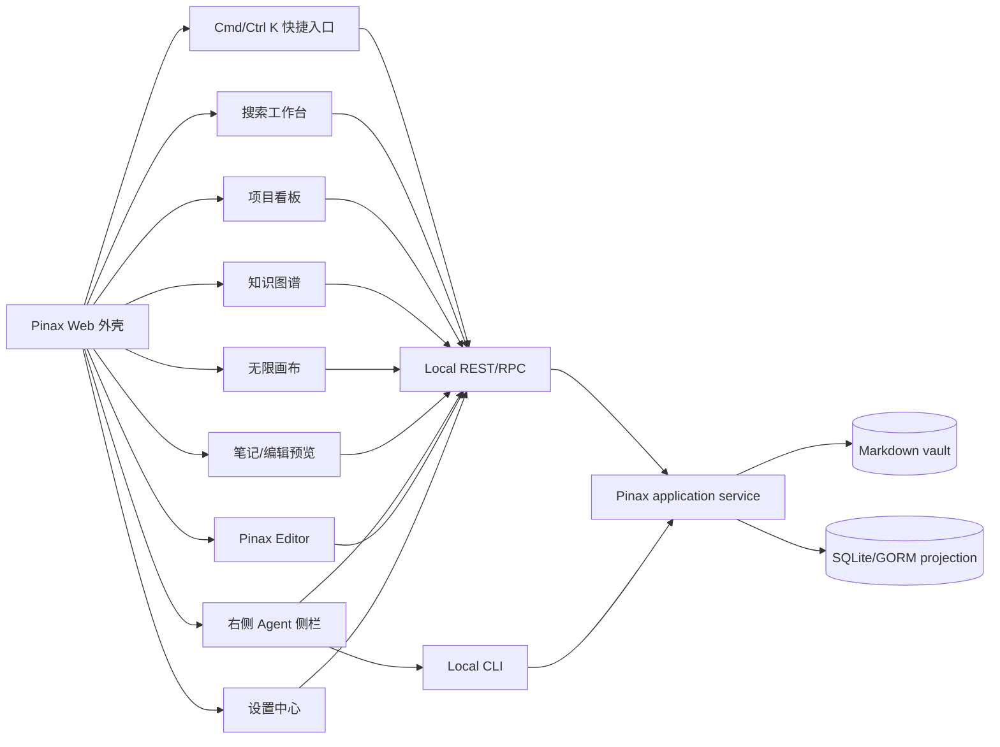

# Pinax Web 开放设计

本文是 Pinax 未来 Web 客户端的开放设计规格。它不是当前 CLI 已实现能力清单，也不是把 Pinax 改造成托管笔记应用的计划。Pinax 仍保持 local-first：Markdown vault 是真源，SQLite/GORM 是可重建索引投影，Web 客户端只消费 `pinax api serve`、CLI JSON、MCP/dashboard 共享的 bounded projection；写操作必须通过 application service、显式确认、snapshot 和 proof loop。

实现 owner 应是未来独立客户端子项目，而不是把跨平台客户端代码塞进 `cli/pinax`。`cli/pinax` 负责提供稳定命令、Local REST/RPC、projection、权限门禁和 redaction contract。

对应的 OpenSpec 任务见 [`pinax-web-open-design-client-contracts`](../../openspec/changes/pinax-web-open-design-client-contracts/tasks.md)。该变更只跟踪 Pinax 侧 CLI/API/projection 合同，不承诺在 `cli/pinax` 内实现 Web 客户端源码。

## 设计方向

Open Design 可用性已确认：`od status --json` 返回 `ok=true`。本设计选择 `default` + `shadcn` 的工作台方向，视觉上吸收 Linear 的克制密度和 Trello 的卡片可理解性，不采用营销页、展示大屏、玻璃拟态、强渐变或炫技 3D。

| 维度 | 决策 |
| --- | --- |
| 产品类型 | 本地知识库工作台、agent-safe 操作控制台 |
| 默认风格 | 克制、清晰、高信息密度、低饱和、非营销页 |
| 布局骨架 | 左侧活动栏 + 主侧栏 + 编辑/工作区 + 可选详情检查器 |
| 组件方向 | React + TypeScript + Tailwind CSS 4 tokens + shadcn/ui/Radix + lucide icons |
| 数据访问 | typed `fetch` client 调 Local REST/RPC；不直接读 `.pinax/**` 或 SQLite |
| 写入边界 | write mode、`yes=true`、snapshot、receipt、undo/restore 路径 |
| 移动端 | 不强塞桌面多栏；按任务入口降级成列表、列详情和底部 sheet |

Open Design 落地规则：

- 使用工作台式 app UI，不做 landing hero、三栏营销卡片或装饰性 dashboard mosaic。
- 基础组件优先复用 shadcn/Radix：`ResizablePanelGroup`、`Tabs`、`Sheet`、`Dialog`、`Command`、`DropdownMenu`、`Tooltip`、`ToggleGroup`、`ScrollArea`、`DataTable`。
- 视觉 token 以浅灰工作区、白色内容面、1px 分隔线、8px 圆角、紧凑 spacing 为主；只有状态、标签和风险提示使用低饱和强调色。
- 右侧区域、看板列、搜索结果和 editor pane 都必须有稳定宽度约束，hover、tooltip、badge 或加载状态不能改变布局尺寸。
- 图标使用 lucide，图标按钮必须带 tooltip；不要用文字胶囊代替明确的图标按钮。

整体信息架构：



## 全局工作台

Pinax Web 不应从单个页面起步，而应是一个 VS Code/Obsidian 风格的工作台：

```text
活动栏
  笔记
  搜索
  项目
  图谱
  画布
  Proof
  设置
主侧栏
  当前视图树、筛选器、已保存视图、查询模板
编辑区
  标签页、笔记预览/编辑、看板、图谱、画布、搜索编辑器
右侧详情检查器
  选中笔记、卡片、实体、证据、proof 详情
右侧 Agent 侧栏
  对话、上下文包、计划、工具调用预览、BYOK/local provider 状态
状态栏
  vault、索引状态、同步状态、正文暴露状态、写入模式
```

通用规则：

- 顶栏必须显示 vault、全局搜索、index/sync 状态、write mode 状态和用户可执行的下一步。
- 所有详情编辑优先用右侧详情检查器或 sheet，不跳离当前上下文。
- `card/detail/context` 是默认读取模式；完整正文只在用户显式打开正文时请求。
- 错误态必须给可执行命令，例如 `pinax index refresh --vault ./my-notes --json`，而不是只显示“失败”。
- 所有批量写操作必须先生成计划或 diff，再确认 apply。

## Agent Brain 信息架构

参考 GBrain 的 “Search gives raw pages, brain gives cited answers” 方向，Pinax Web 不应只做搜索页、看板页和图谱页的集合，而应把它们组织成一个 agent-safe brain workbench。目标用户不是普通云笔记用户，而是已经在用 Claude Code、Codex、Cursor、OpenClaw、Hermes 或 MCP client 的 power user；他们需要让 agent 查询长期记忆、理解关系、准备会议、找出过期信息，并生成可审查的下一步计划。

Pinax 的差异点是本地优先和 proof loop：Web 可以呈现“答案”，但答案必须来自 bounded projection，并且每个结论都有 evidence、freshness、confidence 和 next action。Web 不直接读取 vault 文件、`.pinax/**`、SQLite/LanceDB 或 provider config。

Agent Brain 的信息流：

```text
导入/捕获
  import markdown / inbox / journal / memory capture
    ->
投影构建
  index refresh / kb rebuild / graph rebuild / database views
    ->
上下文召回
  memory context / kb context / search / backlinks / graph query
    ->
综合答案
  cited answer / stale facts / open tasks / missing evidence
    ->
受控动作
  proof plan / snapshot / apply / receipt / restore
```

核心用户问题：

| 问题 | Pinax 应展示 | 安全边界 |
| --- | --- | --- |
| 明天见 Alice 前我需要知道什么？ | 人物摘要、最近记录、未完成事项、冲突/过期信息、引用来源。 | 默认只用 memory/search/kb/graph bounded context，不返回完整正文。 |
| 这个项目最近为什么卡住？ | project board、blocked item、相关 notes、proof receipts、最近 decisions。 | 写入建议只生成 plan，不能自动改 board/note。 |
| Acme AI 和 Bob 有什么关系？ | entity cards、graph edges、source notes、confidence、关系路径。 | 不加载全量图；弱关系和推断必须标注。 |
| 哪些记忆可能过期或矛盾？ | superseded memory、stale index、conflicting facts、review queue。 | maintenance 只生成 reviewable plan，不静默合并。 |
| 我能让 agent 做什么？ | registered capabilities、copy command、write gates、provider/cost 状态。 | Agent 不是 shell；只能调用 capability 或展示真实 `pinax ...` 命令。 |

当前 Pinax 侧可组合的真实命令：

```bash
pinax import markdown ./source --dry-run --vault ./my-notes --json
pinax index refresh --vault ./my-notes --json
pinax memory context "prepare for Alice meeting" --entity alice --limit 12 --vault ./my-notes --agent
pinax kb context "prepare for Alice meeting" --limit 8 --vault ./my-notes --json
pinax search "Alice" --vault ./my-notes --json
pinax note backlinks "Alice" --vault ./my-notes --json
pinax graph query --kind technique --match storyboard --vault ./my-notes --json
pinax proof loop run --vault ./my-notes --json
pinax mcp serve --vault ./my-notes
```

Brain workbench 需要的面板：

| 面板 | 作用 | P0/P1 |
| --- | --- | --- |
| Answer Brief | 展示 cited answer、key facts、uncertainties、next command。 | P1；P0 先由 Agent 侧栏组合 context。 |
| Sources | note path、memory id、graph edge、query row、receipt id。 | P0。 |
| Freshness | index status、last seen、superseded memory、provider status。 | P0。 |
| Memory Ledger | facts、decisions、events、tasks 的 lifecycle 和 recall reasons。 | P0。 |
| Entity Graph | people/company/project/source 的一跳/二跳关系和 confidence。 | P0/P1。 |
| Maintenance Queue | duplicate entities、broken refs、stale facts、contradictions、compression candidates。 | P1；apply 必须走 proof gate。 |
| Cost/Provider | embedding/rerank/LLM provider、local-only、credential source、estimated cost class。 | P1；P0 只显示 provider status。 |

类 GBrain 的 dream cycle 在 Pinax 里不应是后台黑箱，而应是 `proof loop` 的扩展形态：夜间或手动维护可以提出实体合并、引用修复、记忆压缩、矛盾检测和摘要刷新计划，但默认只写 review evidence；真正改动 notes、memory ledger 或 structured assets 必须有用户确认、snapshot/receipt 和 restore path。

## 设计评审补充

这轮 review 后，原方案最大的缺口不是 Kanban、图谱、搜索或画布本身，而是“谁在右侧帮助用户形成动作”。Pinax Web 需要把右侧区域从普通详情面板升级成双模式：详情检查器负责解释当前对象，Agent 侧栏负责把当前对象、选区和 vault 状态转成可审查计划。

| 维度 | 评分 | 主要问题 | 本轮补强 |
| --- | --- | --- | --- |
| 信息架构 | 8/10 | 工作台结构清楚，但 Agent 交互和 editor 未独立成一级体验。 | 新增右侧 Agent 侧栏和 Pinax Editor。 |
| 安全边界 | 8/10 | 已有 proof loop 和 bounded projection，但 BYOK/local CLI 未写成界面合同。 | 增加 provider、token、profile、local CLI 和写入门禁。 |
| 可实现性 | 7/10 | 前端选型明确，但 editor、agent、local CLI 的数据流还不够细。 | 增加组件树、交互合同和真实命令入口。 |
| 用户价值 | 8/10 | 已覆盖看板/图谱/搜索/画布，但缺少“下一步怎么做”的常驻入口。 | Agent 侧栏承担诊断、计划、解释和执行前审查。 |

设计结论：右侧区域默认不是聊天窗口，而是“上下文解释 + agent 计划”的工作面。它必须始终暴露 body exposure、write mode、provider 来源、local CLI 可用性和下一步命令。

## 右侧 Agent 侧栏

### 目标

右侧 Agent 侧栏用于把当前 workspace 的选中内容转成安全、可审查、可回滚的动作。它不是自由执行的聊天机器人，也不是远程 shell。它只能读取 bounded projection，调用已注册 Local REST/RPC capability，或触发明确的 local CLI plan/dry-run/apply 链路。

### 区域结构

```text
Agent 侧栏
  顶部状态：provider、model/local、body exposure、write mode、token/profile
  上下文包：当前 note/card/entity/canvas selection/search result
  对话区：用户问题、agent 摘要、证据引用、风险提示
  工具预览：将调用的 route 或 local CLI command
  计划区：plan、diff、snapshot requirement、receipt preview
  底部动作：Ask / Diagnose / Plan / Apply after review / Copy command
```

右侧区域采用双轨模型：

| 轨道 | 默认宽度 | 任务 |
| --- | --- | --- |
| 详情检查器 | 320-380px | 解释当前选中对象：属性、证据、来源、状态、局部操作。 |
| Agent 侧栏 | 360-440px | 基于当前上下文做问答、诊断、计划、diff 和命令预览。 |

桌面端允许两个轨道通过 split view 同时显示；1280px 以下默认只显示一个右侧轨道，用 `Inspector / Agent` segmented control 切换；移动端用 bottom sheet，默认只读 Ask 和 Copy command，不提供复杂 apply。

### 交互合同

| 控件 | 行为 |
| --- | --- |
| Provider 切换 | 显示 `gemini`、`openai`、`ollama`、`fake` 等 provider 状态；不可用时显示配置来源，不显示 secret。 |
| Context chips | 显示当前 note/card/entity/selection；每个 chip 可移除；默认不包含完整正文。 |
| Ask | 只读问答，使用 bounded context；结果必须带 evidence refs 或说明“证据不足”。 |
| Diagnose | 调用 read-only projection，例如 search、graph、proof preview、kb context。 |
| Plan | 生成 reviewable plan；不得直接写 Markdown、`.pinax/**`、Git、provider 或 remote state。 |
| Apply after review | 只在 write mode、snapshot gate 和 `yes=true` 都满足时启用；默认 disabled。 |
| Copy command | 复制用户可直接运行的真实 `pinax ...` 命令，不显示内部执行前缀。 |

### Agent 状态覆盖

| 状态 | 用户看到什么 | 可执行动作 |
| --- | --- | --- |
| Loading | provider/status skeleton、context chips 占位、禁用 apply。 | 取消请求、查看上次结果。 |
| Empty | 提示先选择 note、search result、card、entity 或 canvas object。 | 打开快捷搜索、使用当前页面作为上下文。 |
| Provider missing | 显示 provider 不可用、credential source 缺失、doctor 命令。 | 复制 `pinax kb provider doctor <provider> --vault ./my-notes --json`。 |
| Local API offline | 显示 API 未连接、profile/token 状态未知。 | 复制 `pinax api serve --vault ./my-notes --readonly --port 8787`。 |
| Readonly | ask/diagnose 可用，plan/apply disabled。 | 切换 write mode 或复制 dry-run 命令。 |
| Plan ready | 显示计划、风险、diff preview、snapshot requirement。 | accept/reject、复制命令、创建 snapshot。 |
| Apply failed | 显示失败 code、receipt 或下一步修复命令。 | 重试 dry-run、打开 proof 详情、复制诊断命令。 |

### Agent 上下文类型

Pinax 侧统一使用 `pinax.agent_context.v1` 作为右侧 Agent 的 bounded context shape。当前已在 note card/detail/context、search result、project board item 和 graph links/backlinks projection 中输出；canvas object ref 与 editor selection 保持同一 shape，等未来客户端 capability 接入后只通过 service 填充，不让 Web 手写结构化资产。字段必须至少包含 `context_id`、`source_kind`、`display_title`、`refs`、`snippets`、`evidence`、`body_exposure`、`actions`。默认 `body_exposure` 只能是 `card`、`context`、`snippet` 或 `none`；完整正文只能由用户显式选择 body/source mode 后进入对应 projection。

| 来源 | 默认暴露 | 升级条件 |
| --- | --- | --- |
| Note card/detail | title、path、tags、summary、links、status | 用户显式请求 body mode。 |
| Search result | snippet、heading path、score、path | 用户打开对应 note。 |
| Kanban card | work item metadata、blocked reason、linked note refs | 编辑正文或 archive 需要 proof gate。 |
| Graph entity | entity props、edge evidence、confidence | 图谱编辑先生成 plan。 |
| Canvas selection | node refs、layout、annotation、frame title | 转 note/project item 先 preview。 |
| Editor selection | selected text hash、heading path、snippet | rewrite/apply 必须生成 diff。 |

### BYOK 和 local provider

BYOK 只表示“用户自带 provider credential 或本地模型服务”，不表示 Web 客户端保存明文 key。Pinax Web 只显示 provider 配置状态、credential source 类型和下一步命令。真实 credential 只能进入用户级本地配置、用户级 secret store、环境变量或用户控制的 token 文件，不能进入 vault、docs、fixtures、screenshots、events 或 run evidence。

当前可执行检查命令：

```bash
pinax kb provider list --vault ./my-notes --json
pinax kb provider doctor openai --vault ./my-notes --json
pinax kb provider doctor gemini --vault ./my-notes --json
pinax kb provider doctor ollama --vault ./my-notes --json
pinax kb rebuild --backend lancedb --provider openai --model text-embedding-3-small --vault ./my-notes --json
pinax kb rebuild --backend lancedb --provider ollama --model nomic-embed-text --vault ./my-notes --json
```

界面约束：

- Provider 状态显示 `configured`、`credential_source`、`local_only` 和 default model，不显示 key 值。
- `openai` 和 `gemini` 显示“需要本机凭据”，例如 `env:OPENAI_API_KEY` 或 `env:GEMINI_API_KEY`。
- `ollama` 显示本地服务状态，例如 `local:http://127.0.0.1:11434`。
- `fake` 只用于本地验证、测试和离线演示，不作为真实语义质量展示。
- 缺 credential 时，右侧侧栏显示 `pinax kb provider doctor <provider> --vault ./my-notes --json` 的下一步，而不是让用户在 Web 表单里粘贴 key。

### Local CLI 连接模式

Web 客户端优先走 Local REST/RPC；当用户选择“复制命令”或开发者模式时，才展示 local CLI 命令。Web 不应伪装成一个通用 shell。

Local API 启动和认证命令：

```bash
pinax api routes --vault ./my-notes --json
pinax api schema export --format openapi --vault ./my-notes --json
pinax token create --label local-agent --scope read --expires 30d --vault ./my-notes --json
pinax api serve --vault ./my-notes --readonly --port 8787 --token-file ~/.config/pinax/local-agent.token
pinax profile add local --endpoint http://127.0.0.1:8787 --workspace default --device laptop --secret-ref env://PINAX_API_TOKEN --vault ./my-notes --json
pinax config set remote.api_url http://127.0.0.1:8787 --scope user
```

Agent 侧栏对 local CLI 的使用规则：

- 默认只读：`pinax api serve --readonly` 是首选启动模式。
- 写入必须显式：只有 operator 启动 `--allow-write` 且请求带确认时，写操作才可进入 apply。
- 不远程化本地控制命令：`config`、`api`、`token`、`profile`、`vault` 等控制本地运行环境的命令保持 local-only。
- 不能记录 secret：token、Authorization header、provider payload、raw prompt 和完整 chain-of-thought 不进入 UI 日志、截图或 evidence。

## Pinax Editor

### 定位

Pinax Editor 是面向 Markdown vault 的安全编辑器，不是完整替代 Obsidian/VS Code 的 IDE。它的价值是把 note 编辑、关系检查、搜索命中、proof plan 和 agent 侧栏放在同一个上下文里，让用户能在写作时看到来源、关系、风险和下一步动作。

### 编辑器形态

默认采用 Markdown/source-first 方案：CodeMirror 6 + Markdown AST + Pinax projection。后续如果要做块编辑器，可单独评估 ProseMirror/Tiptap 或 Lexical，但不能在 MVP 同时维护两套编辑模型。

```text
Pinax Editor
  顶部：note title、path、status、body exposure、snapshot 状态
  左侧：outline、backlinks、search hits、attachments
  中央：Markdown editor / rendered preview / diff preview
  右侧：Agent 侧栏或对象详情检查器
  底部：word count、changed paths、index stale、sync state、last receipt
```

### 编辑模式

| 模式 | 用途 | 写入边界 |
| --- | --- | --- |
| Preview | 默认打开 note，展示 rendered view 和 bounded metadata。 | 只读。 |
| Source | 编辑 Markdown 源文本。 | 保存前校验 frontmatter、path safety 和 dirty state。 |
| Split | 左源文本，右预览。 | 同 Source。 |
| Diff | 展示 agent 或 replace 计划造成的变更。 | 只能 accept/reject hunks，不能静默 apply。 |
| Managed blocks | 预览 `pinax-dataview`、`pinax-database-view` 和 managed block。 | refresh 必须通过 service，不让编辑器直接改 block。 |

### Editor 交互合同

| 控件 | 行为 |
| --- | --- |
| 打开 note | 从 search、graph、board、canvas 或 quick search 打开；默认 preview/detail，不自动请求完整 body。 |
| 进入编辑 | 明确切换到 Source 或 Split，状态栏显示 body exposure 已升级。 |
| 保存 | 先校验 frontmatter、schema_version、path conflict、dirty index；成功后提示 index refresh 或自动低成本 refresh。 |
| Agent 改写 | 选中文本 -> Agent 侧栏生成 rewrite plan -> Diff 模式审查 -> accept/reject -> snapshot/apply。 |
| Link autocomplete | 输入 `[[` 时提供 note title/path/alias 候选；歧义候选必须显示 path。 |
| Backlinks panel | 展示 resolved/broken/ambiguous backlinks；修复 broken link 只生成 plan。 |
| Managed block refresh | 显示“由 Pinax 管理”的范围；刷新用 `pinax note refresh --rendered --yes`，不手改 marker。 |
| Attachments | 预览附件 metadata；新增附件走 `pinax note attach` 对应 service。 |

当前可执行相关命令：

```bash
pinax note read "Research Log" --display card --vault ./my-notes --json
pinax note read "Research Log" --display body --vault ./my-notes --json
pinax note edit "Research Log" --editor "code --wait" --vault ./my-notes
pinax note show "Dashboard" --view rendered --vault ./my-notes --json
pinax note links "Research Log" --vault ./my-notes --json
pinax note backlinks "Research Log" --vault ./my-notes --json
pinax note attach "Research Log" ./diagram.png --placement note-folder --embed --vault ./my-notes --json
pinax version snapshot --vault ./my-notes --message "snapshot before editor apply" --json
```

### Editor 安全要求

- Editor 不直接写 `.pinax/**`、SQLite index、sync state、token 文件或 provider config。
- 自动保存只允许保存用户正在编辑的 Markdown note body，不允许自动 apply agent plan。
- 编辑器日志不得包含完整 note body、raw provider payload、Authorization header、token、cookie 或 hidden prompt。
- 每次 agent-assisted rewrite 必须可 diff、可撤销，并能关联 version snapshot 或 receipt。
- 移动端默认 preview 和轻编辑；复杂 diff、managed block refresh、批量 replace 建议回到桌面。

### Editor 状态覆盖

| 状态 | 用户看到什么 | 可执行动作 |
| --- | --- | --- |
| Loading | note title/path skeleton、editor pane loading、状态栏显示 index check。 | 取消打开、复制 note path。 |
| Empty | 没有打开 note 时显示最近笔记、搜索入口、创建 note 动作。 | 快捷搜索、打开最近项、新建 note。 |
| Missing note | 显示 note 未找到、可能的近似匹配和 index refresh 提示。 | 运行 `pinax index refresh --vault ./my-notes --json`，或打开候选 note。 |
| Dirty | 状态栏显示 unsaved changes、changed paths、snapshot 状态。 | 保存、discard、create snapshot。 |
| Conflict | 显示磁盘内容已变化、当前 buffer 与最新版本 diff。 | reload、merge manually、save as copy。 |
| Managed block stale | 标出 stale block 和上次 render run。 | 运行 `pinax note refresh "Research Log" --rendered --yes --vault ./my-notes --json`。 |
| Apply preview | Diff 模式显示 agent 改写或 replace 结果。 | accept/reject hunk、create snapshot、apply after review。 |
| Save failed | 显示错误 code、path safety/frontmatter/schema 失败原因。 | 回到 source、复制诊断命令、恢复上次 snapshot。 |

## Settings 设置中心

### 定位

Settings 是 Pinax Web 的配置控制台，不是一个简单偏好页。它要让用户回答四个问题：当前配置来自哪里、改动会写到哪里、是否会触发本地或远端副作用、下一步可以安全执行什么命令。Settings 只调用 Pinax CLI/API/service；不得让 Web 直接写用户级配置、`.pinax/**`、Cloud Sync state、publish profile、token 文件或 provider config。

页面模式选择：Settings/control page。布局保持工作台密度，不使用卡片瀑布或营销式说明。

```text
Settings
  顶部：vault、profile、API 连接、readonly/write mode、unsaved changes
  左侧导航：General / Appearance / Keymap / Agent & Providers / Cloud Sync / Publish / Security / Advanced
  中央表单：当前分组设置、来源、校验、保存/重置/dry-run
  右侧诊断：配置来源、next actions、风险、最近 receipt、复制命令
  底部状态：config path、last validation、pending writes、redaction status
```

Settings 的保存策略：

| 设置类型 | 默认行为 | 写入边界 |
| --- | --- | --- |
| 纯 UI 偏好 | 本地客户端偏好，可即时预览。 | 未来客户端 owner 自己管理；不写 Pinax vault。 |
| Pinax CLI 配置 | 显示来源和 preview，保存时调用 `pinax config set`。 | 只写 user/project config；必须显式 scope。 |
| Cloud Sync | 默认先 doctor/diff/dry-run，再允许配置或启动 daemon。 | 通过 `pinax cloud ...` 和 `pinax sync ...` 写本地 sync state。 |
| Publish | 默认先 profile validate、plan、build、serve，再 deploy。 | 通过 `pinax publish ...` 写 profile/build receipt 或执行 deploy。 |
| Secret refs | 只保存 `env://`、`op://`、profile name、rclone remote 等引用。 | 不保存 raw token、cookie、Authorization header、provider key。 |

Settings/control 的首个 Pinax 侧合同来自真实配置命令，而不是客户端直接读取配置文件。`pinax config get <key> --json` 在旧的 `key/value` facts 之外暴露 `source`、`writable`、`write_scope`、`write_scopes` 和可复制的 `pinax config set ... --scope ...` next action；`pinax config doctor --json` 在 `data.settings` 中列出每个受支持设置的有效值、来源、可写 scope、secret-reference 边界和安全保存动作。来源只使用 `user`、`project`、`env`、`flag`、`default`；env 来源只读，flag 来源可以显式保存到 user/project scope。

Advanced diagnostics 只显示状态：`local_api_status`、`remote_api_source`、`write_mode`、`redaction_status`、`profile_status`、`token_status`、`body_exposure_default`。这些字段不得包含 token 值、Authorization header、cookie、provider key、raw external CLI config 或完整 note body。

### 信息架构

| 分组 | 主要内容 | 设计要点 |
| --- | --- | --- |
| General | vault、Local API endpoint、remote profile、index/search 默认值。 | 显示 current source：flag/env/user/project/default。 |
| Appearance | UI theme、CLI theme、color mode、density、markdown preview style、custom terminal roles。 | 主题即时预览；CLI 主题必须用真实 `output.*` 和 `themes.custom.*` 配置。 |
| Keymap | preset、快捷键搜索、冲突检测、按页面查看 command binding。 | Web 快捷键是客户端偏好；Pinax CLI 当前只支持 `editor.command`，不得伪造 `pinax keymap` 命令。 |
| Agent & Providers | provider status、BYOK/local provider、KB sidecar、body exposure 默认值。 | 显示 configured/local-only/credential source，不显示 secret。 |
| Cloud Sync | backend、workspace/device、doctor、diff、daemon 状态、conflicts。 | 默认 read-only 诊断；push/pull/daemon start 必须明确确认。 |
| Publish | profiles、target、theme、plan/build/serve/deploy、latest receipt。 | deploy 属危险操作；必须 plan/build 成功后才能启用。 |
| Security | token/profile/auth source、redaction、body exposure、write mode。 | 不显示 token 值；只显示 source 和过期状态。 |
| Advanced | config paths、OpenAPI export、route discovery、logs、danger zone。 | danger zone 不和普通保存按钮放一起。 |

### Appearance 和主题

主题设置分为 Web UI theme 和 Pinax CLI output theme。Web UI theme 由未来客户端独立实现，使用 `light / dark / system`、density 和 accent token；Pinax CLI output theme 必须走现有配置命令。

当前可执行相关命令：

```bash
pinax config path --vault ./my-notes
pinax config get output.theme --vault ./my-notes --json
pinax config set output.theme high-contrast --scope user
pinax config set output.color auto --scope user
pinax config set output.markdown.style dark --scope user
pinax config set themes.custom.accent cyan --scope user
pinax config doctor --vault ./my-notes
```

Appearance 控件：

| 控件 | 行为 |
| --- | --- |
| Theme mode | `light / dark / system`，只影响 Web 客户端；CLI 输出另设。 |
| Density | `comfortable / compact`，影响表格、看板卡片、搜索结果行高。 |
| CLI theme | 映射 `output.theme`：`pinax / mono / high-contrast / custom`。 |
| Color output | 映射 `output.color`：`auto / always / never`。 |
| Markdown preview style | 映射 `output.markdown.style`：`auto / ascii / dark / light / notty`。 |
| Custom roles | 映射 `themes.custom.<role>`，只允许已定义 role 和安全颜色值。 |

### Keymap 和快捷键

Keymap 的核心不是列出所有快捷键，而是帮助用户避免冲突并理解某个动作在哪里生效。页面应包含 preset、搜索、冲突列表和按上下文分组的 bindings。

```text
Keymap
  Preset: Pinax default / VS Code-like / Obsidian-like / Vim-inspired
  Search: command name or key chord
  Context groups: Global / Editor / Search / Board / Graph / Canvas / Agent
  Conflict panel: same chord, same context, disabled binding reason
```

当前 CLI 只提供外部编辑器命令配置，Settings 可以展示真实命令：

```bash
pinax config get editor.command --vault ./my-notes --json
pinax config set editor.command "code --wait" --scope user
```

Keymap 的 Web 快捷键保存属于未来客户端偏好，不能写进 Pinax config，除非后续 OpenSpec 任务新增 typed `ui.keymap.*` 配置并通过 `pinax config set` 支持。设计上先要求：

- 所有快捷键必须有命令名、上下文、默认 chord、当前 chord、冲突状态和是否可禁用。
- 改键时实时检测同上下文冲突；跨上下文复用允许，但必须解释作用域。
- `Reset preset` 只重置 Web 客户端偏好，不改 Pinax vault 或 CLI 配置。
- 移动端不展示完整 keymap 编辑，只显示常用动作和外接键盘提示。

### Cloud Sync 设置

Cloud Sync 设置必须把“集中 Local API”和“分布式 Cloud Sync”分开。`pinax api serve` 是一台本地服务端 vault；Cloud Sync 是每台设备各有本地 vault，通过加密 revision/blob/manifest 同步。

页面结构：

```text
Cloud Sync
  Transport card: server / s3-direct / rclone-direct / local file dev
  Identity: workspace、device、secret ref、encryption secret ref
  Health: cloud status、cloud doctor、daemon status、recent logs
  Plan: ignore status、sync diff、push dry-run、pull preview
  Actions: configure backend、run daemon、start daemon、stop daemon、resolve conflicts
```

当前可执行相关命令：

```bash
pinax cloud status --vault ./my-notes --json
pinax cloud doctor --vault ./my-notes --json
pinax cloud login --endpoint https://cloud.example.test --workspace ws_123 --device laptop --secret-ref env://PINAX_CLOUD_TOKEN --encryption-secret-ref env://PINAX_SYNC_SECRET --vault ./my-notes
pinax cloud backend set s3 --bucket notes --region us-east-1 --prefix pinax-sync/ --profile work --workspace personal --device laptop --vault ./my-notes
pinax cloud backend set rclone --remote onedrive:PinaxSync --workspace personal --device laptop --vault ./my-notes
pinax vault ignore status --vault ./my-notes --json
pinax sync diff --target cloud --vault ./my-notes --json
pinax sync push --target cloud --vault ./my-notes --dry-run --json
pinax sync daemon status --vault ./my-notes --json
pinax sync daemon logs --vault ./my-notes --limit 20 --json
pinax sync daemon run --target cloud --vault ./my-notes --yes
pinax sync daemon stop --vault ./my-notes
```

Cloud Sync 交互规则：

| 操作 | 默认状态 | 启用条件 |
| --- | --- | --- |
| Configure server | 表单输入 endpoint/workspace/device/secret refs。 | secret 只能是 ref；保存前 doctor。 |
| Configure S3 | 表单输入 bucket/region/prefix/profile。 | 不收集 access key；使用 profile。 |
| Configure rclone | 输入 rclone remote。 | 提示先在本机运行 `rclone config`。 |
| Push | 默认 dry-run。 | dry-run 通过且用户显式确认后才允许 `--yes`。 |
| Daemon run/start | 默认 disabled。 | cloud doctor 通过、无未解决 conflict、用户确认。 |
| Logs | 只读。 | 日志必须已脱敏，不显示 note body 或 secrets。 |

### Publish 设置

Publish 设置是发布控制台，不是普通开关。它必须展示 profile、target、renderer、theme、selected/skipped/blocking counts、build receipt、deploy target 和最新扫描结果。

页面结构：

```text
Publish
  Profiles: public / wiki / gist / share
  Profile detail: target、renderer、base_url、theme、body_policy、output path
  Plan: selected/skipped/blocking/private-body warnings
  Build: output dir、manifest、secret scan、receipt
  Preview: loopback serve URL
  Deploy: target repo/gist/http endpoint、confirmation、latest receipt
```

当前可执行相关命令：

```bash
pinax publish profile list --vault ./my-notes --json
pinax publish profile init public --target github-pages --renderer hugo --title "Knowledge" --base-url https://example.github.io/kb/ --vault ./my-notes --json
pinax publish profile validate public --vault ./my-notes --json
pinax publish profile show public --vault ./my-notes --json
pinax publish theme list --vault ./my-notes --json
pinax publish plan --profile public --target github-pages --vault ./my-notes --json
pinax publish build --profile public --target github-pages --out ./dist/site --vault ./my-notes --json
pinax publish serve --profile public --out ./dist/site --host 127.0.0.1 --port 4173 --vault ./my-notes
pinax publish deploy --profile public --target github-pages --out ./dist/site --repo ../kb-pages --yes --vault ./my-notes --json
```

Publish 交互规则：

| 操作 | UI 表现 | 安全边界 |
| --- | --- | --- |
| Profile init/edit | 表单 + YAML preview + validate result。 | 通过 `publish profile init` 或后续 service 写 profile；不手写 YAML。 |
| Theme | 列出 built-in/local theme，支持 eject 到 review 目录。 | local theme path 不得指向 `.pinax/**`。 |
| Plan | 默认 primary action。 | read-only，不输出 private body。 |
| Build | plan 无 blocking 后启用。 | 输出到 `dist/` 或用户选择的安全目录；扫描 secret 和 `.pinax` 泄漏。 |
| Serve | build 成功后启用。 | 仅 loopback preview。 |
| Deploy | 默认危险操作，红色 danger zone。 | 必须 `--yes`、最新 receipt、目标不是 vault root 或 `.pinax/**`。 |

### Settings 状态覆盖

| 状态 | 用户看到什么 | 可执行动作 |
| --- | --- | --- |
| Loading | 分组导航和表单 skeleton，右侧显示正在读取 config/source。 | 取消、重试。 |
| Empty | 某分组尚未配置，例如没有 publish profile 或 cloud backend。 | 初始化 profile、配置 backend、打开 docs。 |
| Invalid config | 显示错误 code、字段、来源和安全解释。 | 复制 doctor 命令、重置该字段、打开 Advanced。 |
| Secret rejected | 显示“只能保存 secret reference”。 | 改用 `env://...`、`op://...`、profile name 或 token file。 |
| Unsaved changes | 顶部和底部固定提示 pending writes。 | Save、discard、view diff。 |
| Write disabled | 所有写按钮 disabled，read-only 操作可用。 | 显示如何以 write mode/API allow-write 启动。 |
| External tool missing | 例如 Hugo、gh、rclone、sidecar 不可用。 | 复制 doctor 或本机安装检查命令。 |

## Kanban 方案

### 定位

Pinax Kanban 是本地项目工作区视图，不是远程 issue tracker。它展示 Markdown work item、project metadata、saved board view 和 planning snapshot；TaskBridge、GitHub、Gitea、Feishu 只能是导入/导出或 provider surface，不能成为看板真源。

默认风格选择：Linear + Trello。

- Linear 部分：低噪音、紧凑、键盘优先、状态清晰，适合研发和知识工作。
- Trello 部分：卡片轻、列结构一眼可懂、快速新增和拖拽友好。
- 不采用 Jira 式重流程作为 MVP 默认，但预留 WIP、泳道、权限和报表扩展。

### 页面结构

```text
顶部栏：vault / 项目切换 / 全局搜索 / 新建事项 / 索引同步状态 / 写入模式
侧边栏：projects / subprojects / 已保存看板视图 / 我的任务 / labels / filters
工具栏：视图切换 / 筛选 / 排序 / 分组 / 密度 / WIP 可见性 / 导出
看板：backlog -> next -> doing -> blocked -> review -> done
详情检查器：选中卡片详情、note context、proof actions、activity
```

MVP 使用这些列：`inbox -> next -> doing -> blocked -> review -> done`。研发项目可以保存视图：`triage -> ready -> in_progress -> code_review -> qa -> done`。学习项目可以保存视图：`inbox -> planned -> learning -> practice -> review -> retrospective -> done`。

列头：

```text
Doing                       4 / 5
WIP 已达到上限              + Add
```

WIP 是 P1 功能，但 UI 从 P0 开始预留位置。达到上限时列头用 warning token、数字加粗，并显示“建议先收敛当前任务”；不能只靠颜色表达状态。

### 卡片字段

默认卡片为中等密度：

```text
[High] 登录页重构              Blocked
修复移动端输入框遮挡问题

Alex    due 2026-06-28    comments 4
#frontend #bug             subtasks 3/5
```

字段分层：

| 层级 | 字段 | 说明 |
| --- | --- | --- |
| 必须一眼看到 | title, priority, blocked/overdue, column | 判断是什么事、是否卡住 |
| 协作/推进 | assignee, due date, comments, attachments, subtasks | 判断谁负责、下一步是什么 |
| 分类 | labels, project, module, kind, points | 支持筛选和批量整理 |

密度模式：

- Compact：title、priority、assignee、due、blocked，只用于高频用户。
- Standard：默认，显示摘要和核心 metadata。
- Detail：额外显示 source note、linked notes、proof status、recent activity。

### 交互合同

| 控件 | 行为 |
| --- | --- |
| 拖拽卡片 | 卡片浮起、原位置显示占位槽、目标列高亮；drop 后调用受控 move projection。 |
| 快速新增 | 每列顶部或底部 `Add item`，输入 title 回车；默认先 dry-run/plan，write mode 下确认写入。 |
| 卡片详情 | 点击打开右侧详情检查器；编辑 title/labels/due/assignee/blocked reason；正文编辑必须显式进入 body mode。 |
| 筛选 | assignee、label、priority、due、blocked、project、subproject、source note、link target。 |
| 批量操作 | multi-select 后批量 move/label/archive；archive 必须 snapshot + confirmation。 |
| 空列 | 显示可执行行动：新增、拖入、调整筛选、查看 archived。 |
| 移动端 | 先显示列列表和计数，点进某列看卡片；详情用 bottom sheet。 |

当前 CLI/API 对应能力：

```bash
pinax project board show research --subproject stock-learning --vault ./my-notes --json
pinax project board configure research --columns inbox,next,doing,blocked,review,done --vault ./my-notes --json
pinax project item add research "Read annual report" --subproject stock-learning --column next --vault ./my-notes --json
pinax project item move item_abc123 doing --vault ./my-notes --json
pinax version snapshot --vault ./my-notes --message "snapshot before archive"
pinax project item archive item_abc123 --yes --vault ./my-notes --json
```

P0：board show、saved view、拖拽移动、快速新增、筛选、卡片详情检查器。P1：WIP limit、swimlane、批量操作、table/calendar 切换。P2：automation rules、reporting、external provider handoff。

## 知识图谱方案

### 定位

知识图谱不是“打开就展示全量毛线团”，而是任务型探索：找对象 -> 看关系 -> 验证证据 -> 形成结论/动作。Pinax 的图谱必须优先展示来源、置信度、link status、recent update 和可执行修复/整理动作。

默认选型：

| 层 | 推荐 |
| --- | --- |
| MVP 图谱渲染 | Cytoscape.js，适合关系探索、路径分析、布局和图算法。 |
| 大图只读浏览 | 后续评估 Sigma.js，用 WebGL 承担更大节点量。 |
| 工作流/DAG | 后续 agent proof loop 或 automation editor 用 `@xyflow/react`，不和知识图谱混用。 |
| 自由编排 | 无限画布用 tldraw，不让 graph library 承担白板职责。 |

### 页面结构

```text
顶部栏：实体搜索 / 自然语言查询 / 已保存视图 / 导出 / 正文暴露状态
左侧面板：实体类型 / 关系类型 / 筛选器 / 查询模板 / 历史记录
图谱画布：节点 / 边 / 展开收起 / 路径分析 / 小地图 / 图例
右侧详情检查器：实体属性 / 证据 / 来源笔记 / 置信度 / 操作
底部面板：表格结果 / 路径列表 / 时间轴 / 诊断 / 查询日志
```

### P0 交互

| 模块 | 设计要点 |
| --- | --- |
| 搜索 | 支持 note title、alias、path、tag、prompt asset、project item、source ref；输入时提示实体类型。 |
| 默认展开 | 搜索一个实体开始，默认 1 跳，用户确认后再 2 跳；不加载全量图。 |
| 详情面板 | 属性、来源、更新时间、关系证据、link status、confidence、repair/organize next action。 |
| 展开关系 | expand one hop、expand same type、expand strongest、expand evidence-backed。 |
| 路径分析 | A 与 B 为什么有关、最短路径、多条路径、关键中介节点。 |
| 过滤 | entity type、relation type、tag、time、source、confidence、broken/ambiguous/resolved。 |
| 防爆图 | Top N、聚类、隐藏弱关系、折叠已读分组、小地图、搜索定位、非相关节点淡化。 |
| 图表联动 | 图上选择 -> 表格高亮；表格筛选 -> 图谱收缩。 |

视觉编码：颜色只表达实体类型；风险/异常用描边或角标；重要性用大小；边类型用线型或颜色；强度用粗细；方向用箭头。hover 边时展示关系名、来源、置信度和时间。

当前 CLI/API 对应能力：

```bash
pinax note links "Research Log" --vault ./my-notes --json
pinax note backlinks "Research Log" --vault ./my-notes --json
pinax note orphans --mode no-incoming --vault ./my-notes --json
pinax search "authentication" --link-target notes/design/auth.md --vault ./my-notes --json
pinax graph rebuild --vault ./my-notes --json
pinax graph query --kind technique --match storyboard --vault ./my-notes --json
```

P0：实体搜索、一跳/二跳展开、link/backlink/orphan、图表联动、证据详情检查器、保存视图。P1：路径分析、时间轴、查询模板、人工标注、权限视图。P2：自然语言问答、query explanation、智能推荐、图谱编辑计划。

## 搜索方案

### 三层入口

Pinax Web 搜索应分三层，而不是只有一个 search page：

| 入口 | 快捷键 | 用途 |
| --- | --- | --- |
| 快捷搜索 | Cmd/Ctrl+K 或 Cmd/Ctrl+P | 快速打开 note、project、saved view、recent item、command。 |
| 搜索侧边栏 | Cmd/Ctrl+Shift+F | 持续搜索、对照结果、跳转正文命中。 |
| 全屏搜索页 | route `/search` | 复杂筛选、保存搜索、批量整理、导出、聚类和研究型搜索。 |

### 搜索侧边栏

```text
搜索输入
  match case / whole word / regex / fuzzy
范围筛选
  vault / project / folder / tag / date / type / link target
搜索结果
  128 results in 42 notes
  Products/2026-Q2.md       8
    H2 Growth strategy
    line 12 ... highlighted snippet ...
编辑区
  打开 note 并滚动到选中的命中位置
```

查询语法建议：

```text
"用户增长" tag:产品 path:work/weekly after:2026-01-01 -草稿 block:heading type:note
```

默认排序：title exact > title fuzzy > alias > tag > heading > body BM25 > attachment/OCR > backlink context > recency/favorite boost。代码块、URL、命令和公式默认偏 exact；普通正文默认允许 fuzzy。

### `rg` 在搜索架构里的位置

Pinax 已有 `pinax search` 和 SQLite/GORM index。Web 侧不应直接在浏览器里扫描 vault；如果是桌面/本地客户端，可以把 `rg` 作为 application service 管理的 raw text scan 后备能力，用来提供精确行列、快速 snippet 和 index 异常时的 fallback。`rg` 结果仍必须走 redaction、path safety、ignore rules 和 bounded projection。

人工调试可以直接运行：

```bash
rg --line-number --column --heading --smart-case --hidden --glob '!.pinax/**' --glob '!.git/**' "用户增长" ./my-notes
rg --json --smart-case --hidden --glob '!.pinax/**' --glob '!.git/**' "用户增长" ./my-notes
```

Web 搜索服务返回结构应分页或流式，不一次性返回所有正文：

```ts
type SearchResult = {
  noteId: string;
  blockId?: string;
  title: string;
  path: string;
  headingPath?: string[];
  score: number;
  matches: Array<{
    field: 'title' | 'heading' | 'body' | 'tag' | 'attachment' | 'link';
    snippet: string;
    ranges: Array<[number, number]>;
    position: number;
  }>;
};
```

Replace 默认隐藏在高级模式。批量替换必须先 preview diff，排除 OCR、加密、只读共享和 unsupported 文件，并生成可回滚操作；`Replace all` 需要二次确认和 undo/restore 路径。

P0：搜索侧边栏、title/body、按 note 分组、snippet highlight、跳转命中、tag/folder/date filter、index status、recent search。P1：全屏搜索页、saved search/smart folder、attachment/OCR、safe replace、export、backlink context。P2：semantic search、本地向量索引、聚类、AI 摘要。

当前 CLI/API 对应能力：

```bash
pinax index refresh --vault ./my-notes --json
pinax search "authentication" --tag auth --group work --folder architecture --kind reference --status active --vault ./my-notes --json
pinax search "authentication" --link-target notes/design/auth.md --vault ./my-notes --json
pinax search "diagram" --has-attachment --vault ./my-notes --json
```

## 无限画布方案

### 定位

无限画布不是做炫酷白板，而是把 Pinax 的 note、search result、graph entity、project item、source evidence 和 proof plan 放在一个可组织的空间里。用户目标是“围绕一个问题组织材料、验证关系、决定下一步”，而不是画海报。

默认选型：tldraw。理由：Pinax 的画布更接近自由材料编排、视觉思考、引用板和研究板，而不是严格 DAG。未来如果要做 agent workflow/DAG editor，再单独用 `@xyflow/react`。

参考产品方向：Obsidian Canvas、Heptabase、Miro/FigJam、Muse。吸收它们的空间组织和卡片关系，但保留 Pinax 的本地真源和 proof loop。

### 画布对象

| 对象 | 说明 | 写入边界 |
| --- | --- | --- |
| Note Card | note bounded projection，可展开 detail/body | 默认只读；正文编辑需显式 body mode。 |
| Search Result | 查询结果组或单条命中 | 保存 search view 写配置，不写结果行。 |
| Graph Entity | note/tag/prompt/project/source 节点 | 图谱 projection，不是新真源。 |
| Project Item | managed work item card | move/archive 走 project service 和 snapshot gate。 |
| Evidence Snippet | 来源片段、link evidence、receipt | bounded snippet，不写 raw provider payload。 |
| Group/Frame | 视觉分组、研究问题、章节 | 作为 canvas layout metadata 由 service 写入。 |
| Connector | 视觉关系线，可绑定 link/backlink 或手工备注 | 手工关系先是 annotation，不自动改 note links。 |
| Sticky/Annotation | 用户解释、假设、下一步 | 可转成 note 或 project item，需确认。 |

Canvas layout 是结构化资产，必须通过 Pinax client service 创建/修改，例如未来的 `.pinax/canvases/*.json`；agent 或 Web 不得手写该文件。画布保存布局、节点引用、视口、分组和样式，不保存完整 note body、搜索结果全文或 provider payload。

### 页面结构

```text
顶部栏：canvas title / saved state / share-export / command palette / zoom
左侧面板：notes、search、graph nodes、project items、templates
画布：cards、frames、connectors、comments、minimap
右侧详情检查器：selected object properties、source evidence、actions
底部栏：zoom、selection count、body exposure、sync/index status
```

### 交互合同

| 控件 | 行为 |
| --- | --- |
| 添加 note card | 从搜索/笔记列表拖入；只保存 note ref 和 layout。 |
| 展开 card | card -> detail -> body 三段展开；body 是显式请求。 |
| 连接线 | 默认创建 visual annotation；用户选择“write wikilink”时生成 proof plan。 |
| Frame | 框选材料形成研究组；可导出为 Markdown outline 或 project plan。 |
| Convert | sticky -> note、selection -> project item、frame -> collection，全部先 preview。 |
| 画布内搜索 | 当前画布内搜索，支持 title/tag/path/text snippet。 |
| 小地图/缩放 | 大画布必须有 minimap、fit selection、reset view、keyboard zoom。 |
| 移动端 | 默认只读浏览和对象列表；复杂编辑引导到桌面。 |

P0：创建画布、拖入 note/search result/project item、移动缩放、frame、connector annotation、详情检查器、导出 Markdown outline。P1：保存 canvas view、从 frame 生成 project plan、路径高亮、单人 comments、timeline snapshots。P2：多人协作、AI suggested clusters、本地 semantic map、workflow DAG editor。

## 技术和质量门禁

| 模块 | 前端建议 | 服务端/Pinax 边界 |
| --- | --- | --- |
| 外壳 | React Router + resizable panels + cmdk | 只调用 Local API discovery 和 projection。 |
| Kanban | dnd-kit 或 Pragmatic DnD；虚拟化长列 | move/add/archive 走 project service。 |
| Graph | Cytoscape.js；后续 Sigma.js | link graph、prompt graph、graph summary 由 Pinax service 生成。 |
| Search | TanStack Virtual + cmdk + typed search API | SQLite/GORM index 为主，`rg` 作为受控 fallback。 |
| Canvas | tldraw | layout metadata 由 service 写入，不保存 raw body。 |
| Agent 侧栏 | resizable inspector + command preview + diff/plan panel | 只调用 registered capability 或展示真实 local CLI command。 |
| Pinax Editor | CodeMirror 6 + Markdown AST + rendered/diff panes | Markdown vault 仍是真源；managed metadata 必须走 service。 |
| Settings | Settings/control page + forms + diagnostics inspector | 配置写入只走 `pinax config`、`cloud`、`sync`、`publish` service。 |
| BYOK/local provider | provider status panel + credential-source hints | 只显示 `configured` 和 credential source，不保存或回显 key。 |
| Tables | TanStack Table | database view render 只返回 bounded rows。 |
| State | TanStack Query | cache 不突破 body exposure 和 token redaction。 |

验收要求：

- 每个页面必须有 loading、empty、error、stale index、readonly、write-disabled 状态。
- 所有图标按钮必须有 accessible label 和 tooltip。
- 所有 destructive/write 操作必须有 confirmation、receipt 和 restore path。
- 大列表、搜索结果、长列必须虚拟滚动。
- 图谱和画布必须有 minimap、fit view、selection inspector 和 keyboard reachable controls。
- 右侧 Agent 侧栏必须显示 provider、model/local、body exposure、write mode 和 local CLI/API 连接状态。
- Pinax Editor 必须覆盖 preview、source、split、diff、managed block 状态，且 diff/apply 不能跳过 proof gate。
- Settings 必须显示配置来源、写入 scope、secret reference 边界、Cloud Sync/Publish 诊断和危险操作确认。
- 颜色不能成为唯一信息通道；blocked、overdue、WIP reached 必须有文本或图标说明。
- Playwright 覆盖 desktop 1440x960、laptop 1280x800、mobile 390x844；画布/图谱需要截图证明非空、可交互、无遮挡。

## MVP 切片

推荐先做一个只读优先、写入受控的 Web MLP：

1. 工作台外壳：vault switch、global search、index/sync/write mode 状态。
2. Settings 设置中心：主题、CLI config、keymap、Cloud Sync、Publish、Security 和 Advanced diagnostics。
3. 右侧 Agent 侧栏：BYOK/local provider 状态、bounded context、plan/diff preview、真实命令复制。
4. Pinax Editor：preview/source/split/diff、outline/backlinks/search hits、managed block preview。
5. 搜索侧边栏：`pinax search` + bounded result grouping + editor jump。
6. 项目看板：render board、filter、card inspector、受控 add/move。
7. 知识图谱：entity search、一跳展开、right inspector、table linkage。
8. 轻量画布读写：拖入 note/search result/project item，保存 layout，不写 note body。
9. Proof gates：所有写操作统一走 preview、snapshot requirement、receipt、restore hint。

暂不做：hosted multi-user workspace、浏览器直接读本地文件、Web 直接写 `.pinax/**`、全量图谱、实时多人协作、复杂自动化规则、3D 图谱、大屏飞线、默认批量替换。

## Future-client handoff

未来 React/Web/桌面客户端必须由独立客户端子项目拥有；`cli/pinax` 只提供 CLI/API/projection 合同、permission gate、redaction 和文档。客户端启动时先消费 discovery，而不是硬编码能力：

```bash
pinax api routes --vault ./my-notes --json
pinax api status --vault ./my-notes --json
pinax api schema export --format openapi --vault ./my-notes --json
```

交接矩阵：

| 能力 | 客户端入口 | Pinax 真源 |
| --- | --- | --- |
| `workbench.status` | 顶栏、状态栏 | `pinax api status --vault ./my-notes --json` |
| `settings.control` | Settings | `pinax config get|doctor|set|unset ... --json`、`cloud`、`sync`、`publish` projections |
| `agent.context` | 右侧 Agent 侧栏 | `pinax.agent_context.v1` bounded context；默认不含完整正文 |
| `provider.status` | BYOK/local provider 面板 | `pinax kb provider list|doctor ... --json`；只显示 credential source |
| `editor.note` | Pinax Editor | `note read/show`、`note refresh`、`note attach`、`version snapshot` |
| `board.view` | Kanban | `project board show`、project item plan/apply gates |
| `graph.view` | 知识图谱 | `note links/backlinks`、`graph query`、bounded evidence |
| `search.view` | 搜索侧栏/全屏搜索 | `pinax search ... --json`；`rg` 只能作为 service-managed diagnostic |
| `canvas.view` | 无限画布 | `canvas.layout.metadata` discovery 标记为 `future-client-only`；layout 由 service-owned structured asset 写入 |
| `proof.gate` | 所有写操作 | plan/diff、`yes=true`、snapshot requirement、receipt、restore hint |

Proof gate checklist：写操作启用前必须确认 server write mode、用户确认、危险操作 snapshot、diff/plan 可审查、receipt 可持久化、restore hint 可展示；缺任一条件时只能显示 `write_disabled`、`approval_required`、`snapshot_required` 或 dry-run plan。

BYOK/provider safety：Web 不收集、不保存、不回显 raw key。缺凭据时显示 `pinax kb provider doctor <provider> --vault ./my-notes --json`；真实凭据只能存在用户级本地配置、secret store、环境变量或用户控制的 token 文件。

Pinax Editor 规则：默认 `card/detail/context`，Source 模式才升级 body exposure；Agent rewrite 必须进入 Diff，managed block refresh 只能调用 `pinax note refresh --rendered --yes`，附件新增走 `pinax note attach`，apply 前优先创建 `pinax version snapshot --vault ./my-notes --message "snapshot before editor apply" --json`。

移动端约束：不要强塞桌面多栏。移动端优先提供搜索、note preview/source、card detail、provider/status、copy command 和只读 Agent Ask；复杂 graph/canvas/Kanban 操作降级为列表、列详情、bottom sheet 和明确的桌面建议。

Deferred items：hosted multi-user workspace、浏览器直接读本地文件、Web 直接写 `.pinax/**`、全量图谱、实时多人协作、3D 图谱、默认批量替换、Web 表单保存 provider key、客户端内实现 Pinax business rule、跨平台客户端源码放进 `cli/pinax`。
