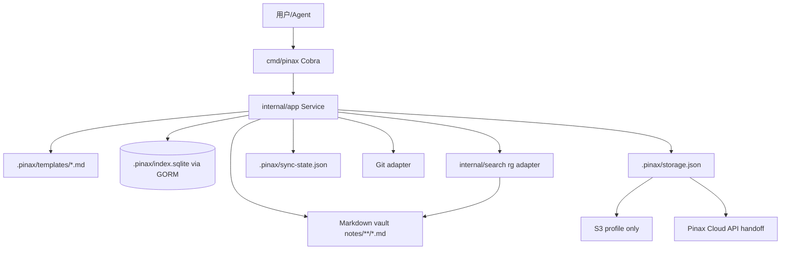

# 设计

## 数据流



## 笔记格式

Pinax 使用 Markdown 文件作为真源。新建笔记必须写入 YAML frontmatter：

```yaml
---
schema_version: pinax.note.v1
note_id: note_<hash>
title: 标题
tags: [tag]
project: research
created_at: 2026-06-06T00:00:00Z
updated_at: 2026-06-06T00:00:00Z
---
```

正文保持普通 Markdown，兼容 Obsidian 核心语法：`[[Wiki Link]]`、`#tag`、代码围栏和 Mermaid 围栏。附件仍以透明文件保存在 vault 内，索引阶段只记录引用关系，不移动附件。

## 模板

模板是 `.pinax/templates/*.md` 下的文本文件。`template init` 由 service 创建内置模板，用户可编辑正文；模板 metadata 和注册状态由 CLI/service 维护。渲染支持保守变量替换：`{{title}}`、`{{date}}`、`{{datetime}}`、`{{project}}`、`{{tags}}`。变量替换不执行脚本，不读取外部环境，避免模板成为执行面。

## 检索和索引

全文检索优先调用本地 `rg`：

- `rg` 可用时，Pinax 读取输出并转成 projection。
- `rg` 不可用或失败时，回退到现有 Go 文件扫描。
- `index rebuild` 通过 GORM 写入 SQLite：note、tag、link 三类投影。
- 应用层不得写 SQL 字符串；迁移和读写通过 GORM model/repository 完成。

## 同步边界

同步命令只通过 service 创建计划和状态资产：

- `sync diff --target git`：读取 Git 工作树状态，生成本地差异摘要。
- `sync diff --target s3`：读取 storage profile，输出需要远端 manifest 的计划；不保存 secret。
- `sync diff --target cloud`：输出 Pinax Cloud 后端 API handoff 和 `backend_required` 状态。
- `sync push/pull`：没有 `--yes` 时只返回审批错误；有 `--yes` 时本轮只更新本地 sync-state 并提示后端/adapter 尚未执行真实远端写入。

云后端后续应作为 `backend-server/pinax-cloud` 独立子模块实现，最小 API 包含 device register、manifest upload/download、object upload/download、conflict receipt 和 index receipt。

## 风险

- `rg` 输出解析必须保持失败可回退，不能让缺失 `rg` 阻塞基础搜索。
- 模板变量替换必须保持非执行语义。
- 同步命令必须明确区分计划、审批和真实远端写入，避免用户误以为已经完成云同步。
