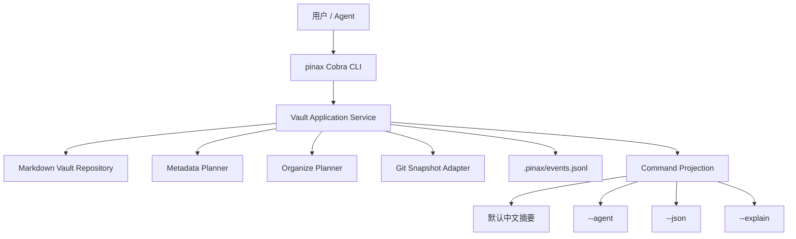

# Design: Pinax Local Vault Organize

## 设计概述

本 change 建立 Pinax 第一条真实自用路径：本地 Markdown vault 是真源，`.pinax/` 保存 CLI/service 生成的投影、计划和事件。整理结构默认先计划后落地，真实写入必须同时满足 `--yes` 和显式 Git snapshot 保护。

## 命令行为

- `pinax init <vault> --title <title>`：创建 vault、`notes/`、`.pinax/`、`.pinax/config.yaml` 和 `.pinax/events.jsonl`。如果 vault 已存在，只补齐缺失目录和配置，不覆盖用户正文。
- `pinax validate --vault <vault>`：扫描 Markdown note、frontmatter、路径边界和 `.pinax/` 基础资产，返回问题和推荐命令。
- `pinax note list/show --vault <vault>`：列出或读取 note，正文可展示，机器输出包含路径、标题、note_id、tags。
- `pinax search <query> --vault <vault>`：在标题、tags、正文中做本地子串搜索；SQLite/GORM 索引留到后续 change，当前实现为可替换的 vault scan。
- `pinax metadata plan/apply --vault <vault>`：为缺 metadata 的 Markdown 生成 frontmatter 补齐计划；apply 需要 `--yes`。
- `pinax organize plan/apply --vault <vault>`：根据标题生成安全 slug，将散落或未规范命名的 Markdown 移入 `notes/`；apply 需要 `--yes` 和 snapshot 保护。
- `pinax git snapshot --vault <vault> --message <message>`：在 vault 内创建 Git commit，并记录 `.pinax/last_snapshot` 作为整理 apply 的保护证据。

## 安全规则

- 所有写入限制在 vault root 内，拒绝 `..`、绝对路径逃逸和 `.pinax/` 非服务写入。
- `organize apply` 无 `--yes` 时只返回 dry-run；无 `.pinax/last_snapshot` 或 `--snapshot-message` 时拒绝写入。
- `--snapshot-message` 会先调用 Git snapshot，再执行整理 apply。
- event 只记录路径、操作、状态和错误码，不记录 provider payload、secret 或完整推理链。
- 新增复杂边界判断、路径安全、frontmatter 合并和 Git adapter 逻辑时添加中文注释说明意图。

## 范围变化

本轮先用 vault scan 完成 search，不引入 SQLite/GORM 索引。GORM index 在后续 `pinax-safe-knowledge-index` change 落地。
