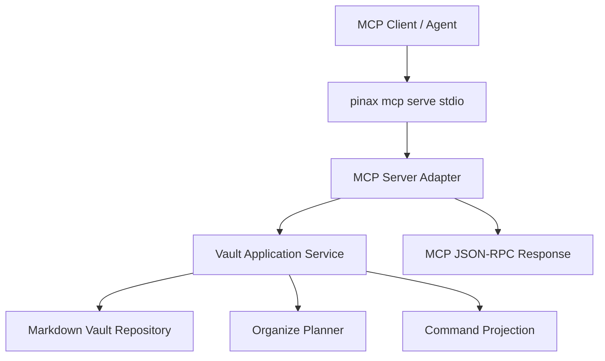

# Design: Pinax MCP Readonly Surface

## 设计概述

MCP surface 是 CLI 的只读 agent 入口，不是第二套业务逻辑。`pinax mcp serve` 通过 stdio 接收 MCP JSON-RPC 请求，转发到同一组 `internal/app` service，并用同一套 projection/redaction 生成 tool/resource payload。

## 暴露范围

- Resources：`pinax://vault/current`、`pinax://note/{note_id}`、`pinax://search/{query}`、`pinax://organize/plan`。
- Tools：`pinax.search`、`pinax.note.read`、`pinax.organize.plan`、`pinax.git.snapshot_plan`。
- Prompts 暂不实现，留到后续 daily review / inbox triage change。

## 安全规则

- MCP server 默认只读；任何写操作返回 `approval_required` 或 `method_not_found`。
- response 不返回 `.pinax/config.yaml` 全量、secret、provider payload 或完整 event log。
- MCP 只报告人可运行的下一步命令，例如 `pinax organize apply --vault <path> --yes`，不直接执行。

## 兼容策略

第一版实现最小 MCP JSON-RPC 方法：`initialize`、`resources/list`、`resources/read`、`tools/list`、`tools/call`。后续可替换为正式 Go MCP SDK，但 app service 和 schema 不变。
