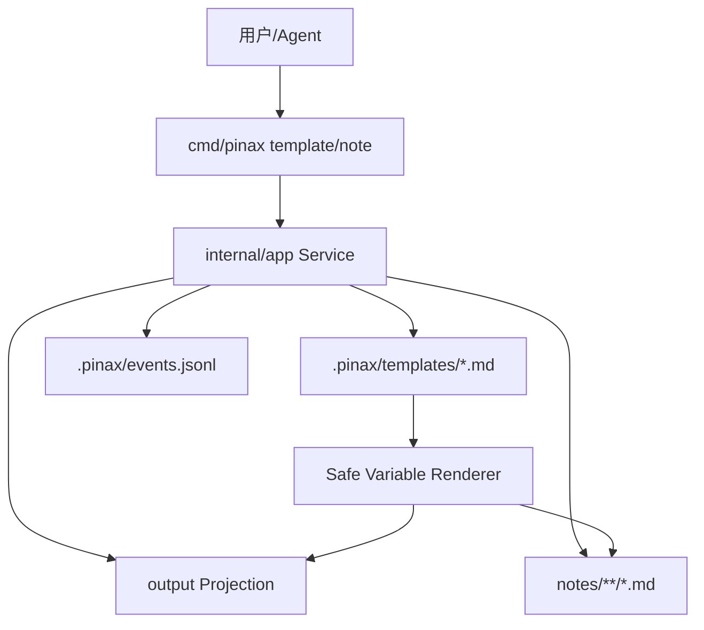

# Design

## Context

当前模板实现已经建立了 `.pinax/templates/*.md` 的文本存储约定和内置模板渲染能力。新设计不推翻现有实现，而是在同一 service 边界内补模板作者 workflow。

## CLI UX

模板管理命令：

```bash
pinax template init --vault ./my-notes
pinax template create meeting --from ./meeting.md --vault ./my-notes
pinax template create daily-review --body "# {{date}}\n\n## 复盘\n" --vault ./my-notes
pinax template create clip --stdin --vault ./my-notes < ./clip-template.md
pinax template list --vault ./my-notes
pinax template show meeting --vault ./my-notes
pinax template validate meeting --vault ./my-notes
pinax template render meeting --title "客户会议" --var client=Acme --var owner=张三 --vault ./my-notes
pinax template delete meeting --vault ./my-notes --yes
```

模板生成笔记：

```bash
pinax note new "客户会议" --template meeting --var client=Acme --var owner=张三 --tags meeting,client --project work --vault ./my-notes
```

规则：

- `template create` 三种内容来源互斥：`--from`、`--body`、`--stdin`。
- 未提供内容来源时返回 `template_source_required`。
- 模板名只允许小写字母、数字、`-`、`_`，文件固定写入 `.pinax/templates/<name>.md`。
- `template delete` 必须显式 `--yes`，不能删除内置模板，除非后续另设 `--force-builtin`，MVP 不做。
- `template validate` 是只读命令，不写文件。
- `template render` 只输出 projection；如果用户要保存成笔记，使用 `note new --template`。

## Data Ownership



- 模板正文是普通 Markdown，可包含 YAML frontmatter、Mermaid fence、YAML fence、Obsidian wiki link、tags 和任意正文。
- `.pinax/templates/*.md` 是用户可编辑文本资产，不需要 SQLite。
- `.pinax/events.jsonl` 记录 `template.create`、`template.delete`、`template.validate` 的 CLI-authored evidence。
- `note new --template` 生成的笔记仍由 `CreateNote` 统一写 frontmatter，模板正文只作为 body。

## Template Variables

MVP 变量语法只支持：

```text
{{title}}
{{date}}
{{datetime}}
{{project}}
{{tags}}
{{client}}
{{owner}}
```

内置变量：`title`、`date`、`datetime`、`project`、`tags`。自定义变量来自重复 `--var key=value`。

变量规则：

- key 只允许 `[A-Za-z_][A-Za-z0-9_:-]*`，避免 shell/path 混淆。
- 未提供的变量保留原样还是报错？MVP 选择报错，返回 `template_variable_missing`，防止生成半成品笔记。
- 未被模板使用的 `--var` 不报错，但在 projection facts 中记录 `unused_vars`，方便用户清理。
- 替换值按纯文本插入，不执行 Markdown、YAML 或 shell 语义。

## Validation

`template validate` 输出：

- `status=success`：无问题。
- `status=partial`：有 warning，例如未使用变量、模板为空、缺少标题。
- `status=failed`：路径不安全、变量语法非法、缺失变量、frontmatter fence 不闭合、代码 fence 不闭合。

校验项：

| Check | Severity | Reason |
| --- | --- | --- |
| template name safe | error | 防止路径穿越 |
| file exists | error | 避免 silent fallback 到内置模板掩盖用户错误 |
| variable token syntax | error | 避免不可预测替换 |
| required vars resolvable under provided context | error for render, warning for validate | render 必须可生成完整正文 |
| frontmatter fence closed | error | 防止生成破坏 Markdown/YAML 的笔记 |
| Markdown code fence closed | error | Mermaid/YAML 代码块必须闭合 |
| template non-empty | warning | 空模板可保存但提示风险 |

## Service Boundaries

建议新增/调整结构：

- `app.TemplateRequest` 扩展：`SourcePath`、`Body`、`StdinBody`、`Vars map[string]string`、`Yes bool`。
- `Service.CreateTemplate(ctx, TemplateRequest)`：创建模板。
- `Service.DeleteTemplate(ctx, TemplateRequest)`：删除模板，要求 `Yes`。
- `Service.ValidateTemplate(ctx, TemplateRequest)`：校验模板。
- `renderTemplateBody(root, req)`：扩展为合并内置变量和自定义变量，并返回 missing/unused vars。
- CLI `splitKeyValueVars([]string)`：解析重复 `--var key=value`，只在命令层做轻量参数整理，复杂校验在 service。

复杂校验逻辑、变量解析、fence 状态机需要中文注释，说明为什么某些 token 失败、为什么不执行模板代码。

## Output Contract

所有命令继续通过 `domain.Projection` 渲染：

- default summary：中文摘要、关键 facts、下一步。
- `--json`：单个 JSON envelope。
- `--agent`：稳定 key=value facts。
- `--events`：start/end NDJSON。
- `--explain`：中文可审查摘要，不包含完整内部推理。

错误码建议：

| Code | Command | Meaning |
| --- | --- | --- |
| `template_source_required` | `template.create` | 未提供 `--from`、`--body` 或 `--stdin` |
| `template_source_conflict` | `template.create` | 同时提供多个来源 |
| `template_conflict` | `template.create` | 模板已存在且未提供 `--overwrite` |
| `builtin_template_protected` | `template.delete` | 内置模板受保护 |
| `template_variable_invalid` | render/create/validate | 变量 key 非法 |
| `template_variable_missing` | render/note new | 模板引用变量但未提供 |
| `template_invalid` | validate/render | frontmatter 或 fence 不闭合 |
| `approval_required` | delete | 缺少 `--yes` |

## Safety

- 模板创建写入前必须通过 `safeJoin(root, ".pinax/templates/<name>.md")` 等价逻辑，不能接受任意目标路径。
- `--from` 只能读取本机文件；读取失败返回稳定错误，不创建空模板。
- `--stdin` 只读取 stdin body，不与 machine output 混用；命令输出仍走 stdout projection。
- `--body` 适合短模板；长模板推荐 `--from`。
- 删除只允许 `.pinax/templates/<name>.md`，不得递归删除目录。

