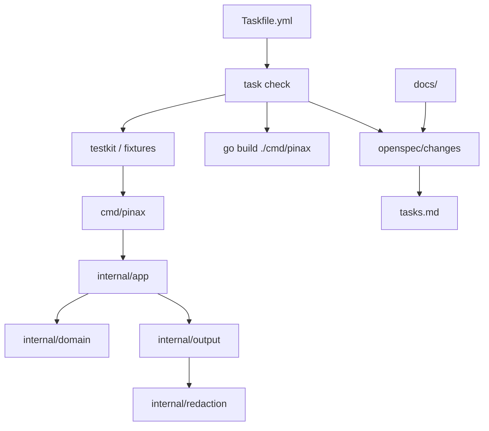

## Context

本 change 落地开发底座，并把后续实现拆成足够细的 Go CLI 开发生态任务。Pinax 的技术选择沿用根级设计：Go/Cobra CLI、GORM repository、testscript command e2e、CLI-backed Provider adapter、AI-native CLI output contract。

## Architecture



## Decisions

- 当前只提供最小 Cobra 入口，确认 Go toolchain、module、测试和 build 可用。
- 新增 `Taskfile.yml` 作为本地开发任务聚合层；`task build` 对齐 Cohors 的体验，底层执行 Go build。
- 业务能力包只保留 `doc.go` ownership marker，避免先写业务逻辑再补 OpenSpec。
- 文档真源放 `cli/pinax/docs/`，根目录不复制项目文档。
- skills profile 由根 `.skills/profiles/targets/cli/pinax.txt` 维护，runtime 副本由 `scripts/skills.sh sync-subprojects` 生成。

## Go Development Ecosystem

开发入口：

```bash
task build
task test
task check
task openspec
```

没有安装 `task` 时，直接运行：

```bash
gofmt -w cmd internal
go test ./...
go build -trimpath -ldflags="-s -w" -o dist/pinax ./cmd/pinax
openspec validate --all
```

后续实现默认新增这些包边界，而不是把逻辑堆到 `cmd/pinax`：

| 包 | 责任 |
| --- | --- |
| `internal/cli` | Cobra command factory、依赖注入、completion |
| `internal/config` | Viper defaults、env、project config、validate |
| `internal/runtime` | clock、filesystem、process runner、context/cancellation |
| `internal/vault` | Markdown vault repository、frontmatter、path safety |
| `internal/index` | SQLite/GORM 索引投影、tag/link/backlink/search |
| `internal/git` | Git status、snapshot plan、rollback hint |
| `internal/provider` | CLI-backed Provider interface 和 fake executable tests |
| `internal/sync` | diff/pull/push/conflict state machine |
| `internal/briefing` | evidence ledger、scoring、review queue、delivery receipt |
| `internal/mcpserver` | stdio MCP resources/tools/prompts |

详细设计见 `docs/architecture/go-development-ecosystem.md`。

## Validation

```bash
task check
```

等价底层命令：

```bash
go test ./...
go build -trimpath -ldflags="-s -w" -o dist/pinax ./cmd/pinax
openspec validate --all
```

## Deferred

- `pinax init`、vault layout、frontmatter schema、GORM index 和 Git adapter。
- `--agent`、`--json`、`--events`、`--explain` projection 实现。
- Provider adapter、sync engine、MCP stdio server 和 briefing workflow。
