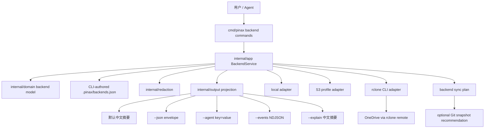
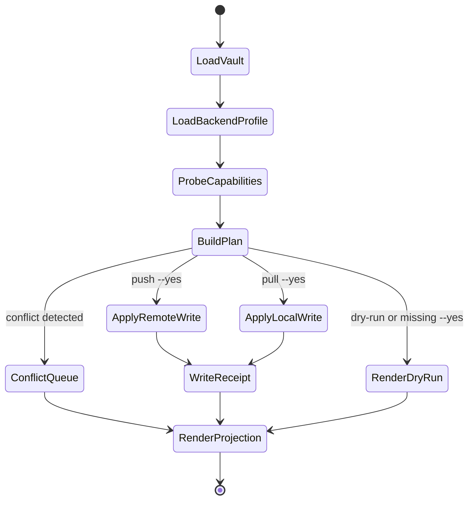

# Design: Pinax Backend Provider CLI

## Context

`pinax storage` 已经能配置 local/S3 backend profile，但它只覆盖存储配置；`pinax sync --target ...` 又覆盖同步计划；未来 rclone/OneDrive/Pinax Cloud 会继续扩大差异。`pinax backend` 应成为用户和 Agent 的统一 provider 控制面：配置、列表、诊断、能力探测、dry-run 同步计划和受控 apply 都从同一个 projection 输出。

## Command Model

首期命令树：

```bash
pinax backend list --vault ./my-notes
pinax backend add local --name local --root ./my-notes --vault ./my-notes
pinax backend add s3 --name work-s3 --bucket notes --region us-east-1 --prefix pinax/ --profile work --vault ./my-notes
pinax backend add rclone --name work-drive --remote workdrive:pinax --vault ./my-notes
pinax backend add onedrive --name personal-drive --remote onedrive:Pinax --vault ./my-notes
pinax backend status --name work-s3 --vault ./my-notes --json
pinax backend doctor --name work-drive --vault ./my-notes --json
pinax backend capabilities --name work-drive --vault ./my-notes --agent
pinax backend diff --name work-drive --vault ./my-notes --json
pinax backend push --name work-drive --vault ./my-notes --dry-run
pinax backend push --name work-drive --vault ./my-notes --yes
pinax backend pull --name work-drive --vault ./my-notes --dry-run
pinax backend pull --name work-drive --vault ./my-notes --yes
pinax backend remove --name work-drive --vault ./my-notes --yes
```

`pinax storage set-s3`、`storage status`、`storage doctor` 保留为兼容入口，内部调用 backend service，并在默认摘要中给出新命令建议。兼容期内不得改变已有 JSON envelope 的稳定字段；新增 backend 字段只能作为可选 data/facts 字段。

## Architecture



## Backend Profile Contract

`.pinax/backends.json` 由 `BackendService` 写入，schema 使用 `pinax.backends.v1`：

```json
{
  "schema_version": "pinax.backends.v1",
  "default_backend": "local",
  "backends": [
    {
      "name": "work-drive",
      "kind": "rclone",
      "remote": "workdrive:pinax",
      "credential_source": "rclone_config",
      "capabilities": ["list", "diff", "pull", "push", "delete", "dry_run"],
      "created_at": "2026-06-06T00:00:00Z",
      "updated_at": "2026-06-06T00:00:00Z"
    }
  ]
}
```

允许的 `kind`：

| Kind | MVP behavior | Credential source | Network behavior |
| --- | --- | --- | --- |
| `local` | 本地文件目录 profile、状态和 plan | none | none |
| `s3` | 复用现有 S3 profile，首期不保存 secret | AWS profile/env/instance role reference | doctor 默认不联网；后续 adapter 可联网 |
| `rclone` | 外部 CLI-backed provider | rclone config / env | doctor/capability 可调用 fake 或真实 rclone；测试用 fake |
| `onedrive` | rclone remote 的语义别名 | rclone onedrive remote | 不直接管理 OAuth token |
| `pinax-cloud` | 未来第一方云端同步 profile | pinax cloud secret ref | 由后续 cloud change 实现 |

## Provider Adapter Contract

每个 adapter 实现同一组能力，但可以声明 `unsupported`：

| Method | Purpose | Notes |
| --- | --- | --- |
| `NormalizeProfile` | 校验并规范化 profile | 不读取 secret，不联网 |
| `Capabilities` | 返回稳定 capability 列表 | 可离线返回静态能力 |
| `Doctor` | 检查配置、外部 CLI、凭据来源和远端可达性 | 默认不打印 raw payload |
| `BuildDiffPlan` | 生成 local/remote 差异计划 | dry-run，只读 |
| `BuildPushPlan` | 生成上传计划 | 缺少 `--yes` 不写远端 |
| `BuildPullPlan` | 生成下载计划 | 缺少 `--yes` 不写本地 |
| `ApplyPush` / `ApplyPull` | 执行受控写入 | 必须有 `--yes`，记录 redacted receipt |

复杂点必须有中文注释：rclone 输出解析、remote path 规范化、dry-run 和 apply 的边界、冲突判断、删除 tombstone、credential source 脱敏。

## Sync Semantics

`backend diff/push/pull` 不替代本地 Git 保护。写本地或远端前，projection 应给出 Git snapshot 建议；如果服务要自动创建 snapshot，必须另建 OpenSpec 明确行为。本 change 只要求输出明确风险和后续命令。

状态机：



## Output Contract

所有 backend 命令从同一个 projection 渲染：

- 默认：中文摘要，包含 `状态`、`Backend`、`能力`、`风险`、`证据` 和一个推荐下一步。
- `--json`：stdout 只输出 JSON envelope，`command` 使用 `backend.<action>`，错误码包含 `BACKEND_NOT_FOUND`、`BACKEND_UNSUPPORTED`、`RCLONE_NOT_FOUND`、`PROVIDER_UNAVAILABLE`、`APPROVAL_REQUIRED`、`CONFLICT_DETECTED`。
- `--agent`：低 token key=value，不包含中文段落或 ANSI。
- `--events`：长操作输出 start/progress/end/error NDJSON；外部 CLI stderr 只能作为脱敏 evidence 摘要进入事件。
- `--explain`：中文可审查摘要，只记录结论、证据、风险、取舍和下一步，不输出完整思维链或 raw provider payload。

## Migration From Storage

现有 `.pinax/storage.json` 不立即删除。实现顺序：

1. `backend list/status` 读取 `.pinax/backends.json`；若不存在但有 `.pinax/storage.json`，投影为一个 legacy backend。
2. `backend add s3` 写 `.pinax/backends.json`，同时保留兼容 `storage status` 能读取。
3. `storage set-*` 内部调用 backend service，默认摘要提示对应 `backend add ...` 命令。
4. 后续单独 change 决定是否归档 `storage` 命令；本 change 不删除现有命令。

## Testing Strategy

- Unit：profile normalization、capability、redaction、plan builder、output projection。
- Command：Cobra 命令参数、approval gate、stdout/stderr 分离、JSON/agent/events/explain。
- Testscript：临时 vault + fake rclone executable + fake remote tree，验证 list/add/doctor/diff/push/pull dry-run 和 `--yes` gate。
- No real secrets：测试不得依赖真实 S3、真实 OneDrive、真实 rclone config 或公网。
- Evidence：integration/e2e 测试入口后续必须写入 `temp/integration-test-runs/<run-id>/`，并脱敏 provider payload 和 secret。
