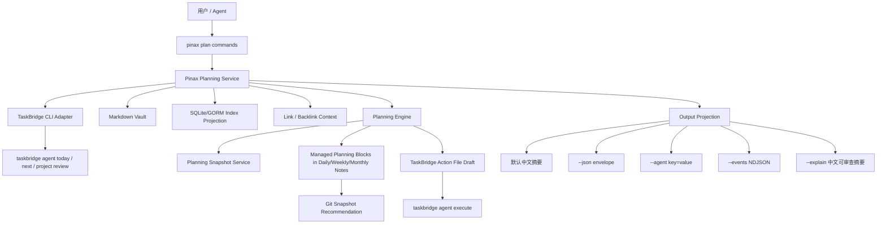
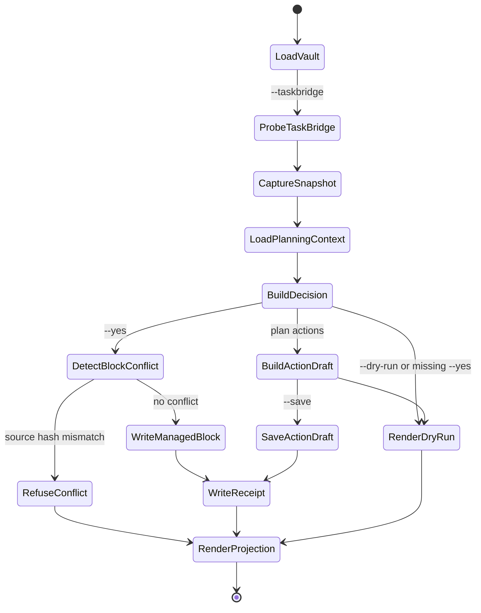

# Design: Pinax TaskBridge Planning Workflows

## 核心设计

Pinax 后续升级不是“笔记 + Todo 列表”，而是以 Markdown vault 为真源的计划记忆系统。它需要表达四类东西：

- `Goal`：长期方向、判断标准、约束和放弃条件。
- `Project`：正在推进的主题、关联笔记、里程碑和风险。
- `Commitment`：日/周/月层面的承诺，不等同于所有任务。
- `Decision`：为什么今天/本周选择这些任务，为什么推迟或放弃另一些任务。

TaskBridge 提供任务事实，Pinax 负责解释和沉淀。

## 架构



## 命令模型

首期命令树：

```bash
pinax plan daily --vault ./my-notes --taskbridge --dry-run --json
pinax plan daily --vault ./my-notes --taskbridge --yes
pinax plan weekly --vault ./my-notes --taskbridge --dry-run --json
pinax plan weekly --vault ./my-notes --taskbridge --yes
pinax plan monthly --vault ./my-notes --taskbridge --dry-run --json
pinax plan monthly --vault ./my-notes --taskbridge --yes
pinax plan review --vault ./my-notes --period daily --json
pinax plan actions --vault ./my-notes --from daily --dry-run --json
pinax plan actions --vault ./my-notes --from weekly --save --json
pinax plan snapshot --vault ./my-notes --taskbridge --json
```

`--taskbridge` 表示从 TaskBridge CLI 读取任务事实。后续可以支持 `--snapshot <id>` 重放历史快照，便于测试和复盘。

## TaskBridge Adapter 边界

Pinax 只允许通过 TaskBridge CLI 的稳定输出读取任务和生成 action file：

```bash
taskbridge agent capabilities
taskbridge agent today
taskbridge next --format json
taskbridge review --format json
```

如果某些命令尚未稳定，Pinax adapter 应降级为 capability warning，而不是直接读取 TaskBridge store 文件。

禁止行为：

- 不 import `cli/taskbridge/internal/...`。
- 不读取 `~/.taskbridge/tasks.json`、`projects.json` 或 token 文件。
- 不持有 provider token。
- 不绕过 `taskbridge agent execute` 写远端 Provider。

复杂协议转换必须加简短中文注释，说明字段映射、缺失字段降级和安全边界。

## 数据合同

### Planning Snapshot

`.pinax/planning/snapshots/<snapshot_id>.json` 由 service 写入，schema 为 `pinax.planning.snapshot.v1`：

```json
{
  "schema_version": "pinax.planning.snapshot.v1",
  "snapshot_id": "plan_snap_01J00000000000000000000000",
  "source": "taskbridge",
  "captured_at": "2026-06-06T09:00:00+08:00",
  "taskbridge": {
    "capabilities_ok": true,
    "today_request_id": "req_20260606_090000",
    "schema": "taskbridge.agent-result.v1"
  },
  "facts": {
    "must_do_count": 3,
    "overdue_count": 4,
    "project_next_count": 2,
    "inbox_count": 5
  },
  "risks": [
    {
      "code": "OVER_CAPACITY",
      "message": "今日任务量超过可用容量",
      "evidence": ["must_do_count=3", "overdue_count=4"]
    }
  ]
}
```

Snapshot 保存的是归一化事实和脱敏证据，不保存 provider token、raw prompt、隐藏系统提示、未脱敏 provider payload 或完整思维链。

### Managed Planning Block

Pinax 在 daily/weekly/monthly Markdown note 中维护受管理区块，不覆盖用户正文：

```markdown
<!-- pinax:plan daily start id=plan_2026-06-06 -->
## 今日计划

### 承诺

- [ ] 完成 TaskBridge planning adapter 设计

### 为什么是这些

- 今日只选择 2 个深度任务，因为逾期任务需要先止血。

### 风险

- 任务过载：建议推迟 2 个低价值任务。

### 晚间复盘

- 完成：
- 推迟：
- 明天继承：
<!-- pinax:plan daily end -->
```

更新策略：只替换同 id 或同 period 的受管理区块；用户在区块外的正文不得被改写。若用户修改了受管理区块且 source hash 不匹配，`--yes` 应拒绝并返回 `PLANNING_BLOCK_CONFLICT`，除非后续引入显式 `--force`。

### Planning Decision

每次生成计划都输出决策摘要：

```json
{
  "schema_version": "pinax.planning.decision.v1",
  "decision_id": "plan_dec_01J00000000000000000000000",
  "period": "daily",
  "selected": ["task_1", "task_2"],
  "deferred": ["task_3"],
  "reasons": [
    {
      "kind": "capacity",
      "summary": "今日容量不足，优先保留最高风险任务",
      "evidence_refs": ["snapshot:must_do_count", "snapshot:overdue_count"]
    }
  ],
  "next_actions": ["pinax daily open --vault ./my-notes"]
}
```

这是中文可审查推理摘要，不保存完整 chain-of-thought。

### TaskBridge Action Draft

`pinax plan actions` 可以保存 `taskbridge.actions.v1` 草稿。默认写到 `.pinax/planning/actions/<action_id>.json`，并在输出里给出下一步命令：

```bash
taskbridge agent execute --action-file .pinax/planning/actions/actions-abc123.json --dry-run
```

Pinax 保存 action file 时必须通过 service 写入，并附带 source decision id、snapshot id 和 redacted event。

## 计划引擎规则

MVP 使用保守、可解释的启发式，不引入复杂 AI 自动排程：

| 维度 | 规则 |
| --- | --- |
| 容量 | 每日最多 1-3 个深度承诺，超出进入风险/推迟建议 |
| 截止 | 今日和逾期任务优先，但可被低价值/已失效标记降权 |
| 项目连续性 | 活跃项目如果多日没有 next，应进入 weekly risk |
| 长期目标 | goal/project notes 只影响推荐解释，不自动创建远期 Todo |
| Inbox | inbox 任务默认进入整理建议，不自动承诺为今日任务 |
| 复盘 | 未完成承诺进入第二天候选，但连续滚动超过阈值后建议放弃/重写 |

所有非显然选择逻辑必须有中文注释，尤其是容量判断、滚动继承、项目风险、action draft 生成和冲突处理。

## 状态机



## 输出合同

- 默认输出：中文摘要，包含期间、承诺数量、风险、证据来源、是否写入、推荐下一步。
- `--json`：stdout 只输出 JSON envelope，`command` 使用 `plan.daily`、`plan.weekly`、`plan.monthly`、`plan.actions`。
- `--agent`：输出低 token key=value，例如 `period=daily status=ok selected_count=3 risk_count=2 snapshot_id=...`。
- `--events`：长流程输出 NDJSON start/progress/end/error，不包含 raw provider payload。
- `--explain`：输出中文可审查摘要：结论、关键依据、风险、取舍、下一步和证据引用。

错误码建议：`TASKBRIDGE_UNAVAILABLE`、`TASKBRIDGE_CONTRACT_UNSUPPORTED`、`PLANNING_BLOCK_CONFLICT`、`APPROVAL_REQUIRED`、`ACTION_DRAFT_INVALID`、`VAULT_CONTEXT_STALE`。

## 与现有能力关系

- `daily/weekly/monthly`：计划命令复用 journal note 路径和创建逻辑。
- `index/search`：计划上下文读取 goal/project/review notes 时优先使用 fresh index，缺失时降级扫描并给出 `pinax index rebuild` next action。
- `project`：Pinax project metadata 用于解释笔记归属，不替代 TaskBridge project execution。
- `organize/repair`：计划生成不自动整理 vault，最多给出建议。
- `mcp serve`：MVP 可新增只读 planning resources，不能提供写工具。

## 测试策略

- Unit：TaskBridge adapter contract、snapshot normalization、capacity/risk heuristic、managed block patch、action draft validation。
- Command：`plan daily/weekly/monthly/actions` 参数、dry-run/yes gate、stdout/stderr 分离、错误 envelope。
- Testscript：临时 vault + fake taskbridge executable + fixture daily/weekly/monthly notes，验证无真实 provider、无真实 token、无用户 vault 依赖。
- Redaction：确保 action draft、snapshot、events、explain 不包含 token、Authorization header、raw prompt、provider payload 或完整思维链。
- Integration evidence：如新增 integration/e2e runner，必须写入 `temp/integration-test-runs/<run-id>/`。

## 延期项

- 自动日历排程和时间块安排。
- 长期 daemon、系统通知和后台 watcher。
- LLM 自由生成计划正文。
- Pinax 直接写远端 Todo provider。
- 多人协作计划和云端合并。

