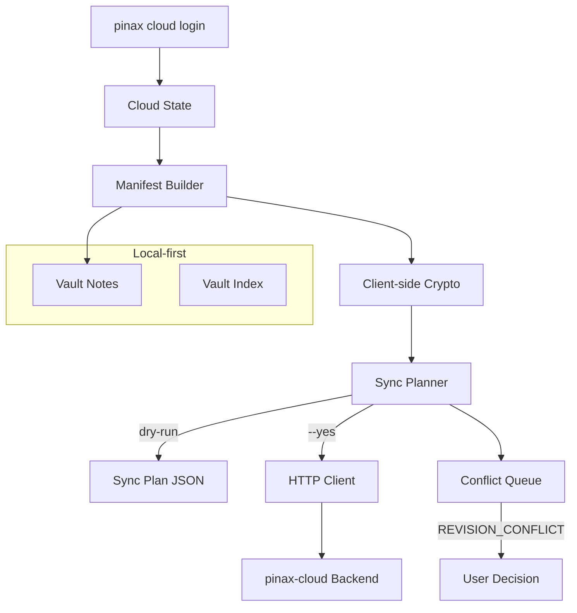

## Context

根 `pinax-cloud-storage-backend` 设计已完成。本 change 实现 Pinax CLI 内的云同步客户端。

## Goals / Non-Goals

**Goals:**

- Phase 1: Fake Cloud Client（fake HTTP server 下 encrypted manifest/blob、diff/push/pull dry-run 和冲突队列）。
- Phase 3: Two-device E2E（两个本地 vault 通过本地后端同步）。
- 端侧加密确保明文不离开本地。
- Local-only 模式完整可用，所有普通笔记命令不依赖 cloud backend。

**Non-Goals:**

- 不实现后端 API server。
- 不改变本地优先工作流。

## Decisions

### 1. 端侧加密

Manifest 和 blob 使用 client-side encryption（path hash + encrypted blob envelope）。明文不离开本地，后端只看到加密数据。

### 2. Local-only 默认可用

所有普通笔记、vault 和索引命令在无后端时正常工作。Cloud 命令只在用户配置后端时可用。

### 3. Fake HTTP server for testing

使用 fake HTTP server 模拟后端行为，支持本地开发和 E2E 测试。

## Risks

- 加密实现安全性 -> 使用经过审计的 crypto 库，通过 testscript e2e 验证。
- 冲突处理复杂性 -> MVP 只支持手动解决，后续可加自动合并。
