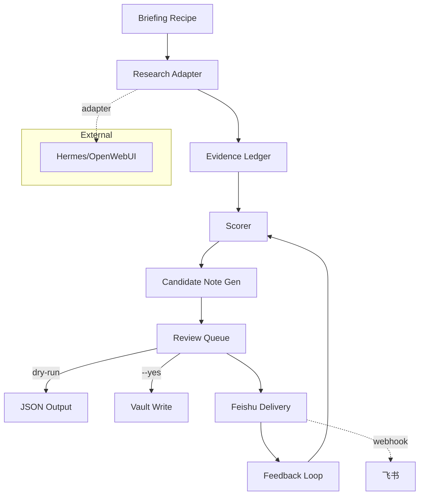

## Context

根 `pinax-daily-hot-notes-briefing` 设计已完成。本 change 实现 Pinax CLI 内的 briefing 全链路。

## Goals / Non-Goals

**Goals:**

- Phase 1: Local Briefing Dry Run（fake evidence ledger → scorer → `--json` top candidates）。
- Phase 2: Candidate Notes Review Queue（`--yes` 写 review candidate notes、events）。
- Phase 3: Hermes Research Integration（外部服务配置 + fake harness）。
- Phase 4: Feishu Delivery and Feedback（webhook MVP + fake sender）。
- Hermes 作为外部服务配置，本地开发使用 fake fixture。
- 飞书 MVP 使用 webhook adapter，不引入原生 SDK。

**Non-Goals:**

- 不实现 Hermes research harness 本体。
- 不在 MVP 使用原生飞书 SDK。
- 不改变 Pinax 核心笔记和索引功能。

## Decisions

### 1. Hermes 作为外部服务

`backend-server/openwebui-hermes` 当前无独立 owner。Pinax 通过 research adapter 接口与 Hermes 交互，本地开发和测试使用 fake harness fixture。Hermes endpoint/capability 在 Pinax 配置中登记。

### 2. 飞书 delivery MVP 使用 webhook

优先实现 webhook adapter，使用 HTTP POST 发送 briefing 消息。不引入 `lark-cli` 或原生 SDK 作为 MVP 依赖。后续可在 OpenSpec 中论证升级到 SDK。

### 3. 结构化资产由 CLI service 写入

Briefing recipe、evidence ledger、candidate note、delivery receipt、feedback event 等机器可读资产必须由 CLI service 创建和修改，agent 不直接手写。

## Risks

- Hermes 不可用 -> fake fixture 覆盖本地开发和测试。
- 飞书 webhook secret 管理 -> 通过 secret_ref 和脱敏 gate 控制。
- 评分算法调优 -> MVP 先使用简单加权，后续迭代优化。
