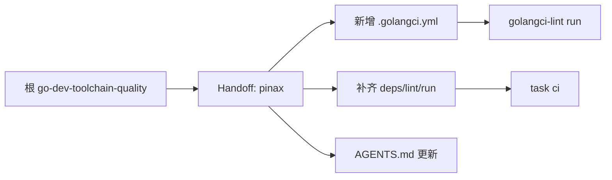

## Context

`cli/pinax` Taskfile 简洁，无 lint 配置和热加载。本项目属于"新增 lint + 补齐 Taskfile"类型。

## Goals / Non-Goals

**Goals:**

- 新增 `.golangci.yml`，覆盖基线 linters。
- 补齐 `deps`、`mod-check`、`fmt`、`fmt-check`、`lint`、`run` 任务。
- 明确热加载不适用。

**Non-Goals:**

- 不新增 Air 热加载。Pinax 有多个短生命周期 CLI 命令，没有长期运行开发入口。

## Risks

- lint 新增可能暴露大量历史债 -> 按 staged linters 处理。
