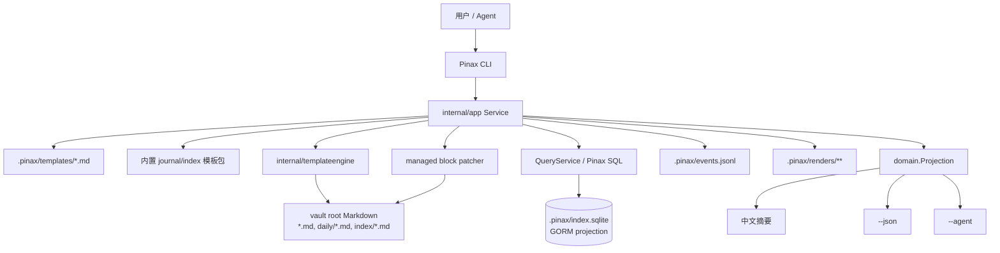

## Context

Pinax 已经具备本地 Markdown vault、SQLite/GORM index projection、journal daily/weekly/monthly、template v2 和 query-backed template。当前薄弱点不是缺模板语法，而是日记和 index 的产品模型没有模板化：`builtInTemplates()` 里的 `daily` 是 simple token 文本，`ensureJournalNote` 直接拼正文，`appendDailyIndex` 又在 service 内硬编码创建 daily index 内容。

本设计把“日记正文结构”和“索引页结构”提升为内置模板包，并让 CLI 能够 inspect、preview、create 和 refresh。模板正文仍是 Markdown 真源，结构化事件、render runs、index page 状态和 evidence 必须由 Pinax service 写入。

## Goals / Non-Goals

**Goals:**

- 内置 journal/index 模板具备 v2 frontmatter、变量 schema、默认 metadata、输出路径和示例上下文。
- 新 vault 的默认笔记内容根是 vault 根目录；普通笔记、daily、weekly、monthly 和 index page 不再默认放入 `notes/`。
- `pinax journal daily open` 首次创建 daily note 时使用 `journal.daily` 模板，用户已有 daily note 不被重写。
- `index.home`、`index.projects`、`index.inbox` 能通过本地 index projection 生成可刷新的 Markdown index 页面。
- managed block 刷新只 patch Pinax 托管区块，保留用户在同一篇 Markdown 中写的正文。
- CLI 输出继续遵守中文 human summary、稳定 `--json` envelope、`--agent` key=value 和 stdout/stderr 分离。

**Non-Goals:**

- 不新增远端 provider、云同步或网络检索能力。
- 不让 index page 成为数据库真源；SQLite/GORM index 仍是可重建 projection。
- 不让模板 query 执行 raw SQLite 或动态字符串拼接。
- 不在本 change 中实现 template marketplace、Web/TUI 编辑器或复杂模板继承。

## Architecture



## Template Contract

### Vault Content Layout

Pinax 新 vault 的默认内容布局以 vault 根目录为用户笔记空间：

```text
my-notes/
  README.md                 # 可选的人类说明，不是 Pinax 机器资产
  demo.md                   # 默认普通笔记
  inbox/idea.md             # inbox 或用户自建文件夹
  daily/2026-06-08.md       # journal.daily
  weekly/2026-W24.md        # journal.weekly
  monthly/2026-06.md        # journal.monthly
  index/home.md             # index.home 系统导航页
  index/projects.md         # index.projects 系统导航页
  attachments/              # 用户附件目录，不作为默认笔记输出位置
  .pinax/                   # Pinax 结构化资产
```

安全边界不是 `notes/` 前缀，而是 vault-relative content path：路径必须位于 vault 内，不能是绝对路径，不能包含 `..`，不能写入 `.pinax/`、`.git/`、`temp/`、`dist/`、`node_modules/`、`vendor/`、`attachments/` 等保留目录。`notes/` 作为旧 vault 兼容路径继续可读、可解析、可引用，但新模板和新命令示例不再推荐它。

### Journal Template

Journal 模板使用 `kind: journal_template`，由 journal 命令消费。首版内置三类：

- `journal.daily` -> `daily/{{ .Date }}.md`
- `journal.weekly` -> `weekly/{{ .Week }}.md`
- `journal.monthly` -> `monthly/{{ .Month }}.md`

推荐 daily 模板形态：

```markdown
---
schema_version: pinax.template.v2
kind: journal_template
name: journal.daily
title: 每日笔记
engine: go-template
output:
  path_pattern: daily/{{ .Date }}.md
defaults:
  kind: daily
  status: active
  tags: [daily]
variables:
  date:
    type: date
    required: true
  weekday:
    type: string
    required: false
queries:
  inbox_today:
    language: sql
    text: SELECT title, status, path FROM notes WHERE kind = "inbox" OR status = "inbox" ORDER BY updated_at DESC LIMIT 10
    required: false
---

# {{ .Date }} {{ .Vars.weekday }}

## 今日重点

- 

## 记录

- 

## Pinax 捕获
<!-- pinax:managed name=daily-captures -->
{{ table .Queries.inbox_today }}
<!-- /pinax:managed -->

## 复盘

### 做成了什么

### 卡住了什么

### 明天继续
```

`journal weekly/monthly` 不应复制 daily 捕获流水；它们应偏复盘，默认 query 最近周期内 active/done notes，并保留手写总结区。

### Task-Oriented Note Templates

Pinax 的模板不能只是“Markdown 片段库”。默认模板需要覆盖用户每天会重复发生的工作，并且每个模板都要告诉用户三件事：适用场景、生成路径、下一步。首版内置模板按场景分为 starter pack 和 focused pack。

Starter pack 默认出现在 `template list` 的推荐区：

| Template | Use case | Default path | Kind/status/tags | Key variables |
| --- | --- | --- | --- | --- |
| `note.quick` | 快速普通笔记 | `{{ .Slug }}.md` | `note/active/[note]` | `title` |
| `inbox.capture` | 临时想法、稍后整理 | `inbox/{{ .Slug }}.md` | `inbox/inbox/[inbox]` | `title`, `source` |
| `meeting.notes` | 会议纪要和行动项 | `meetings/{{ .Date }}-{{ .Slug }}.md` | `meeting/active/[meeting]` | `participants`, `topic`, `date` |
| `decision.record` | ADR/产品/技术决策 | `decisions/{{ .Date }}-{{ .Slug }}.md` | `decision/active/[decision]` | `context`, `decision`, `owner` |
| `project.brief` | 项目首页/项目 brief | `projects/{{ .Slug }}.md` | `project/active/[project]` | `goal`, `owner`, `status` |

Focused pack 覆盖知识沉淀和长期资料：

| Template | Use case | Default path | Kind/status/tags | Key variables |
| --- | --- | --- | --- | --- |
| `learning.video` | 视频/课程学习 | `learning/videos/{{ .Slug }}.md` | `learning/active/[learning, video]` | `url`, `source`, `teacher` |
| `learning.book` | 书籍/长文阅读 | `learning/books/{{ .Slug }}.md` | `learning/active/[learning, book]` | `author`, `source` |
| `research.topic` | 研究主题汇总 | `research/{{ .Slug }}.md` | `research/active/[research]` | `question`, `scope` |
| `person.profile` | 人物/联系人/客户档案 | `people/{{ .Slug }}.md` | `person/active/[person]` | `role`, `org`, `contact` |

每个 note template 的 body 应遵守这些设计原则：

- 第一屏包含可直接填写的主内容，不用先读说明。
- section 名称短而稳定，便于搜索、agent 补全和后续 index 查询。
- 默认包含 `## 下一步` 或 `## Action Items` 区域；会议、决策和项目模板必须能提炼待办。
- 变量少而明确；能从 title/date/project/tags 推导的值不要要求用户重复输入。
- 不把空泛框架堆满正文；模板应给“刚好够用”的结构，减少用户删改成本。

推荐 `meeting.notes` 正文形态：

```markdown
---
schema_version: pinax.template.v2
kind: note_template
name: meeting.notes
title: 会议纪要
engine: go-template
output:
  path_pattern: meetings/{{ .Date }}-{{ .Slug }}.md
defaults:
  kind: meeting
  status: active
  tags: [meeting]
variables:
  participants:
    type: string
    required: false
    description: 参会人
  topic:
    type: string
    required: false
    description: 会议主题
---

# {{ .Title }}

时间：{{ .Date }}
参会：{{ default "" .Vars.participants }}

## 结论

- 

## 讨论

- 

## Action Items

- [ ] 负责人 / 事项 / 日期

## 关联

- 项目：
- 决策：
```

推荐 `decision.record` 正文形态：

```markdown
---
schema_version: pinax.template.v2
kind: note_template
name: decision.record
title: 决策记录
engine: go-template
output:
  path_pattern: decisions/{{ .Date }}-{{ .Slug }}.md
defaults:
  kind: decision
  status: active
  tags: [decision]
variables:
  owner:
    type: string
    required: false
    description: 决策 owner
---

# {{ .Title }}

Owner：{{ default "" .Vars.owner }}
Status：proposed

## 背景

## 选项

1. 

## 决策

## 影响

## 复查日期
```

推荐 `project.brief` 正文形态：

```markdown
---
schema_version: pinax.template.v2
kind: note_template
name: project.brief
title: 项目 Brief
engine: go-template
output:
  path_pattern: projects/{{ .Slug }}.md
defaults:
  kind: project
  status: active
  tags: [project]
variables:
  goal:
    type: string
    required: false
    description: 项目目标
---

# {{ .Title }}

## 目标

{{ default "" .Vars.goal }}

## 当前状态

- 状态：active
- Owner：

## 里程碑

- [ ] 

## 决策

## 会议

## 风险
```

推荐 `research.topic` 正文形态：

```markdown
---
schema_version: pinax.template.v2
kind: note_template
name: research.topic
title: 研究主题
engine: go-template
output:
  path_pattern: research/{{ .Slug }}.md
defaults:
  kind: research
  status: active
  tags: [research]
variables:
  question:
    type: string
    required: false
    description: 核心问题
---

# {{ .Title }}

## 问题

{{ default "" .Vars.question }}

## 已知事实

- 

## 假设

- 

## 证据

- 

## 结论

## 后续
```

### Index Template

Index 模板使用 `kind: index_template`，由 `pinax index page` 命令消费。首版内置三类：

- `index.home` -> `index/home.md`
- `index.projects` -> `index/projects.md`
- `index.inbox` -> `index/inbox.md`
- `index.decisions` -> `index/decisions.md`
- `index.learning` -> `index/learning.md`
- `index.meetings` -> `index/meetings.md`
- `index.research` -> `index/research.md`

推荐 home 模板形态：

```markdown
---
schema_version: pinax.template.v2
kind: index_template
name: index.home
title: 知识库首页
engine: go-template
output:
  path_pattern: index/home.md
defaults:
  kind: index
  status: system
  tags: [index]
queries:
  recent:
    language: sql
    text: SELECT title, kind, status, updated_at, path FROM notes ORDER BY updated_at DESC LIMIT 20
  active_projects:
    language: sql
    text: SELECT title, status, due, path FROM notes WHERE tags CONTAINS "project" AND status = "active" ORDER BY updated_at DESC LIMIT 20
  inbox:
    language: sql
    text: SELECT title, updated_at, path FROM notes WHERE kind = "inbox" OR status = "inbox" ORDER BY updated_at DESC LIMIT 20
---

# 知识库首页

## 最近更新
<!-- pinax:managed name=recent -->
{{ table .Queries.recent }}
<!-- /pinax:managed -->

## 活跃项目
<!-- pinax:managed name=active-projects -->
{{ table .Queries.active_projects }}
<!-- /pinax:managed -->

## Inbox
<!-- pinax:managed name=inbox -->
{{ table .Queries.inbox }}
<!-- /pinax:managed -->
```

补充 index 模板应直接服务上面的 note 模板，让用户能从导航页回到真实工作流：

| Index template | Default path | Managed query blocks |
| --- | --- | --- |
| `index.projects` | `index/projects.md` | active projects, stale projects, recent project notes |
| `index.inbox` | `index/inbox.md` | inbox backlog, oldest inbox, recently captured |
| `index.decisions` | `index/decisions.md` | proposed decisions, accepted decisions, decisions needing review |
| `index.learning` | `index/learning.md` | active learning notes, videos, books, unreviewed highlights |
| `index.meetings` | `index/meetings.md` | recent meetings, open action items, meetings without linked project |
| `index.research` | `index/research.md` | active research topics, evidence notes, unanswered questions |

这些 index 模板不是报表系统。它们只提供导航和复盘入口，默认 limit 必须保守，正文必须允许用户在 managed blocks 之外写自己的说明。

### Template Discovery And Recommendation

为了让模板“好用”，Pinax 需要在模板 metadata 里记录推荐语义，而不是依赖用户记名字。新增 metadata 字段：

```yaml
use_cases: [meeting, actions, project]
aliases: [meeting, 会议, 纪要]
difficulty: starter
starter: true
after_create_actions:
  - name: preview
    command: pinax template preview meeting.notes --vault {{ .Vault }}
  - name: create_note
    command: pinax note add "{{ .Title }}" --template meeting.notes --vault {{ .Vault }}
```

推荐命令面：

```bash
pinax template list --pack starter --vault ./my-notes
pinax template list --use-case meeting --vault ./my-notes --json
pinax template recommend --intent meeting --vault ./my-notes --json
pinax template inspect meeting.notes --vault ./my-notes --json
```

规则：

- `template list` 默认先显示 starter templates，再显示 focused/index/journal/legacy。
- `template recommend --intent <text>` 首版只做本地 metadata 匹配，不调用 LLM、不联网、不写 `.pinax`。
- 推荐结果必须给出 1 个 primary template 和最多 3 个 alternatives，并附真实 next action。
- 未匹配到 intent 时，fallback 到 `note.quick` 和 `inbox.capture`，不要返回空列表。
- `template inspect` 对 starter 模板必须显示“适合什么场景”和“建议下一步”。

## CLI UX

模板作者和使用路径：

```bash
pinax template inspect journal.daily --vault ./my-notes --json
pinax template preview journal.daily --title "Daily 2026-06-08" --vault ./my-notes
pinax journal daily open --template journal.daily --vault ./my-notes
pinax journal weekly open --template journal.weekly --vault ./my-notes
pinax index page create home --template index.home --vault ./my-notes --json
pinax index page preview home --vault ./my-notes
pinax index page refresh home --vault ./my-notes --json
```

规则：

- `journal daily open` 未指定模板时默认使用 `journal.daily`；若 `.pinax/templates/journal.daily.md` 存在，优先使用用户覆盖版本，否则使用内置版本。
- `index page create <name>` 只创建缺失页面；已存在时返回 `index_page_exists`，除非后续显式支持 `--overwrite`。
- `index page refresh <name>` 只更新 managed blocks；缺失 managed block 返回 `managed_block_missing`，不重写整篇文件。
- `index page preview <name>` 只输出渲染结果，不写 note、`.pinax`、Git 或 provider state。
- `template inspect` 对 journal/index 模板展示 `template_kind`、`path_pattern`、`managed_blocks`、`query_count`、`example_vars` 和 `refreshable=true|false` facts。

### Template Completion UX

当前 `template` 命令最影响手感的问题不是缺少语法，而是用户很难靠 Tab 发现“我现在能用哪个模板、这个模板需要哪些变量、下一步该执行什么”。本 change 需要把补全当成命令合同的一部分，而不是实现细节。

补全目标：

- 用户输入 `pinax template inspect <TAB>`、`pinax template preview <TAB>`、`pinax template render <TAB>`、`pinax template validate <TAB>`、`pinax template show <TAB>`、`pinax template delete <TAB>` 时，应看到模板候选，而不是文件名候选。
- 候选必须合并三类来源：内置模板、vault-local 模板、legacy simple 模板。vault-local 同名模板覆盖 built-in 时，候选描述必须标出 `override`。
- 候选描述应包含最有用的短事实：`journal_template`、`index_template`、`note_template`、`legacy`、`builtin`、`local`、`override`、`query-backed`、`refreshable`。
- 所有模板名候选返回 `ShellCompDirectiveNoFileComp`，避免 shell 文件名混进模板列表。
- 补全只允许读 `.pinax/templates/*.md`、内置模板 registry 和必要的轻量 metadata；不得执行模板、执行 SQL、触发 index rebuild、写 `.pinax`、写 Markdown、调用 Git/provider/remote。
- 如果 vault 尚未初始化或 `.pinax/templates` 缺失，补全仍然应返回内置模板候选；不能因为本地目录不存在就降级成文件补全。

推荐候选示例：

```text
journal.daily	builtin journal_template daily note, refreshable
journal.weekly	builtin journal_template weekly review
index.home	builtin index_template query-backed, refreshable
index.projects	builtin index_template query-backed, refreshable
meeting	local note_template
daily	legacy builtin simple template
```

上下文补全规则：

- `pinax template create <name> --engine <TAB>` 补 `simple` 和 `go-template`。
- `pinax template create <name> --from <TAB>` 只做本地文件补全，优先描述 Markdown 文件；这是读取用户源文件的场景，可以保留文件补全。
- `pinax template render <template> --var <TAB>`、`pinax template preview <template> --var <TAB>` 和 `pinax note new <title> --template <template> --var <TAB>` 根据模板 `variables` schema 补 `key=`，描述包含 required/optional、type 和中文说明。例如 `url=	required string 视频链接`。
- `pinax template render <template> --run <TAB>` 保持现有 render run 补全，但描述要从 `render-run` 提升为可判断的新鲜度信息：`alias render_run latest, title=..., created=..., stale|fresh`。
- `pinax journal daily open --template <TAB>` 只补 `journal_template`；daily/weekly/monthly 分别优先补 period 对应模板，但允许用户显式选择其它 journal 模板。
- `pinax index page create home --template <TAB>` 和 `pinax index page preview home --template <TAB>` 只补 `index_template`。
- `pinax template delete <TAB>` 默认只补 vault-local 自定义模板，不补 built-in；如果后续支持删除本地 override，也只删除 `.pinax/templates/<name>.md`，描述标出 `local` 或 `override`。

补全实现建议：

- 在 CLI 层新增统一 helper，例如 `templateNameCompletion(vaultPath, filter)`，由各 template/journal/index/note 命令复用。
- metadata 读取应走 template registry/service 的只读方法，避免 CLI 层复制解析逻辑；但 completion 不应创建 app event 或 render run。
- filter 至少支持 `all`、`executable`、`journal`、`index`、`local_deletable`。
- 对格式损坏的本地模板，仍返回候选，但描述为 `local invalid`；执行 `inspect/validate` 时再给详细错误。

### Concrete Next Actions

每个 `template` 子命令默认人类输出、`--json` envelope 和 `--agent` 都必须携带可执行下一步。下一步不是泛泛的“查看帮助”，而是根据当前模板状态和用户意图生成真实命令。

推荐 action 规则：

| Command | Success next action | Failure/partial next action |
| --- | --- | --- |
| `template list` | `pinax template inspect journal.daily --vault <vault> --json` 或 inspect 第一条推荐模板 | vault 未初始化时给 `pinax init <vault>` 或 `pinax template init --vault <vault>` |
| `template inspect <name>` | executable 模板给 `pinax template preview <name> --vault <vault>`；journal 模板给 `pinax journal daily open --template <name> --vault <vault>`；index 模板给 `pinax index page preview home --template <name> --vault <vault>` | invalid/schema 问题给 `pinax template validate <name> --vault <vault> --json` |
| `template preview <name>` | note 模板给 `pinax note new "<title>" --template <name> --vault <vault>`；journal 模板给对应 `pinax journal ... open --template <name>`；index 模板给 `pinax index page create <page> --template <name> --vault <vault> --json` | query stale 给 `pinax index rebuild --vault <vault> --json` |
| `template render <name>` | 有 `--save-run` 时给 `pinax template render <name> --run <alias> --vault <vault> --json`；无保存时给 `pinax note new "<title>" --template <name> --vault <vault>` | 缺变量时给补齐后的命令骨架：`pinax template render <name> --var <missing>=... --vault <vault>` |
| `template create <name>` | `pinax template inspect <name> --vault <vault> --json` | source 冲突给只保留一种 source 的示例 |
| `template validate <name>` | success 给 `pinax template preview <name> --vault <vault>` | failed 给 `pinax template inspect <name> --vault <vault> --json` |
| `template delete <name>` | `pinax template list --vault <vault>` | 缺 `--yes` 给 `pinax template delete <name> --vault <vault> --yes` |

输出合同：

- default human 输出只展示一个“推荐下一步”，可附最多两个“可选下一步”。
- `--json` 使用 envelope 的 `actions` 数组，字段至少包含 `name`、`command`、`reason`。
- `--agent` 使用 `action.primary=...` 和可选 `action.inspect=...`、`action.repair=...`，不得输出中文 prose。
- 下一步命令必须包含当前 vault 参数；如果用户显式传入 `--json`、`--agent` 等机器模式，action 中推荐的下一条命令按当前场景选择最有用的模式，不盲目继承所有输出 flag。
- action 中不得包含 secret-like `--var token=...` 原值；缺变量只输出 `<redacted>` 或 `...` 占位。

## Data And Safety Contracts

- 模板文件：`.pinax/templates/<name>.md`，用户可编辑；CLI/service 创建和规范化 frontmatter。
- 普通 notes：默认直接写入 vault 根目录，例如 `demo.md`；用户选择 `--dir inbox` 时写入 `inbox/<slug>.md`。旧 `notes/<path>.md` 继续作为兼容路径可读。
- Journal notes：`daily|weekly|monthly/*.md`，普通 Markdown 真源，首次创建时由 service 写入 Pinax note frontmatter。
- Index pages：`index/*.md`，`kind=index`、`status=system`，普通 note 列表、orphan 检测和最近更新 query 默认排除，除非用户显式包含 system notes。
- Managed blocks：只允许 `<!-- pinax:managed name=<safe-name> -->` 和 `<!-- /pinax:managed -->` 成对出现；name 只能包含小写字母、数字、`-`、`_`。
- Query-backed templates：只调用现有 Pinax SQL parser/planner/query service；不拼 raw SQLite SQL，不读取完整 note body，不越过 GORM repository 边界。
- Evidence：create/refresh 写入 `.pinax/events.jsonl` 和必要 render run receipt；receipt 必须脱敏 secret-like vars，不保存 raw prompt、provider payload、Authorization header 或完整思维链。

## Migration Plan

1. 保留旧内置模板名 `daily`，但新增 `journal.daily`，并在 `template list/inspect` 中提示推荐使用新模板。
2. 新建 daily note 时使用 `journal.daily` 并写入 `daily/YYYY-MM-DD.md`；已有 `notes/daily/YYYY-MM-DD.md` 作为 legacy daily note 可读取，但不会被自动迁移或重写。
3. `appendDailyIndex` 的后续实现优先定位 `daily/YYYY-MM-DD.md` 的 `daily-captures` managed block；若只存在旧 `notes/daily/YYYY-MM-DD.md`，则按 legacy 路径读取并返回明确 action，建议用户运行后续迁移命令或手动移动到 `daily/`。
4. 新增 `index/*.md` 系统页，不把旧 `notes/index/*.md` 或旧 daily 文件当新 index 页面迁移。
5. README 和 local-development 文档把 `journal.*` 与 `index.*` 作为推荐模板；legacy simple 模板作为兼容说明。

## Testing Strategy

- `internal/templateengine` 单元测试：解析 `output.path_pattern`、识别 managed blocks、拒绝非法 block name、渲染 journal/index 示例上下文。
- `internal/app` service tests：首次创建 daily note 使用模板，已有 daily note 不重写，index page create/preview/refresh 的读写边界正确。
- `internal/cli` contract tests：`template inspect`、`journal daily open --template`、`index page refresh` 的错误码、facts 和 next action 稳定。
- `tests/e2e` testscript：覆盖真实进程命令、fixture vault、index rebuild/query、managed block refresh，并把 integration evidence 写入 `temp/integration-test-runs/<run-id>/`。
- OpenSpec 校验：`openspec validate pinax-journal-index-template-pack` 和 `openspec validate --all`。

## Risks / Trade-offs

- `journal.daily` 默认 query inbox 会让 daily 创建依赖 index freshness。缓解：创建时允许 query partial warning，必要时建议 `pinax index sync --vault ./my-notes`。
- Managed block patch 若边界识别错误可能破坏用户正文。缓解：patcher 必须有独立单元测试，缺失、重复、嵌套和未闭合 block 都失败且不写文件。
- Index pages 默认排除 system notes 可能让用户搜索不到首页。缓解：输出 action 提示使用后续 `--include-system` 能力；首版保持普通结果干净。
- 旧 daily index 行为改变可能影响 inbox capture 后的自动追加。缓解：保留兼容路径一段时间，遇到旧 daily note 缺 block 时返回明确 action，不静默丢数据。

## Open Decisions

- 是否在本 change 内实现 `pinax journal daily upgrade` 自动插入 managed block，还是只提供 next action。
- `index page refresh all` 是否首版提供；推荐先只做单页 refresh，避免一次性批量写入过多 Markdown。
- `template scaffold journal.daily` 是否作为别名加入本 change；推荐先由 `template init` 和 `index page create` 覆盖主路径。
