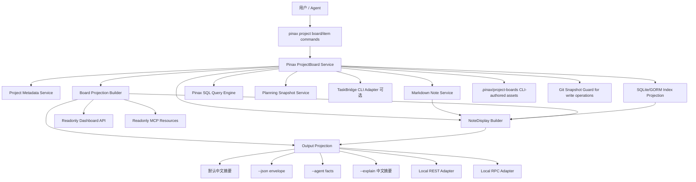
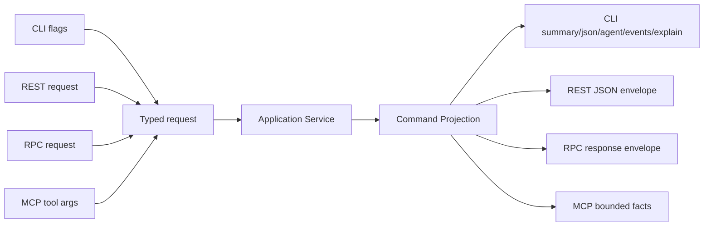
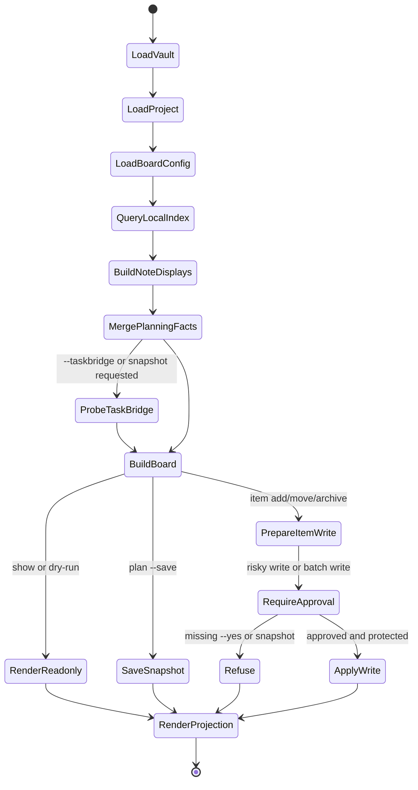

# Design: Pinax Project Board Workspace

## 核心判断

看板不应该成为 Pinax 的第二套 Todo 系统。Pinax 的优势是本地 Markdown、索引、链接、计划证据和 Git 回滚；TaskBridge 的优势是 Todo provider 执行和远端写回。因此项目看板首期要做成“本地项目工作区投影 + 受控轻量工作项写入”，而不是实时协作 UI 或远端任务同步器。

## 架构



## 领域模型

```text
ProjectBoard
  project_slug
  title
  columns[]
  items[]
  facts
  warnings[]
  source_snapshot_id
  generated_at

BoardColumn
  id              // inbox|next|doing|blocked|review|done|custom slug
  name
  order
  wip_limit       // optional

BoardItem
  item_id
  title
  column
  source_kind     // note|managed_task|inline_task|taskbridge|manual_review
  note_id
  path
  project
  tags[]
  status
  priority
  due
  evidence_refs[]
  writable        // true only for Pinax-managed item notes/blocks

NoteDisplay
  note_id
  title
  path
  display         // card|detail|context|body
  exposure        // public|agent|local_detail|local_body
  project
  board_column
  kind
  status
  tags[]
  updated_at
  excerpt
  body            // only when display=body and caller explicitly asks
  links_count
  backlinks_count
  attachments_count
  related[]       // bounded note cards for context mode
  actions[]
  redaction_warnings[]

RemoteRoute
  route_id
  surface        // rest|rpc|mcp|dashboard
  method         // GET/POST or rpc method name
  path
  command        // projection command such as project.board.show
  capability_id
  schema_version
  exposure       // public|agent|local_detail|local_body
  readonly
  approval_required
  snapshot_required
  body_allowed
```

默认列映射：

| Column | 含义 | 默认来源 |
| --- | --- | --- |
| `inbox` | 未归类或刚捕获 | `status=inbox`、缺少 `board_column` 的项目工作项 |
| `next` | 可开始的下一步 | `status=active` 且 priority/due 靠前 |
| `doing` | 当前正在推进 | `board_column=doing` 或 managed plan commitment |
| `blocked` | 需要解除阻塞 | `status=blocked`、blocked tag、planning risk |
| `review` | 等待检查/合并/复盘 | `status=review` 或 checklist done 但未归档 |
| `done` | 已完成 | `status=done`、checked managed item |

## 笔记展示层级

看板必须能快速查看笔记，但不能默认把完整正文、隐私字段或 provider payload 暴露给 agent、dashboard 或 MCP。因此新增共享 `NoteDisplay` 投影，由 `note read/show`、`project board show`、dashboard 和 MCP 复用。

| Display | 适用场景 | 字段边界 |
| --- | --- | --- |
| `card` | 看板行、列表、agent facts | title、path、note_id、project、kind、status、tags、updated_at、excerpt、board_column |
| `detail` | CLI drilldown、JSON 详情 | `card` + links/backlinks/attachments counts、frontmatter selected properties、next actions |
| `context` | Agent/MCP 上下文、项目复盘 | `detail` + bounded related note cards、evidence refs，不含完整正文 |
| `body` | 用户显式读笔记正文 | `detail` + raw/rendered Markdown body，仍需脱敏 machine output |

外显等级：

- `public`：面向 dashboard 索引页和导出摘要，默认不含正文、不含本地绝对路径、不含 provider refs。
- `agent`：面向 `--agent` 和 MCP，低 token facts，不含正文、不含本地化段落。
- `local_detail`：面向 `--json` 的显式 detail/context 请求，包含相对路径、关系计数、selected properties 和 bounded related cards。
- `local_body`：仅 `pinax note read/show <ref> --display body` 或等价显式命令返回正文。

`NoteDisplay` 不新增笔记真源；它只读取 Markdown、frontmatter、index、link graph 和 board facts，输出可审查的展示投影。

## REST/RPC 维护策略

远程接口的核心风险不是技术选型，而是字段、权限、错误码和行为在 CLI、dashboard、MCP、REST、RPC 之间漂移。Pinax 的策略是 projection-first：所有接口都从 `internal/app` 的 command projection 出发，adapter 只做协议映射、鉴权、参数解析、状态码转换和序列化。



约束：

- REST/RPC 不直接读写 `.pinax` 结构化资产，不直接解析 Markdown，不直接访问 GORM repository。
- REST/RPC response envelope 与 `--json` 保持同一稳定顶层字段：`spec_version`、`mode`、`command`、`status`、`facts`、`actions`、`evidence`、`data`、`error`。
- HTTP status 只表达 transport 结果；业务失败仍放在 projection `status=failed` 和 stable `error.code` 中。例如参数无效返回 400 + failed envelope，权限不足返回 403 + failed envelope，冲突返回 409 + failed envelope。
- RPC 方法名稳定，request/response 字段只增不改；删除或重命名必须提升 major schema version。
- OpenAPI / RPC schema 应由 Go route registry 或 schema generator 输出，或由实现任务维护 contract test；不允许文档、handler、SDK 三处手写互相漂移。
- 默认 remote server 只绑定 `127.0.0.1`。非 loopback、CORS、token、TLS、多用户和公网暴露属于后续安全 change。

## REST API Draft

MVP REST 是本地 API surface，服务于 dashboard、轻量 Web UI、脚本和本机 agent，不是 Pinax Cloud 明文笔记 API。路径统一使用 `/v1`，默认 `readonly=true`。

| Method | Path | Projection command | Body exposure | Notes |
| --- | --- | --- | --- | --- |
| `GET` | `/v1/capabilities` | `api.capabilities` | none | 列出 routes、schema versions、readonly/write flags |
| `GET` | `/v1/vault` | `vault.stats` / `dashboard.overview` | none | vault 概览、健康、index status |
| `GET` | `/v1/projects` | `project.list` | none | project metadata 摘要 |
| `GET` | `/v1/projects/{slug}/board?note_display=card` | `project.board.show` | card/detail/context | 默认 card，不返回正文 |
| `GET` | `/v1/notes/{ref}?display=detail` | `note.read` | card/detail/context/body | `body` 仅 loopback local body exposure |
| `GET` | `/v1/search?q=...&limit=20` | `search` | card/detail | 返回 bounded note cards |
| `POST` | `/v1/project-items:plan` | `project.item.plan` | none | 预览 add/move/archive，不写 vault |
| `POST` | `/v1/project-items` | `project.item.add` | detail | 需要 local write token，写入仍走 service |
| `POST` | `/v1/project-items/{id}:move` | `project.item.move` | detail | 默认 dry-run；真实写入需要 `yes=true` 和 snapshot evidence |
| `POST` | `/v1/project-items/{id}:archive` | `project.item.archive` | detail | approval + snapshot gate |
| `GET` | `/v1/events?since=...` | `api.events` | none | 只读 NDJSON/event projection，后续可用于 UI refresh |

REST 写路径首期可以只实现 `:plan` dry-run，把真实写入延后到 CLI 命令；如果实现真实写入，必须复用 `approval_required`、`snapshot_required` 和 redacted event evidence。

## RPC API Draft

RPC 适合 agent/SDK，因为它是命令式调用，能表达 dry-run、approval、capabilities 和 typed request。MVP 建议先定义本地 JSON-RPC 或 Connect-style 方法名，但实现仍可先落在 MCP stdio；不要同时维护两套 handler 逻辑。

| Method | Projection command | Request | Response |
| --- | --- | --- | --- |
| `Pinax.Capabilities.List` | `api.capabilities` | `{surface}` | projection envelope |
| `Pinax.ProjectBoard.Show` | `project.board.show` | `{vault, project, note_display, limit}` | projection envelope |
| `Pinax.Note.Read` | `note.read` | `{vault, ref, display, with_context}` | projection envelope |
| `Pinax.Search.Run` | `search` | `{vault, query, filters, limit, cursor}` | projection envelope |
| `Pinax.ProjectItem.Plan` | `project.item.plan` | `{vault, operation, item}` | projection envelope |
| `Pinax.ProjectItem.Move` | `project.item.move` | `{vault, item_id, column, dry_run, yes, snapshot_id}` | projection envelope |
| `Pinax.Events.Subscribe` | `api.events` | `{vault, since, filters}` | event stream envelope |

RPC 只比 REST 多一层 typed method；它不能返回不同的数据结构。Agent 应优先用 RPC/MCP 获取 bounded facts，用 CLI 命令执行用户可见写入。

## Capability Registry

为控制维护成本，新增 route/method 必须登记 capability。可由 Go 代码中的 registry 生成 `api.capabilities` projection：

```json
{
  "schema_version": "pinax.remote.capability.v1",
  "id": "project.board.show",
  "surfaces": ["cli", "rest", "rpc", "mcp"],
  "command": "project.board.show",
  "readonly": true,
  "body_allowed": false,
  "request_schema": "pinax.project_board.show.request.v1",
  "response_schema": "pinax.projection.v1",
  "errors": ["project_not_found", "invalid_note_display", "index_unavailable"]
}
```

新增 capability 的验收规则：

- CLI、REST、RPC 至少两个 surface 的 golden/contract test 断言同一 facts keys。
- 远程接口必须有 redaction test，覆盖 token、Authorization header、raw prompt、provider payload 和 note body gating。
- integration/component 测试如果启动 HTTP/RPC server，证据写入 `temp/integration-test-runs/<run-id>/`。

## 数据资产

### Board Registry

`.pinax/project-boards/<project_slug>.json` 由 application service 写入，保存配置而不是结果快照：

```json
{
  "schema_version": "pinax.project_board.v1",
  "project_slug": "research",
  "columns": [
    {"id": "next", "name": "下一步", "order": 20, "wip_limit": 5}
  ],
  "query": "SELECT title, status, due FROM notes WHERE project = \"research\" LIMIT 100",
  "updated_at": "2026-06-08T00:00:00Z"
}
```

Agent 不直接编辑该 JSON。CLI 命令如 `pinax project board configure` 或 `pinax project board plan --save` 通过 service 创建和更新。

### Board Snapshot

`project board plan --save` 可以写 `.pinax/planning/project-boards/<snapshot_id>.json`，保存审查用投影、风险、source facts 和 next actions。它是 evidence，不是真源；过期后重新生成。

## 命令设计

```bash
pinax project board show research --vault ./my-notes
pinax project board show research --note-display card --vault ./my-notes
pinax project board plan research --vault ./my-notes --dry-run --json
pinax project board plan research --vault ./my-notes --save --json
pinax project board configure research --columns inbox,next,doing,blocked,review,done --vault ./my-notes --json
pinax project board export research --format markdown --vault ./my-notes

pinax note read note_123 --display card --vault ./my-notes
pinax note read note_123 --display detail --with-context --vault ./my-notes --json
pinax note show note_123 --display body --vault ./my-notes

pinax project item add research "实现看板 projection" --column next --body "先做只读 projection" --vault ./my-notes --json
pinax project item move item_abc123 blocked --reason "等待 TaskBridge contract" --vault ./my-notes --json
pinax project item archive item_abc123 --yes --vault ./my-notes --json
```

`show` 默认只读，不写 `.pinax`、Markdown、Git、TaskBridge 或远端 provider。`project board show --note-display card` 默认只嵌入 note card；需要正文时用户运行 `pinax note read/show <ref> --display body`。`plan --save` 只写 snapshot evidence。`item add/move/archive` 是真实写入，必须路由 note/projectboard service；批量移动或 done/archive 需要 `--yes`，高风险变更需要 Git snapshot guard。

## 状态机



## 与现有能力关系

- `project create/list/switch`：继续管理 project metadata，board 只扩展 project workspace。
- `note read/show`：保留 source/rendered 语义，新增 `--display card|detail|context|body` 作为外显信息层级；默认人类正文仍可用 Glamour 渲染。
- `database view/query`：board projection 复用 typed property 和 Pinax SQL，不新增 parallel query engine。
- `plan daily/weekly/monthly`：可以读取 board snapshot，改进承诺和风险判断；不能自动把所有 board item 写到日计划。
- `organize/repair`：board 中的断链、孤立、歧义项只生成 manual review，不自动改写正文。
- `dashboard`：新增只读 `/api/project-board/<slug>` 或等价 API，页面展示列和 CLI next action。
- `mcp serve`：新增只读 `pinax://project/{slug}/board` resource 和 `pinax.project.board` tool。
- `api serve`：后续可新增本地 REST/RPC server，但必须复用 dashboard/MCP 的 application service projection，不新增业务解析层。
- `TaskBridge`：只读任务事实和 action draft；真实远端写回仍通过 TaskBridge。

## 输出合同

默认 human 输出：

```text
项目 research 看板：next 4，doing 1，blocked 2，review 1，done 8。
风险：blocked 超过 1 项；最近 due：2026-06-10。
下一步：pinax project board plan research --vault ./my-notes --save
```

JSON facts 至少包含：`project`、`columns`、`items`、`blocked`、`next`、`doing`、`review`、`done`、`engine`、`index_status`、`snapshot_id`、`writable_items`、`warnings`。

Board item 的 `data.items[*].note` 默认使用 `NoteDisplay{display=card, exposure=local_detail}`，只含短摘和关系计数；`--agent` 使用 `exposure=agent`，不输出正文 body、长摘、ANSI、Markdown 表格或本地化段落。`--json` 只有在显式 `note read/show --display body` 时才返回正文，字段放在 `data.note.body`，并附带 `facts.display=body` 和 `facts.exposure=local_body`。`--explain` 输出中文可审查摘要：结论、关键依据、风险、取舍、下一步和 evidence refs，不保存完整思维链。

`NoteDisplay` 的稳定 fields：`note_id`、`title`、`path`、`project`、`kind`、`status`、`tags`、`updated_at`、`display`、`exposure`、`excerpt`、`board_column`、`links_count`、`backlinks_count`、`attachments_count`、`related_count`、`redaction_warnings`。新增字段必须是可选字段；删除或重命名需要输出合同 major version。

REST/RPC response 使用 `mode=json` 或 `mode=events`，不使用 `summary`/`agent` 作为 wire format。需要 agent 低 token facts 时通过 projection `facts` 字段或 RPC `exposure=agent` 控制，而不是让远程客户端解析 CLI `--agent` 文本。

## 测试策略

- Unit：column mapping、item source normalization、query result to board item、approval/snapshot rule。
- Unit：NoteDisplay display/exposure mapping、excerpt bounding、body-only-on-explicit-request、redaction warnings。
- Command：`project board show/plan/configure/export` 和 `project item add/move/archive` 参数、输出模式、错误码。
- Command：`note read/show --display card|detail|context|body` 输出模式、body gating、stdout/stderr 分离。
- Testscript：fixture vault + temporary Git repo + fake TaskBridge executable，覆盖 dry-run、save、approval gate、snapshot guard、stdout/stderr 分离。
- Redaction：board snapshot、events、explain 不包含 token、Authorization header、raw prompt、provider payload、完整思维链。
- Dashboard/MCP：只读 API/tool 不写 Markdown、`.pinax`、Git、TaskBridge 或远端 provider。
- REST/RPC：route registry、HTTP status mapping、RPC method schema、capabilities projection、body exposure gate、readonly/write approval gate。
- Integration evidence：启动 HTTP/RPC server 的 component/e2e 测试必须写 `temp/integration-test-runs/<run-id>/summary.json`、`command.txt`、`stdout.log`、`stderr.log`、`env.json` 和 `artifacts/`。

## 延期项

- 浏览器拖拽写入和 WebSocket 实时协作。
- Calendar/time blocking。
- 自动从任意 checklist 回写 Markdown。
- 跨 vault portfolio 看板。
- AI 自由生成完整项目计划正文。
- 公网 REST/RPC、多人权限、CORS/TLS/token 管理和 hosted API 网关。
