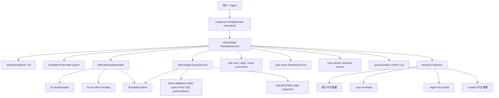

# Design: Pinax Template Engine v2

## Context

当前模板实现集中在 `internal/app/service.go`：模板文件保存在 `.pinax/templates/*.md`，`template render` 与 `note new --template` 通过 `renderTemplateBody` 做变量替换。这个结构足够完成 MVP，但继续扩展会把解析、校验、上下文构造、函数白名单、错误映射和 CLI projection 全部挤进 app service。

v2 设计把“模板引擎”抽成 Pinax 内部共享模块：命令层仍只解析 flags，app service 仍负责 vault 路径、模板文件、事件和 projection，真正的 Go template parse/execute/inspect 放到 `internal/templateengine`。

## Architecture



## Template File Contract

模板文件仍是 Markdown 文本。v2 模板推荐使用 YAML frontmatter：

```yaml
---
schema_version: pinax.template.v2
kind: note_template
engine: go-template
name: video-study
title: 视频学习
description: 视频课程学习笔记模板
variables:
  url:
    type: string
    required: false
    description: 视频链接
  highlights:
    type: list
    required: false
    description: 重点列表
defaults:
  status: active
  tags: [learning, video]
queries:
  active_projects:
    language: sql
    text: SELECT title, status, due FROM notes WHERE tags CONTAINS "project" AND status = "active" ORDER BY due ASC LIMIT 10
    required: false
    max_rows: 10
example:
  title: Go 模板学习
  vars:
    url: https://go.dev
    highlights: [语法, 安全边界]
---

# {{ .Title }}

{{- if .Vars.url }}
链接：{{ .Vars.url }}
{{- end }}

{{- if .Vars.highlights }}
## 重点
{{- range .Vars.highlights }}
- {{ . }}
{{- end }}
{{- end }}
```

字段规则：

| Field | Required | Notes |
| --- | --- | --- |
| `schema_version` | v2 推荐 | `pinax.template.v2`；缺失时走 legacy 兼容识别 |
| `kind` | v2 推荐 | `note_template`、`daily_template`、`project_template`、`template_design` |
| `engine` | v2 推荐 | `go-template` 或 `simple`；默认由内容推断 |
| `name` | optional | 文件名仍是真实模板 id；frontmatter name 用于展示和校验一致性 |
| `variables` | optional | 变量 schema，用于 inspect、validate 和缺失变量错误 |
| `defaults` | optional | note status、tags、project、folder 等默认值，不覆盖显式 CLI flag |
| `queries` | optional | 命名 Pinax SQL 查询，渲染前由 query service 执行并注入 `.Queries` |
| `example` | optional | `template preview` 和 `template inspect` 的示例上下文 |

YAML 解析必须使用结构化 parser。若 parser 引入新依赖，优先使用项目已有 YAML v3 依赖形态；不得继续扩大 ad hoc string parser 覆盖面。

## Shared Engine API

新增 `internal/templateengine` 包，避免 app service 手写解析：

```go
type Engine struct {
    funcs template.FuncMap
    now func() time.Time
}

type TemplateDocument struct {
    Name string
    Path string
    Metadata Metadata
    Body string
}

type Context struct {
    Title string
    Date string
    Datetime string
    Project string
    Tags []string
    Vars map[string]any
    Note map[string]any
    Vault map[string]any
    Queries map[string]QueryResult
}

type RenderResult struct {
    Body string
    Variables []VariableRef
    Missing []string
    Warnings []Issue
}
```

复杂点需要中文注释：AST 变量扫描、legacy `{{title}}` 兼容转换、missing key 错误映射、函数白名单和 YAML frontmatter/schema 合并。

## SQL Query-Backed Templates

SQL 查询模板不是新 SQL 引擎。它是模板系统对 `pinax-database-views-query` 的消费层：模板声明 Pinax SQL 查询，app service 在渲染前调用 query service，获得受限、分页、脱敏的 query result，再注入 template context。

推荐声明方式是 frontmatter `queries`：

```yaml
queries:
  active:
    language: sql
    text: SELECT title, status, due FROM notes WHERE tags CONTAINS "project" AND status = "active" ORDER BY due ASC LIMIT 10
    required: false
    max_rows: 10
```

模板正文消费结果：

```gotemplate
## 活跃项目
{{ table .Queries.active }}

{{ range .Queries.active.Rows }}
- {{ .Values.title }} / {{ .Values.status }}
{{ end }}
```

模板正文也可以包含 Markdown fenced SQL block：

````markdown
```pinax-sql name=active kind=table
SELECT title, status, due FROM notes WHERE tags CONTAINS "project" AND status = "active" ORDER BY due ASC LIMIT 10
```
````

实现时 fenced block 先解析为等价的命名 query declaration，再统一走 query service。`template inspect` 只解析和 explain 查询，不执行完整结果；`template preview` 和 `template render` 执行查询，但必须遵守 limit、cursor 和 max rows。查询结果形状复用 `pinax-database-views-query` 的 table/list/task projection：

```go
type QueryResult struct {
    Name string
    Kind string
    Columns []Column
    Rows []Row
    Page Page
    Facts map[string]string
    Warnings []Issue
}
```

安全和边界：

- 模板不得把 SQL 文本直接拼接成 SQLite SQL；Pinax SQL 必须先解析成 AST，再由 query planner/repository 执行。
- 业务层不得硬编码 SQL；复杂 SQLite/FTS 例外只能集中在 `internal/index` repository，参数绑定并测试覆盖。
- 查询模板默认只读，不写 notes、`.pinax` metadata、Git、provider 或 remote state。
- 动态查询文本只允许来自模板 metadata、fenced block 或显式 CLI `--query-var` 后续扩展；首版不允许用户在模板函数里拼出任意查询。
- 查询结果默认不包含完整 note body，除非 Pinax SQL 明确选择受支持字段且 query service 允许。
- `token`、`secret`、`Authorization` 等 secret-like 变量不得进入错误详情、query explain 或 event evidence。

支持范围以 `pinax-database-views-query` change 为准：首版支持 `SELECT ... FROM notes|tasks ... WHERE ... ORDER BY ... GROUP BY ... LIMIT ...`，不支持 join、子查询、窗口函数、跨 vault 查询或执行期动态查询函数。

## Rendered Note View and Refresh

不要新增顶层 `cat` 或 `render` 命令。查看和刷新都归到 `note` 命令面，保持用户心智为“对一篇笔记做操作”：

```bash
pinax note show projects/dashboard.md --view rendered --vault ./my-notes
pinax note show projects/dashboard.md --view source --vault ./my-notes
pinax note refresh projects/dashboard.md --rendered --yes --vault ./my-notes --json
```

`note show --view rendered` 是只读查看：读取 Markdown，解析 `pinax-sql` fenced block 或 frontmatter query declaration，执行受限 query service，把结果渲染成 Markdown stdout。它不得写 Markdown、`.pinax` structured asset、Git、provider 或远端状态。

`note show --view source` 只输出源 Markdown，不执行 SQL，不触发 index rebuild。机器模式输出同一 projection，但 facts 标明 `view=source`、`query_count=0`。

需要把 SQL 结果写回文件时，用 `note refresh --rendered --yes`，并且只能更新显式托管区块：

````markdown
```pinax-sql name=active-projects kind=table
SELECT title, status, due FROM notes WHERE tags CONTAINS "project" AND status = "active" ORDER BY due ASC LIMIT 10
```

<!-- pinax:render active-projects start hash="..." -->
<!-- pinax:render active-projects end -->
````

刷新规则：

- 无 `--yes` 时只输出计划和 approval required，不写文件。
- 只 patch matching managed block，不重写整篇 note。
- 源 `pinax-sql` block、普通正文、用户手写内容和未知 marker 保持不变。
- marker 缺失、嵌套、跨越越界、hash 不匹配或查询失败时返回稳定错误码，不做部分写入。
- 写回由 app service 完成，并追加脱敏 event evidence；命令层不直接改 Markdown。

## Render Run Versioning and Reuse

我建议把每次正式渲染都记录为 `RenderRun`，但不要让只读查看默认写入 `.pinax/`。这样能同时满足三个目标：有版本、能复用长参数、不让 `note show` 这种查看命令产生隐藏副作用。

`RenderRun` 是 CLI/service authored structured asset。不要把所有版本扁平堆到 `.pinax/renders/<date>/`，也不要默认放进 `notes/**/renders/`。默认采用 `.pinax/renders/` 下镜像 note 路径的布局：

```text
.pinax/renders/
  index.json
  学习/
    galang高性能/
      1-协程/
        index.json
        render_20260606T142233Z_ab12cd/
          receipt.json
          rendered.md
  templates/
    video-study/
      index.json
      render_20260606T142233Z_ef34ab/
        receipt.json
        rendered.md
```

路径规则：

- note 绑定 run：以 note 相对 vault 的路径为主键，去掉 `.md` 后作为目录，例如 `notes/学习/galang高性能/1-协程.md` 对应 `.pinax/renders/学习/galang高性能/1-协程/`；如果 vault 本身已经以 `notes/` 为内容根，则不重复保留 `notes/` 前缀。
- template-only run：没有 target note 时放入 `.pinax/renders/templates/<template-name>/`。
- 所有目录名使用原始相对路径段的安全编码，禁止 `..`、绝对路径、控制字符和路径穿越；receipt 里保留原始 `target_note`。
- 每个 note/template 目录有局部 `index.json`，根 `index.json` 只做 lightweight alias 和最近使用索引，避免一次补全扫描全量历史。

不默认使用 `notes/学习/galang高性能/renders/1-协程.md` 的原因：它会把生成物放进用户正文区域，容易被 search/index 当作普通笔记收录，也会让用户误以为可以手写修改这些机器资产。用户需要把结果贴进正文时，用 `pinax note refresh --rendered --yes` 写入显式托管区块。

`receipt.json` 只保存脱敏元数据和可复用上下文，不保存 secret、raw prompt、provider payload 或完整思维链：

```json
{
  "schema_version": "pinax.render_run.v1",
  "run_id": "render_20260606T142233Z_ab12cd",
  "name": "video-go",
  "created_at": "2026-06-06T14:22:33Z",
  "command": "template.render",
  "template": "video-study",
  "target_note": "projects/dashboard.md",
  "source_hash": "sha256:...",
  "template_hash": "sha256:...",
  "index_status": "fresh",
  "git_head": "...",
  "args": {
    "title": "Go 模板学习",
    "vars": {"url": "https://go.dev"},
    "tags": ["learning", "golang"]
  },
  "queries": [
    {"name": "active", "language": "sql", "query_hash": "sha256:...", "rows": 10, "has_more": false}
  ],
  "artifacts": {
    "rendered_markdown": "rendered.md",
    "rendered_hash": "sha256:..."
  }
}
```

命令面不新增分散的顶层 `cat` 或 `render`。复用能力挂在已有 `template` 和 `note` 命令上：

```bash
pinax template render video-study --title "Go 模板学习" --var url=https://go.dev --save-run video-go --vault ./my-notes --json
pinax template render video-study --run video-go --vault ./my-notes --json
pinax template inspect video-study --runs --vault ./my-notes --json
pinax note show projects/dashboard.md --view rendered --snapshot video-go --vault ./my-notes
pinax note refresh projects/dashboard.md --rendered --save-run dashboard-latest --yes --vault ./my-notes --json
pinax note refresh projects/dashboard.md --rendered --snapshot video-go --yes --vault ./my-notes --json
```

语义边界：

- `--save-run <name>`：`template render` 或 `note refresh --rendered` 完成后写入当前 note/template 对应的镜像目录，并把 `<name>` 作为用户友好的别名指向该 run。
- `--run <name-or-id>`：读取历史 run 的参数、vars、query limits 和目标上下文，重新执行当前模板和当前索引数据，并生成新的 run；显式传入的新 flag 可以覆盖历史参数。
- `--snapshot <name-or-id>`：使用历史 `rendered.md` 快照，不重新执行 SQL；适合查看或把某个历史版本写回托管区块。
- `template inspect --runs`：列出模板相关 runs，包括 created_at、name、run_id、template_hash、rendered_hash、row_count 和是否仍匹配当前模板 hash。
- `note show --view rendered --snapshot` 仍只读；`note refresh --rendered --snapshot --yes` 才写 Markdown。

别名和版本规则：

- run id 不可变，格式建议 `render_<UTC timestamp>_<short random>`，用于审计和精确回放。
- run name/alias 按 note/template scope 生效，不是全局唯一；同名 alias 在不同 note 下互不冲突。
- `--save-run <name>` 如果 scope 内已有同名 alias，成功写入新 run 后移动 alias 指针；旧 run 保留，只能通过 run id 或 `--runs` 看到。
- 自动维护 `latest` alias，指向 scope 内最新成功 run；用户可以直接用 `--run latest` 或 `--snapshot latest`。
- 如果命令没有足够上下文导致 alias 匹配多个 scope，返回 `render_run_ambiguous`，并建议带上 note path/template name 或 run id。
- alias 可以是中文，但不得包含路径分隔符、控制字符、NUL 或 `..`；别名只存在 index/receipt 中，不参与目录名。

## Render Run Discovery and Completion

历史渲染版本如果不可发现，就会变成新的记忆负担。CLI 需要提供两条路径：

```bash
pinax template inspect video-study --runs --vault ./my-notes --json
pinax note show notes/学习/galang高性能/1-协程.md --runs --vault ./my-notes --json
pinax template render video-study --run video-go --vault ./my-notes --json
pinax note show notes/学习/galang高性能/1-协程.md --view rendered --snapshot video-go --vault ./my-notes
```

补全规则：

- `pinax template render <template> --run <TAB>`：优先列出该 template 的 run alias 和 run id，描述包含 created_at、target_note、title、rendered_hash 前缀和 freshness。
- `pinax note show <note> --snapshot <TAB>` / `pinax note refresh <note> --rendered --snapshot <TAB>`：优先列出该 note 镜像目录下的 run alias 和 run id。
- `pinax template inspect <template> --runs <TAB>` 不需要补值；`pinax note show <note> --runs` 输出列表。
- completion 只读读取局部 `index.json` 和根 lightweight index；不得执行 SQL、渲染模板、触发 index rebuild、写 `.pinax`、写 Markdown、调用 Git/provider/remote。
- 如果局部 index 缺失或损坏，completion 降级为扫描该 note/template 目录下一层 run receipt；仍然不得全量扫描整个 vault。
- 补全候选要带 tab 描述，且返回 `ShellCompDirectiveNoFileComp`，避免 shell 把本地文件名混入 run 候选。

版本控制策略：`.pinax/renders/**/receipt.json` 和小型 `rendered.md` 可以进入 vault Git，用于审计和回滚。因为路径按 note/template 镜像，用户能从目录结构看出版本归属。receipt 需要记录 `git_head`、`git_dirty`、`note_source_hash`、`template_hash`、`index_status` 和 rendered artifact hash，便于用户判断这个版本来自哪个 vault 状态。大型或包含敏感结果的 snapshot 后续可通过 retention policy、`--no-artifact` 或 `pinax template runs prune` 控制；MVP 先要求所有字段脱敏，并给出清理提示，避免无界增长。

维护和修复：

```bash
pinax template inspect video-study --runs --vault ./my-notes --json
pinax note show notes/学习/galang高性能/1-协程.md --runs --vault ./my-notes --json
pinax template runs prune video-study --keep 20 --dry-run --vault ./my-notes --json
pinax template runs repair --vault ./my-notes --json
```

`template runs prune` 和 `template runs repair` 仍属于 template surface，不新增顶层命令。prune 默认 dry-run，只有显式 `--yes` 才删除历史 artifact；repair 重建局部/root index，不修改 receipt 和 rendered artifact。

## Go Template Dialect

底层使用标准库 `text/template`，执行选项使用：

```go
template.New(name).Option("missingkey=error").Funcs(pinaxFuncMap)
```

允许语法：

- 字段访问：`{{ .Title }}`、`{{ .Vars.url }}`、`{{ .Note.status }}`。
- 条件：`{{ if .Vars.url }}...{{ end }}`。
- 循环：`{{ range .Tags }}...{{ end }}`。
- 管道：`{{ .Title | slug }}`。
- Pinax 安全函数白名单。

首期安全函数：

| Function | Behavior | Safety |
| --- | --- | --- |
| `default` | 空值 fallback | pure |
| `join` | join string/list | pure |
| `lower` / `upper` | 大小写转换 | pure |
| `slug` | 复用 Pinax slug 策略 | pure |
| `date` | 格式化当前或传入时间 | pure, no clock mutation |
| `yaml` | 把 list/map 渲染为 YAML inline/block | pure |
| `json` | 把值渲染为 JSON 字符串 | pure |
| `quote` | 安全 Markdown/YAML 字符串引用 | pure |
| `table` | 把 query table result 渲染为 Markdown table | pure, consumes precomputed query result |
| `list` | 把 query list/task result 渲染为 Markdown list | pure, consumes precomputed query result |

禁止函数和能力：

- 不开放 `env`、`exec`、`readFile`、`http`、provider、Git、network、random secret、filesystem traversal。
- 不开放 `sql`、`query` 这类会在模板执行期动态执行查询的函数；查询必须预声明并预执行。
- 不开放用户自定义函数插件。
- 不把 raw provider payload、hidden prompt、secret 或完整思维链放入上下文。

## Compatibility

兼容三类模板：

1. v2 Go template：有 `schema_version: pinax.template.v2` 且 `engine: go-template`，按 Go template 执行。
2. legacy simple：旧模板只包含 `{{title}}`、`{{date}}`、`{{project}}`、`{{tags}}` 或 `{{client}}` 这类 token，继续支持。
3. template design：`schema_version: pinax.template_design.v1` 仍可作为草稿读取；`template validate` 给出“这是设计稿，尚未声明可执行 engine”的 warning，`template publish` 可在后续任务中转换为 v2 模板。

兼容策略不应静默改变用户输出：旧 `{{title}}` 模板默认仍按 simple 渲染；只有模板明确声明 `engine: go-template` 时才要求 `{{ .Title }}` 语法。若要自动迁移，应作为单独命令 `pinax template migrate <name>`，并先输出 plan。

## Command Surface

首期命令树：

```bash
pinax template create "视频学习" --vault ./my-notes
pinax template create video-study --engine go-template --from ./video-study.md --vault ./my-notes
pinax template inspect video-study --vault ./my-notes --json
pinax template validate video-study --vault ./my-notes --strict --json
pinax template preview video-study --title "Go 模板学习" --var url=https://go.dev --vault ./my-notes
pinax template render video-study --title "Go 模板学习" --var url=https://go.dev --save-run video-go --vault ./my-notes --json
pinax template render video-study --run video-go --vault ./my-notes --json
pinax template render project-dashboard --title "项目看板" --vault ./my-notes --json
pinax template inspect video-study --runs --vault ./my-notes --json
pinax note show notes/学习/galang高性能/1-协程.md --runs --vault ./my-notes --json
pinax note show projects/dashboard.md --view rendered --vault ./my-notes
pinax note show projects/dashboard.md --view rendered --snapshot video-go --vault ./my-notes
pinax note show projects/dashboard.md --view source --vault ./my-notes
pinax note refresh projects/dashboard.md --rendered --save-run dashboard-latest --yes --vault ./my-notes --json
pinax note refresh projects/dashboard.md --rendered --snapshot video-go --yes --vault ./my-notes --json
pinax note new "Go 模板学习" --template video-study --var url=https://go.dev --tags learning,golang --vault ./my-notes
```

`template preview` 与 `template render` 使用同一 service，区别是默认人类输出偏向正文预览；机器模式保持同一 projection envelope。`template inspect` 不执行模板，只解析 metadata、AST 变量引用、函数引用和潜在 warnings。`note show` 负责查看已有 note 的 rendered/source view，`note refresh` 才负责把 rendered query result 写回托管区块。

## Error Contract

稳定错误码：

| Code | Command | Meaning |
| --- | --- | --- |
| `template_parse_failed` | validate/render/preview | Go template parse 失败 |
| `template_execute_failed` | render/preview/note new | Go template execute 失败 |
| `template_variable_missing` | render/preview/note new | 必填变量缺失或 missingkey |
| `template_function_unsupported` | validate/render | 使用未开放函数 |
| `template_schema_invalid` | inspect/validate | frontmatter schema 非法 |
| `template_engine_unsupported` | create/validate/render | engine 不是 `simple` 或 `go-template` |
| `template_design_unpublished` | render/note new | 设计稿未发布为可执行模板 |
| `template_query_parse_failed` | inspect/validate/render | 模板声明的 Pinax SQL 查询解析失败 |
| `template_query_execute_failed` | render/preview/note new | 查询执行失败 |
| `template_query_limit_required` | validate/render | 查询缺少可接受 limit 或超过 max rows |
| `template_query_dependency_unavailable` | validate/render | database query service/index 尚不可用 |
| `note_render_block_invalid` | note refresh | 托管渲染区块 marker 缺失、嵌套、越界或 hash 不匹配 |
| `note_refresh_approval_required` | note refresh | 写回托管区块缺少 `--yes` |
| `note_render_query_failed` | note show/refresh | rendered view 的查询执行失败 |
| `render_run_not_found` | template render/note show/note refresh | 指定 run id、run name 或 snapshot 不存在 |
| `render_run_secret_redacted` | template render | 渲染 run 元数据发现 secret-like 值并已脱敏 |
| `render_snapshot_hash_mismatch` | note show/note refresh | 历史 rendered artifact hash 与 receipt 不一致 |
| `render_run_index_unreadable` | completion/inspect/render | 局部或根 render run index 损坏，已降级或需要修复 |
| `render_run_ambiguous` | template render/note show/note refresh | run alias 在当前上下文无法唯一解析 |
| `render_run_alias_invalid` | template render/note refresh | `--save-run` alias 包含路径分隔符、控制字符或保留路径片段 |

默认人类输出用中文摘要和下一步；`--json` stdout 只输出 envelope；`--agent` 使用稳定 key=value；`--explain` 是脱敏中文推理摘要，不输出 Go template AST 全量 dump 或用户 secret。

## Testing Strategy

- Unit：`internal/templateengine` parse、execute、FuncMap、missingkey、变量扫描、legacy simple 兼容。
- Query unit：query declaration parser、fenced query block、query result context、`table`/`list` render helper、limit enforcement。
- App service：模板文件读取、frontmatter schema、inspect/validate/render projection、设计稿 warning、note new 集成。
- Query integration：复用 `pinax-database-views-query` fixture，验证 Pinax SQL 查询结果注入模板，不绕过 query service。
- CLI：Cobra flags、`template inspect/preview/render`、`template inspect --runs`、`note show --runs`、`note show --view rendered/source`、`note refresh --rendered`、`--save-run`、`--run`、`--snapshot`、render run completion 输出模式、stdout/stderr 分离、错误码。
- Process/e2e：用 testscript 或现有 CLI harness 创建临时 vault，覆盖从 `template create` 到 `note new --template`，以及已有 note rendered view、render run 复用、snapshot 查看和托管区块 refresh 的完整流程。
- 安全：测试断言模板不能调用未开放函数，不能读取 env，不能把 secret-like `--var token=...` 泄漏到错误详情。

## Rollout

1. 先引入 `internal/templateengine`，保持现有 simple 渲染通过。
2. 为 v2 frontmatter 和 Go template 增加 inspect/validate/render。
3. 让 `note new --template` 通过共享引擎渲染。
4. 在 `pinax-database-views-query` 的 parser/planner/query service 可用后，接入 query-backed template。
5. 增强 `note show --view rendered/source`，先做只读查看。
6. 增强 `note refresh --rendered --yes`，只写回托管区块。
7. 增加 `.pinax/renders/<note-path>/` 镜像路径 render run 版本化、`--save-run`、`--run`、`--snapshot` 和 run 补全。
8. 更新内置模板，逐步添加 v2 版本；旧模板不强制迁移。
9. 文档推荐新模板使用 `engine: go-template`、`.Title/.Vars`、`.Queries.<name>`、`pinax-sql` block 和 render run 复用。
