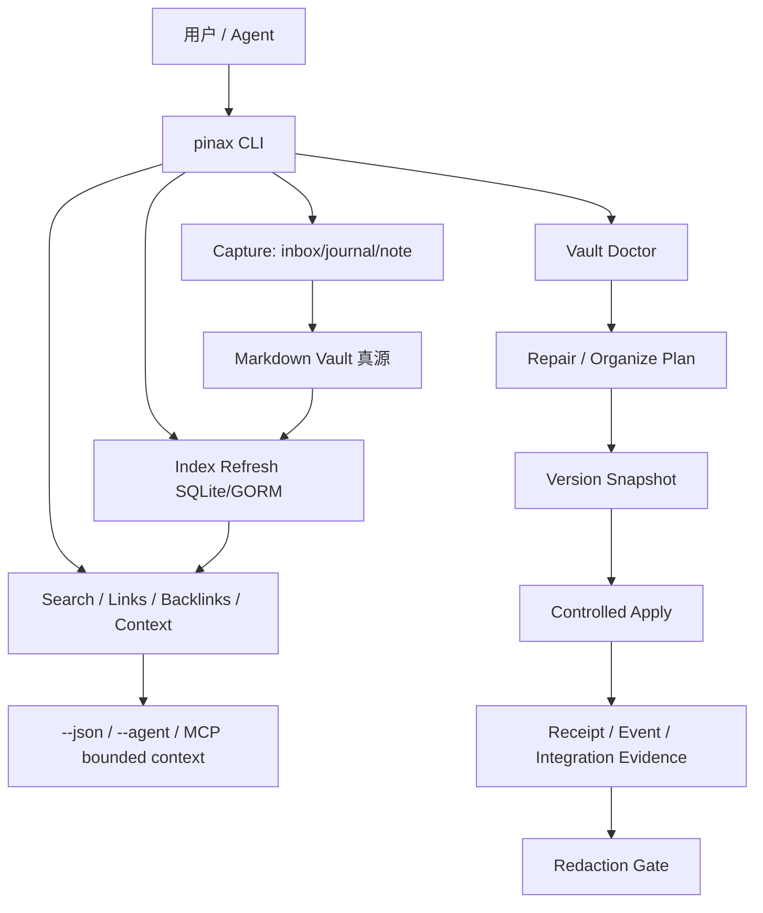
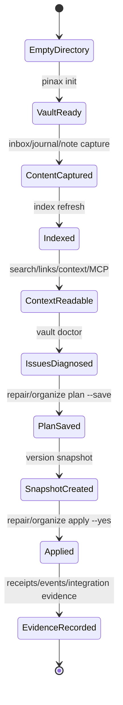

## Context

Pinax 已支持本地 vault、note/journal/inbox、SQLite/GORM 索引、search、links/backlinks/orphans、repair/organize plan、version snapshot、MCP、local API 和 Cloud Sync preview。CEO review 的判断是：下一步不应继续横向扩张，而应把已有能力串成一个真实、可验证、可演示的用户闭环。

目标用户不是“需要另一个云笔记应用的人”，而是“需要让 agent 安全读取和规划本地 Markdown 知识库的人”。核心产品承诺是：人继续拥有 Markdown，agent 只拿 bounded projection，写入必须经过 plan、snapshot、receipt 和 explicit apply。

## Architecture

## Scope

### In scope

1. 真实 vault proof fixture：包含普通 note、inbox、journal、broken link、orphan、缺 metadata、可低风险修复项和需要人工 review 的项。
2. 端到端 proof command path：`pinax init`、`inbox capture`、`journal daily append`、`note add/read`、`index refresh`、`search`、`note links/backlinks/orphans`、`vault doctor`、`repair plan --save`、`organize plan --save`、`version snapshot`、`repair apply --yes` 或 `organize apply --yes`。
3. Agent-safe evidence：`--json` 和 `--agent` 不输出完整 note body，除非用户明确调用本地内容读取命令并选择对应 display。
4. Integration evidence：`task test:integration` 或等价项目入口生成标准证据目录。
5. 文档主路径：README 和 command map 把 Capture、Retrieve、Diagnose、Plan、Apply safely 放在第一屏。

### Out of scope

- 新增 Notion、Feishu、Hermes、OneDrive native SDK 或 provider。
- 扩展 daily briefing。
- hosted SaaS、billing、用户管理或云端搜索。
- agent 自动 apply，或绕过 CLI service 直接写 `.pinax` 结构化资产。

## Proof Loop State Flow

复杂状态转换、写入 gate、脱敏红线、MCP/JSON projection 边界、test fixture 构造和失败证据生成都属于非显然逻辑，未来实现必须写中文注释解释不变量。

## Validation Strategy

- 最小验证：`openspec validate pinax-agent-safe-proof-loop --strict`。
- 实现验证：`go test ./...`、`task check`、`task test:integration`。
- 行为验证：一个真实临时 vault 从初始化到 controlled apply 全程通过，失败路径仍生成证据。
- 脱敏验证：扫描 proof loop 的 stdout、stderr、events、receipts、fixtures、evidence，不能出现 token、Authorization、raw provider payload、hidden system prompt、完整 note body 或未授权路径明文。

## Deferred Work

Cloud server sync、daily briefing、provider pull、native external SDK 和 hosted platform capability 由独立 OpenSpec change 管理，不进入本 proof loop。
