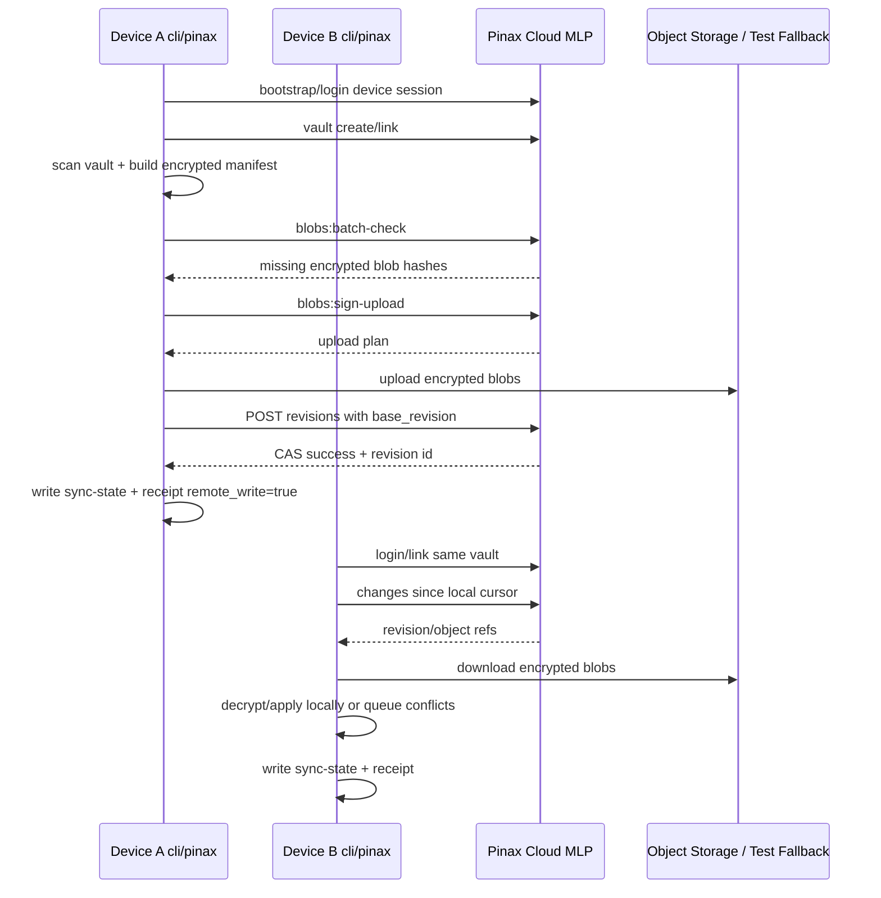
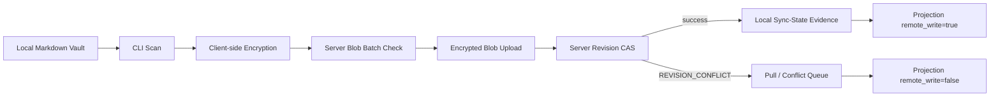

## Context

Pinax CLI 拥有本地 vault 扫描、manifest 构建、端侧加密、sync plan、conflict queue、本地 sync-state、run receipt 和 output contract。Pinax Cloud MLP 拥有 auth/device、vault metadata、blob availability/upload planning、revision CAS 和 redacted audit。两者联调的边界必须清楚：Cloud 不读取明文，CLI 不绕过应用服务，`remote_write=true` 只来自 durable server commit。

## Architecture

## Data Flow and Gates

## Scope

### In scope

1. Server transport contract parity with Pinax Cloud MLP.
2. `pinax cloud login` / `cloud backend set server` / `cloud doctor` / `sync status` server boundary truthfulness.
3. Push path: scan, encrypt, batch-check, upload plan, upload encrypted blobs, CAS commit, local sync-state evidence.
4. Pull path: changes cursor, encrypted blob download, decrypt/apply, conflict copy preservation.
5. Two-device server-backed e2e with redacted integration evidence.
6. Stable output contracts for summary, `--json`, `--agent` and relevant `--events` paths.

### Out of scope

- Native hosted auth UI or device code completion beyond MLP fields.
- Server-side plaintext Markdown merge/search.
- Native Microsoft Graph/OneDrive.
- Daily briefing delivery.
- Cloud agent action plans or `/v1/agent-runs/*`.

## Error and Recovery Map

| Failure | CLI behavior | User/agent sees |
| --- | --- | --- |
| Missing/expired token | Stop before vault mutation | `UNAUTHENTICATED`, login next action |
| Forbidden scope | Stop before mutation | `FORBIDDEN_SCOPE`, device/session diagnostic |
| Blob upload plan rejected | Do not commit revision | `VALIDATION_FAILED` or `BLOB_MISSING`, `remote_write=false` |
| Server unavailable | Preserve local vault and state | `BACKEND_UNAVAILABLE`, retry next action |
| CAS conflict | Do not overwrite local or remote | `REVISION_CONFLICT`, pull/conflict next action |
| Pull same-path conflict | Preserve local conflict copy | conflict list/show/diff/resolve next actions |

Protocol mapping, conflict handling, `remote_write` gate, redaction scan, sync-state writes and server/direct transport parity are non-obvious logic and must include Chinese comments where touched.

## Validation Strategy

- Contract tests: MLP fixture parity in `internal/cloudclient`.
- Focused sync tests: `go test ./cmd/pinax ./internal/app ./internal/cloudclient ./internal/cloudsync -run 'Cloud|Server|Sync|Conflict|RemoteWrite' -count=1`.
- E2E: server-backed two-device convergence and conflict preservation.
- Evidence: `task test:integration` writes redacted run evidence under `cli/pinax/temp/integration-test-runs/<run-id>/`.
- OpenSpec: `openspec validate pinax-cloud-server-sync-client --strict` and `openspec validate --all --strict`.

## Sequencing

1. Complete or keep green `pinax-agent-safe-proof-loop` so local value is proven.
2. Complete `backend-server/pinax-cloud/openspec/changes/pinax-cloud-sync-mlp` enough to expose the MLP server contract.
3. Implement this CLI handoff against the real MLP contract, not only fake transport.
