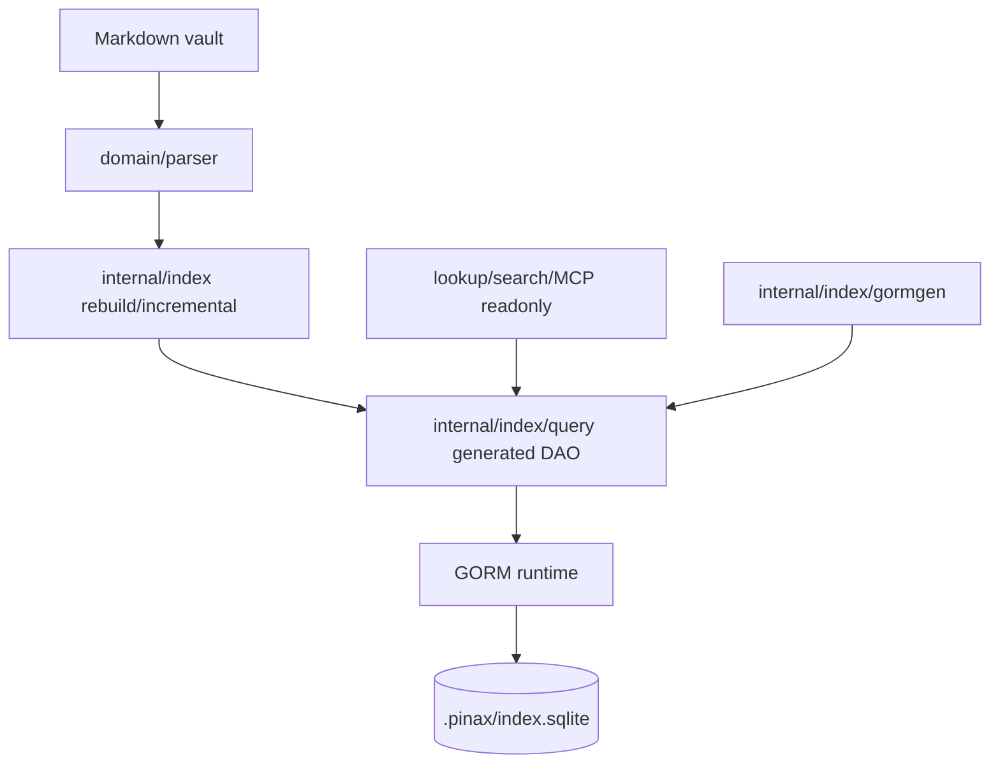

# Design: Pinax GORM Gen Database Access

## 决策

Pinax 保持“Markdown 是真源，SQLite index 是可重建投影”的架构。变化只落在投影访问层：索引投影的普通数据库读写必须通过 GORM Gen DAO，GORM runtime 只保留连接、迁移、事务和极少数集中 helper。

## 迁移策略

1. 盘点 `AutoMigrate` model 和当前索引表。
2. 生成所有 index models 的 GORM Gen query package。
3. 先迁移只读 lookup/search/doctor 查询，再迁移 rebuild/incremental 写入路径。
4. 保持 public function signatures 不变，让 `internal/app`、CLI、MCP readonly 不感知迁移。
5. 对 schema version 读取建立集中 helper；如果必须保留 SQLite PRAGMA，helper 必须有测试和注释，普通业务文件不得调用 raw SQL。

## 禁止项

- `database/sql` 作为业务访问层。
- `db.Raw`、`Exec`、SQL verb 字符串。
- 普通业务逻辑中的 `Where("...")`、`Order("...")`、`Find`、`Create`、`Save`、`Delete` direct GORM chain。

## 验证策略

- Guard test 扫描 `internal/index` 普通业务文件。
- Index rebuild and lookup tests 证明投影结果不变。
- Notebook/search/MCP focused tests 证明 user-facing behavior 不变。
- `openspec validate pinax-gorm-gen-database-access --strict` 证明任务可追踪。
