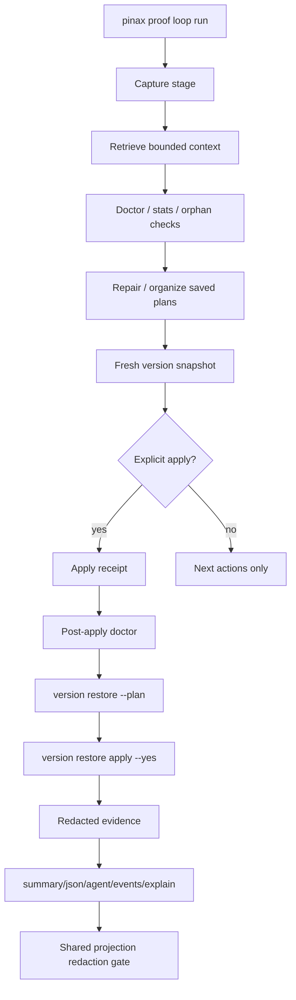

# Design: Pinax Proof Loop Operational Hardening

## Decision

Proof loop 需要从“文档化命令序列”变成“有 run id、有 receipts、有恢复路径、有统一脱敏门禁”的本地工作流。实现仍复用现有 app services；command 层只做参数校验、调用 service 和渲染 projection。



## Core Invariants

- Markdown vault remains the truth source.
- Writes require explicit `--yes` and a fresh snapshot or restore plan.
- Restore apply never invents content; it applies an existing snapshot/restore plan.
- Every stage writes bounded facts, evidence paths and next actions, not full note bodies.
- Projection redaction is centralized before rendering any mode.
- Complex restore, redaction, orchestration and evidence logic must include Chinese comments explaining invariants.

## Restore Apply

`version restore --plan` remains read-only. New apply behavior consumes the plan and restores files from the chosen snapshot. It must:

- refuse without `--yes`.
- verify target vault and snapshot id match the plan.
- write a restore receipt under `.pinax/receipts/` or the existing receipt convention.
- avoid remote writes and provider calls.
- produce `remote_write=false` and `local_write=true` only after local files are restored.
- preserve a failure receipt if restore fails halfway.

## Projection Redaction Gate

The shared gate runs after projection construction and before every renderer. It must inspect nested facts/actions/evidence/data/error/event payloads and reject or redact forbidden values: note body sentinels, full body fields, Authorization, Bearer tokens, cookies, webhook URLs, provider payloads, raw prompts and hidden prompts.

## Proof Loop Run Command

`pinax proof loop run --vault <vault> [--apply --yes]` orchestrates existing commands/services and emits one run projection. It should default to preview mode unless explicit apply flags are present.

```text
proof_loop_run_id
  ├── capture facts
  ├── retrieval facts
  ├── diagnosis issues
  ├── saved plan ids
  ├── snapshot id
  ├── optional apply receipts
  ├── optional restore plan/apply receipt
  └── redacted evidence paths
```

## Validation Strategy

- TDD for restore apply: failing e2e proves a bad apply can be reverted.
- Contract tests for all output modes and recursive redaction.
- Integration evidence under `cli/pinax/temp/integration-test-runs/<run-id>/` for proof loop run and restore apply.
- `task check`, `task test:integration`, and strict OpenSpec validation before archive.
