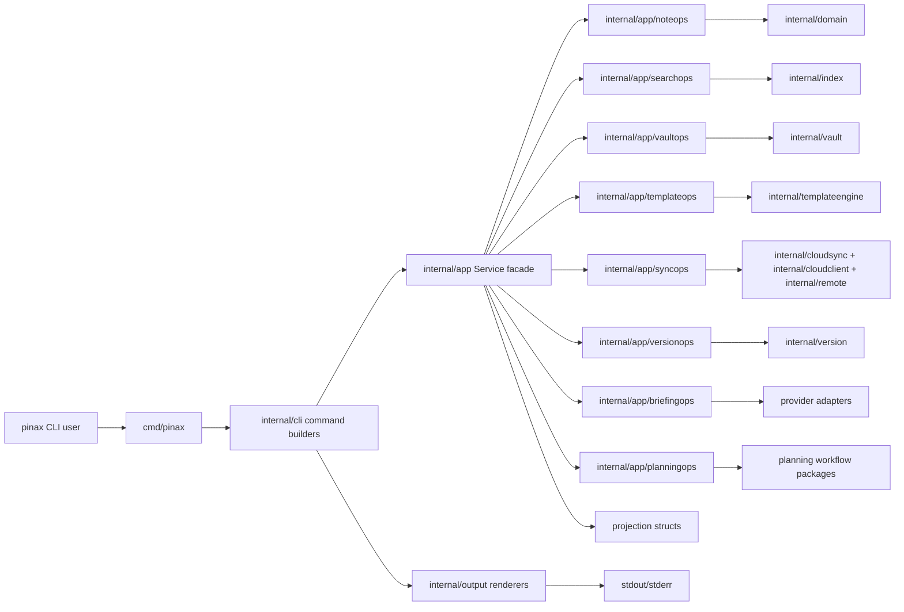

## Context

Pinax already documents the intended boundary as CLI -> app service -> vault/index/version/provider/output. The implementation has outgrown that boundary in a few hotspots:

- `internal/app/service.go` owns many unrelated use case families in one file.
- `internal/cli/root.go` owns many Cobra command builders in one file.
- `cmd/pinax/main_test.go` mixes command tests for unrelated command families.
- Runtime skill copies under `.agents/skills` and `.claude/skills` produce broad generated churn that should not be treated as feature implementation ownership.

The decomposition should first make package ownership enforceable, then move use cases in narrow vertical slices.

## Target Package Responsibilities

| Package | Responsibility | Must not own |
| --- | --- | --- |
| `internal/app` | Service facade, constructors, shared dependency wiring, compatibility shims, request/response structs that CLI uses directly. | New feature logic that belongs to a capability package. |
| `internal/app/noteops` | Note CRUD, metadata, tags, folders, import/export, attachments. | CLI rendering, provider token handling, sync backend state. |
| `internal/app/searchops` | List/search/query/database views and app-level search orchestration. | Cobra command parsing, output rendering. |
| `internal/app/vaultops` | Init/validate/project/storage/stats/doctor/repair/organize. | User-visible render text, cloud sync protocol. |
| `internal/app/templateops` | Templates, journal flows, render runs, index page generation. | Version backend implementation, output renderer ownership. |
| `internal/app/syncops` | Cloud backend, push/pull/diff, logs, conflicts, backend provider orchestration. | CLI flags, direct stdout/stderr writes. |
| `internal/app/versionops` | Version-control use cases exposed through app facade. | Git porcelain parsing in CLI. |
| `internal/app/briefingops` | Briefing use cases, provider orchestration through existing adapters. | Raw provider payload output. |
| `internal/app/planningops` | Planning workflow app use cases. | OpenSpec CLI implementation or root-level governance. |
| `internal/cli` | Cobra command tree, flag parsing, service dispatch, output mode selection. | Business rules, vault writes outside app service, direct capability package calls. |
| `internal/output` | Human, JSON, agent, events, and explain rendering. | Business orchestration or persistence. |

Each capability package needs a `doc.go` that names the owner, command family, allowed dependencies, prohibited dependencies, and focused test entrypoint.

## Compatibility Matrix

| Surface | Change class | Policy |
| --- | --- | --- |
| CLI command names and flags | Preserved | Command-family builder split must keep existing command tree behavior. |
| Default human output | Preserved | Rendering stays in `internal/output`; no business package writes user text. |
| `--json` envelopes | Preserved | No top-level field rename/removal. Contract tests stay valid. |
| `--agent` keys | Preserved | No key rename/removal. New keys require additive tests. |
| `--events` event types | Preserved | No event type rename/removal. |
| Config keys | Preserved | No key rename/removal. |
| Vault file layout | Preserved | No file path migration. |
| SQLite/GORM schema | Preserved | No migration in this change. |
| `internal/app` Go symbols | Internal, may change | Allowed only with in-repo callers/tests updated in same slice; facade shims preferred. |
| Capability package paths | New internal surface | May evolve while this change is active; document final state before archive. |

## Implementation Strategy

1. Create OpenSpec artifacts and package guardrails.
2. Add capability package `doc.go` files with no behavior changes.
3. Add architecture guard tests using Go source/import inspection.
4. Move CLI builders into command-family files without changing command names, flags, or output.
5. Move tests from `cmd/pinax/main_test.go` into command-family test files, keeping helpers in `cli_testkit_test.go`.
6. Move app use cases one family at a time behind `app.Service` facade methods.
7. Update architecture docs and verify `task check`.

## Guard Tests

The first guard test should verify:

- `internal/cli` does not import `github.com/yeisme/pinax/internal/app/noteops` or any other `internal/app/*ops` capability package.
- `cmd/pinax` does not import capability packages directly.
- Capability packages do not import `internal/cli` or `internal/output`.
- New app capability packages have `doc.go`.

Later guard expansion may add size thresholds or allowed-dependency manifests, but those should start as advisory tests only after the initial move is stable.

## Rollout

- Slice 1: OpenSpec, package docs, architecture guard tests.
- Slice 2: CLI builder split, no behavior changes.
- Slice 3: command test split, no expectation changes.
- Slice 4: app note/search/vault capability extraction.
- Slice 5: template/sync/version/briefing/planning extraction.
- Slice 6: docs, final `task check`, OpenSpec closeout and archive.

## Open Questions

- Should guard tests enforce maximum file length immediately, or should they report only after the first extraction establishes a realistic threshold?
- Should existing generated skill runtime churn be reconciled before or after the first app capability move?
