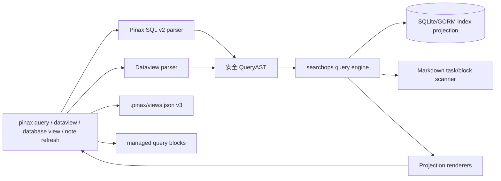

# pinax-dataview-database-query 设计

## 总体方案

Pinax 继续以 Markdown vault 为真源，以 SQLite/GORM index 为可重建投影。本变更不把用户暴露给 raw SQLite，而是在 `internal/app/searchops` 下建立统一的安全查询管线：SQL v2 parser 和 Dataview parser 都编译到同一 `domain.QueryAST` 扩展结构，再由 query engine 对 index projection 和必要的 Markdown task projection 执行。



## 查询语言边界

### Pinax SQL v2

继续只允许只读 SELECT 子集：

- source：`notes`、`tasks`、`links`、`backlinks`、`assets`。
- select：普通属性、`COUNT(*)`、`COUNT(field)`、`MIN(field)`、`MAX(field)`。
- where：`=`、`!=`、`>`、`>=`、`<`、`<=`、`CONTAINS`、`LIKE`、`IN (...)`、`EXISTS field`、`field IS EMPTY`、`field IS NOT EMPTY`。
- sort：`ORDER BY field ASC|DESC`。
- group：`GROUP BY field[, field...]`。
- limit/cursor：默认 limit 50，命令行 `--limit` 只能收窄，不能扩大超过上限。

禁止：`JOIN`、`UNION`、子查询、写入语句、函数任意调用、raw SQLite 表名、PRAGMA、文件/网络/环境访问。

### Dataview-compatible 子集

新增 `pinax dataview run <query>`，支持常用 Dataview 形态：

```text
TABLE title, status, due FROM #project WHERE status != "done" SORT due ASC LIMIT 20
LIST FROM "notes/research" WHERE contains(tags, "paper") LIMIT 20
TASK FROM #project WHERE !completed SORT due ASC LIMIT 20
```

Dataview parser 只做语法兼容和用户体验，不执行 DataviewJS。`FROM #tag`、`FROM "folder"`、`WHERE contains(tags, "x")`、`SORT`、`GROUP BY`、`LIMIT` 编译到同一 `QueryAST`。

## 数据模型扩展

需要扩展 `internal/domain/database.go`：

- `QueryExpression`：支持 field、literal、aggregate、function-like safe forms。
- `QueryFilter`：支持 unary filter，例如 `EXISTS field`、`IS EMPTY`。
- `QueryAggregate`：记录 `function`、`field`、`alias`。
- `QueryResultKind`：`table|list|task|calendar|board`。
- `TaskRow` 或扩展 `DatabaseRow.Source=tasks`：包含 source note、line、text、completed、due、scheduled、priority、tags、block id。
- `DatabaseViewDefinition` v3：新增 `query_language`、`result_kind`、`group_by`、`display`、`calendar_field`、`board_column`、`source_query_id`。

所有新增字段必须是可选字段，读取旧 `pinax.views.v1/v2` 时保持兼容并在写回时升级到 v3。

## 命令设计

新增：

```bash
pinax dataview run 'TABLE title, status FROM #project LIMIT 20' --vault ./my-notes --json
pinax dataview explain 'TASK FROM #project WHERE !completed' --vault ./my-notes --json
pinax database view save project-dashboard --query 'TABLE title, status FROM #project' --language dataview --kind table --vault ./my-notes --json
pinax database view render project-dashboard --format markdown --vault ./my-notes --json
```

增强：

```bash
pinax query run 'SELECT status, COUNT(*) AS count FROM notes GROUP BY status LIMIT 20' --vault ./my-notes --json
pinax database view save active-projects --query 'SELECT title, status FROM notes WHERE tags CONTAINS "project"' --language sql --kind table --vault ./my-notes --json
pinax note refresh Dashboard --rendered --vault ./my-notes --json
```

## 输出合同

所有命令继续使用统一 `domain.Projection`：

- `--json`：顶层 envelope 不新增命令专属字段；新增内容放在 `data`。
- `--agent`：新增 key 使用 `fact.` 前缀，例如 `fact.language=dataview`、`fact.source=tasks`、`fact.groups=3`、`fact.aggregates=count`。
- `--events`：长查询可发 `start/progress/fact/end`，短查询可直接 envelope；不得把 human progress 写入 JSON stdout。
- `--explain`：只给 review summary，不输出 raw note body、raw provider payload 或 full chain-of-thought。

## 测试策略

- parser unit tests：覆盖 SQL v2 和 Dataview 子集的 AST。
- engine tests：覆盖 notes/tasks/links/backlinks/assets source、类型比较、聚合、分组、分页。
- command tests：覆盖 JSON/agent/default output、help、completion、错误 next action。
- testscript e2e：真实 vault 中创建 notes、frontmatter、inline fields、tasks、links、assets、dashboard note，运行 query/dataview/database view/note refresh。
- integration evidence：如新增集成入口，必须写入 `temp/integration-test-runs/<run-id>/` 并脱敏。

## 风险和约束

- 风险：语法扩得过快会变成半成品 SQL 引擎。缓解：只支持 Dataview 高频 20% 用法，其他返回稳定错误和 next action。
- 风险：task/block 扫描绕过 index 性能边界。缓解：首版 task source 可使用增量 index 投影；临时 Markdown scanner 必须有 limit 和证据说明。
- 风险：视图 v3 写回破坏旧视图。缓解：读取 v1/v2，写回 v3，保留旧字段语义，不删除字段。
- 风险：内嵌查询刷新误写用户正文。缓解：只更新 `pinax:managed` 标记块；没有 managed marker 时只 preview，不写入。

## 回滚

本变更是 additive。若发布后出现问题：

1. 保留既有 `query.run` 和 `database.view.*` 行为。
2. 临时隐藏 `dataview` 命令帮助入口，但保留二进制兼容命令返回 `feature_disabled`。
3. `database view` 继续读取 v3 文件，忽略未知 v3 字段，按 v2 字段渲染。
4. 删除或禁用 `pinax-dataview` managed block 刷新时不得删除用户原始 fenced block。
