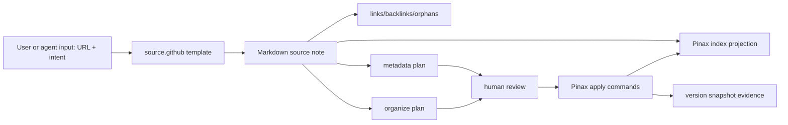

## Design

Pinax durable source notes 把“外部资料源”建模为可长期复查的 Markdown note，而不是临时收藏链接。Markdown 仍是真源；Pinax 只通过 CLI/service 写 frontmatter、路径、索引和组织建议。第一版聚焦 GitHub 仓库资料源，因为它覆盖了最常见的长期资料场景：代码库、开源数据源、工具集合、规范仓库和参考实现。



## Source Note Shape

第一版推荐 `kind: source`，但必须兼容既有 `kind: reference`。实现不得要求旧笔记迁移。

推荐 frontmatter 字段：

- `kind: source`：标记为外部资料源；旧 `reference` 继续有效。
- `status: active`：可检索、可维护。
- `tags`: 使用分层 tag，例如 `source/github`、`media/iptv`、`playlist/m3u`、`license/cc0`。
- `source_url`: 原始资料源 URL，可选新增字段。
- `last_checked_at`: 最近人工或工具复查时间，可选新增字段。
- `source_license`: 资料源许可摘要，可选新增字段。
- `review_after`: 建议下次复查时间，可选新增字段。

推荐正文结构：

1. `一句话`：一句话说明它是什么。
2. `Source facts`：主仓库、主入口、license、维护方、数据来源。
3. `Canonical URLs`：README、docs、license、API、related repos。
4. `Use decision`：当前使用判断，例如只读参考、测试数据源、生产禁用。
5. `Risk and boundary`：稳定性、法律、隐私、供应链边界。
6. `Verification`：如何复查，最近复查结果。
7. `Related notes`：概念卡、项目卡、风险卡链接。
8. `Next actions`：可执行后续动作。

## Built-In Template

新增 `source.github` 内置模板，作为 `pinax note add` 可选模板，不改变默认 note 创建行为。

示例命令：

```bash
pinax note add "iptv-org/iptv" --template source.github --var url=https://github.com/iptv-org/iptv --vault ./my-notes --json
```

模板默认行为：

- 输出路径建议为 `sources/github/{{slug}}.md`。
- 默认 `kind: source`、`status: active`。
- 默认 tags 至少包含 `source/github` 和 `reference/source`。
- 模板正文只使用用户提供的变量和静态结构，不自动联网抓取。
- 显式 CLI 参数 `--dir`、`--kind`、`--status`、`--tags` 必须继续优先于模板默认值。

## Metadata and Organize Planning

`metadata plan` 和 `organize plan` 应能识别外部资料源候选，但第一版只生成建议，不自动改正文。

候选识别信号：

- 正文或 frontmatter 含 `github.com/<owner>/<repo>` URL。
- 标题形如 `<owner>/<repo>` 或包含 GitHub 仓库名。
- tags 包含 `github`、`source`、`reference`、`repo` 中的一项。

建议类型：

- metadata 建议：`kind: source`、`source_url`、`last_checked_at`、结构化 tags。
- path 建议：`sources/github/<slug>.md`。
- review 建议：缺少 `Use decision`、`Risk and boundary`、`Verification`、`Related notes` 时给出 manual review item。
- graph 建议：有 `Related notes` 但无可解析内部链接时提示补链接；不自动创建新概念卡。

## Agent Skill Boundary

后续可新增 `long-term-note-review` skill，但该 skill 只能做审稿流程：读取笔记、判断类型、解释建议、调用 Pinax 命令。长期规则的来源仍是 Pinax docs/spec/template/organize policy。

## Compatibility and Rollback

本变更只新增模板、建议类型、可选字段和文档。若实现后出现问题，可隐藏 `source.github` 模板、关闭 durable-source organize 建议，并保留已创建 Markdown 笔记不变。新增 frontmatter 字段是可选文本字段，旧 Pinax 版本应继续把它们当普通 metadata 保留。

## Verification Evidence Plan

- `go test ./cmd/pinax -run 'TestSourceTemplate|TestDurableSource' -count=1`：验证模板、CLI 输出、显式参数覆盖。
- `go test ./internal/app -run 'TestSourceTemplate|TestDurableSource' -count=1`：验证模板渲染、metadata/organize 建议和 manual review items。
- `go test ./internal/index -run 'TestSourceMetadata' -count=1`：验证新增可选字段不破坏索引投影。
- `go test ./...`：回归测试。
- `openspec validate pinax-durable-source-notes --strict` 和 `openspec validate --all --strict`：规格校验。
