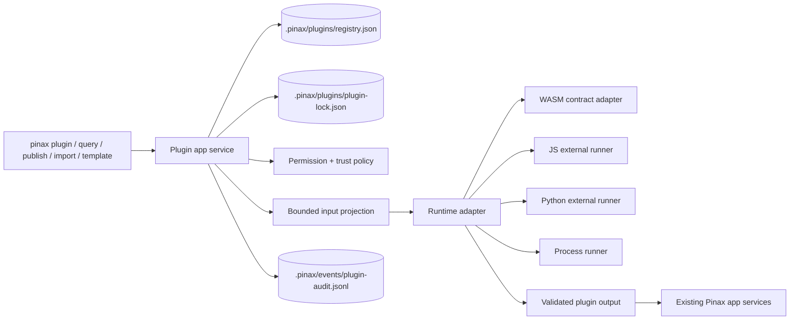

# pinax-dynamic-plugin-runtime 设计

## 架构概览

Pinax 插件机制采用 manifest-driven + capability-scoped + runner-isolated 架构。Pinax 主进程负责安装、校验、权限、输入投影、执行预算、输出校验、审计和真实写入；插件只负责计算扩展结果。



## 语言和运行时选择

Pinax 是 Go CLI，默认保持纯 Go 和 `CGO_ENABLED=0` 构建路径。动态语言支持不把 JS/Python VM 嵌入 Go 主进程：

- WASM：默认推荐的未信任插件运行时方向。首版只固定 call/result/budget/sandbox 合同和 fail-closed adapter boundary，不引入真实 engine；未配置 engine 时返回 `plugin_runner_unavailable`。后续真实 runtime 优先选纯 Go engine（例如 wazero 类 adapter），不开 cgo，不需要系统动态库。
- JavaScript：外部 runner 模式。Pinax 不内嵌 V8，不引入 cgo。用户或插件 manifest 指定 `node`、`deno` 或 `bun` runner；Pinax 通过 stdio JSON-RPC 传入 bounded input，并限制 cwd、env、timeout、output bytes。
- Python：外部 `python3` runner 模式。适合用户本地数据转换、轻量 ML/解析或临时生态 glue；不作为 Pinax 长期服务进程。依赖由插件自带或用户环境提供，Pinax 只做 runner probe 和权限审计。
- Process：兼容任意 CLI-backed provider，权限默认最低，必须声明输入/输出 schema 和 action kind。

JS/Python/process 无法由 Pinax 在所有平台上提供强制系统级沙箱，因此首版把它们定义为 trusted runner。未信任插件的目标运行时仍是 WASM，但真实 WASM engine 不属于本 change 的完成范围，必须作为后续独立 OpenSpec 交付。

## Manifest v1

插件目录包含 `pinax-plugin.yaml` 或 `pinax-plugin.json`。manifest 是插件包的一部分；安装到 vault/user scope 后，Pinax 生成 CLI-authored registry 和 lock。

```yaml
schema_version: pinax.plugin.v1
id: project-dashboard
name: Project Dashboard
version: 0.1.0
runtime:
  kind: wasm
  entrypoint: dist/plugin.wasm
capabilities:
  - id: render_dashboard
    kind: view.render
    input_schema: schemas/render-input.json
    output_schema: schemas/render-output.json
permissions:
  vault:
    read: projection
    write: action_plan
  filesystem:
    read: none
    write: temp
  network: false
budgets:
  timeout_ms: 3000
  max_input_bytes: 262144
  max_output_bytes: 262144
  max_memory_mb: 64
hooks:
  - event: database.view.render
    capability: render_dashboard
```

Manifest 校验规则：

- `id` 必须稳定、ASCII、不可与内置 capability 冲突。
- `runtime.kind` 只能是 `wasm|javascript|python|process`。
- `permissions` 默认 deny；缺省权限等于无权限。
- `budgets` 必须有上限；缺省使用 Pinax 安全默认值。
- `capabilities[].kind` 必须来自 Pinax allowlist。
- manifest 不得包含 token、Authorization、Cookie、webhook URL 或 secret value。

## Registry 和 lock

Pinax 写入以下 CLI-authored structured assets：

- `.pinax/plugins/registry.json`：安装状态、enabled、scope、source、manifest digest、capability metadata、permission grants。
- `.pinax/plugins/plugin-lock.json`：plugin id、version、runtime、entrypoint sha256、schema sha256、installed_at、installed_by_command。
- `.pinax/events/plugin-audit.jsonl`：安装、启用、授权、执行、失败、禁用事件。

用户和 agent 不应手写这些文件。插件源目录的 manifest 可由插件作者维护；安装后的 registry/lock 只能由 Pinax 命令更新。

## 执行协议

所有 runtime adapter 使用同一 Plugin RPC envelope：

```json
{
  "schema_version": "pinax.plugin.call.v1",
  "call_id": "plugincall_...",
  "plugin_id": "project-dashboard",
  "capability": "render_dashboard",
  "input": {},
  "permissions": {},
  "budgets": {}
}
```

插件响应：

```json
{
  "schema_version": "pinax.plugin.result.v1",
  "status": "success",
  "facts": {},
  "data": {},
  "action_plan": null,
  "warnings": []
}
```

Pinax 校验响应 schema、大小、redaction、action kind allowlist 和权限。任何失败都转为 Pinax projection error，不直接透出 raw stack trace 或 raw stderr。

## Capability allowlist

首版支持以下 capability kind：

- `query.source.read`：提供只读 rows，供 Dataview/query/database view 使用。
- `template.function`：提供纯函数式模板 helper；必须 deterministic，无网络、无写入。
- `import.transform`：把外部内容转换为 Pinax import plan。
- `export.render`：把 bounded note projection 渲染为 artifact。
- `publish.render`：生成 publish staging artifact，必须过 publish scanner。
- `note.action_plan`：根据 bounded note facts 生成 action plan，不直接写正文。
- `diagnostic.rule`：产生 vault doctor/repair finding。

后续可新增 capability kind，但删除或重定义既有 kind 是 breaking change，必须走 OpenSpec migration。

## 权限模型

权限按 plugin + capability + vault scope 授权：

- `projection.read`：只读 Pinax bounded projection，不含完整 note body。
- `note.body.read`：高风险，默认拒绝；需要 `--yes` 授权并记录原因。
- `action_plan.write`：插件可返回计划，但不执行写入。
- `temp.write`：只能写 Pinax 创建的临时目录。
- `network`：默认 false；首版仅 process/JS/Python 可请求，WASM 默认不开放。
- `env.read`：默认 empty allowlist；只能读取 manifest 声明且用户授权的变量名，输出必须脱敏。

真实写入必须满足现有 Pinax gates：dry-run、plan、approval、snapshot、record event、index update 和 redacted evidence。

## 命令设计

```bash
pinax plugin validate ./plugins/project-dashboard --json
pinax plugin install ./plugins/project-dashboard --scope vault --vault ./my-notes --json
pinax plugin list --vault ./my-notes --json
pinax plugin inspect project-dashboard --vault ./my-notes --json
pinax plugin enable project-dashboard --vault ./my-notes --yes --json
pinax plugin disable project-dashboard --vault ./my-notes --yes --json
pinax plugin permissions list project-dashboard --vault ./my-notes --json
pinax plugin permissions grant project-dashboard projection.read --capability render_dashboard --vault ./my-notes --yes --json
pinax plugin run project-dashboard render_dashboard --vault ./my-notes --dry-run --json
pinax plugin doctor --vault ./my-notes --json
pinax plugin uninstall project-dashboard --vault ./my-notes --yes --json
```

默认 `plugin run` 是 dry-run/read-only。任何执行 action plan 的命令必须另设 `plugin apply --plan <id> --yes` 或复用现有能力 apply 命令，不能在 `plugin run` 中隐式写入。

## 与 Dataview/数据库能力关系

`pinax-dataview-database-query` 先提供内置、安全、无插件依赖的 Dataview 子集。插件机制只作为后续扩展点：

- 插件可新增 `query.source.read`，例如从本地 CSV、BibTeX、Zotero export projection 提供 rows。
- 插件不可覆盖内置 `notes/tasks/links/backlinks/assets` source 的语义。
- 插件 query source 输出必须经过同一 limit、schema、redaction、agent-safe projection。

## 安全边界

- 插件默认 disabled，install 不等于 enable。
- 未启用或未授权插件不能执行。
- 安装、启用、授权和执行都写 audit event。
- 插件 stderr/stdout 会被分离、截断和脱敏；machine stdout 仍只输出 Pinax envelope。
- 插件输入默认不包含完整 note body、absolute host path、tokens、Authorization、Cookie、provider payload、raw prompts 或 hidden prompts。
- 插件异常不应污染 Pinax 主进程；外部 runner 失败只返回 failed projection。

## 回滚

本变更是 additive。若插件机制出现安全或稳定问题：

1. 保留 registry/lock 读取能力，但 `pinax plugin run` 返回 `plugin_runtime_disabled`。
2. `pinax plugin list/inspect/disable/uninstall` 继续可用，方便清理。
3. 忽略 plugin hooks，不影响内置 note/query/publish/sync 命令。
4. `.pinax/plugins/registry.json` 和 lock 是本地结构化资产，可通过 `pinax plugin doctor --repair --yes` 降级或禁用。
