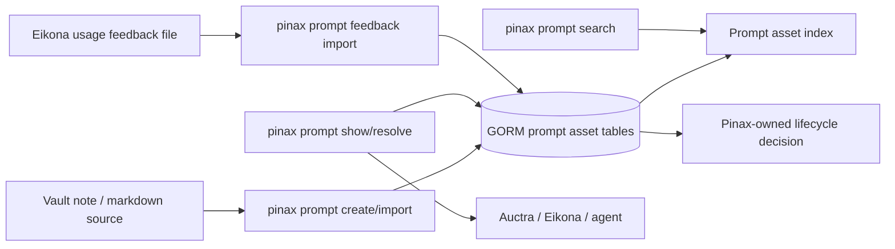

## Context

Root change `prompt-asset-cross-project-contract` defines the cross-project prompt asset contract. Pinax owns the durable prompt vault side because Pinax already owns local notes, indexing, retrieval, and agent-safe proof loops.

The Pinax implementation must preserve these boundaries:

- Pinax stores prompt assets and source refs.
- Auctra exports narrative context packs and evidence refs.
- Eikona renders prompts, runs visual workflows, and emits usage feedback.
- Pinax imports or links feedback; Eikona never mutates Pinax state directly.



## Data Model

Implementation should add GORM models through the existing store/index pattern, then generate typed DAO code through GORM Gen.

Minimum conceptual entities:

- `PromptAsset`: stable ID, schema version, title, domain, lifecycle, permission, prompt template hash, source refs, owner project, created/updated timestamps.
- `PromptAssetVersion`: version ID, asset ID, prompt template, variables schema, constraints JSON, review criteria, content hash.
- `PromptUsageFeedback`: feedback ID, asset ID, version/hash, external run ref, artifact refs, decision, reason, imported timestamp.
- `PromptAssetSourceRef`: source URI, note path/ref, evidence span if available.

Structured mutations must be performed through Pinax app services and CLI commands, not agent-written JSON.

## CLI Shape

Target commands:

```bash
pinax prompt create --from notes/prompts/novel-character.md --id novel_character_portrait_v1 --json
pinax prompt import --from temp/prompt-assets/novel-character.yaml --json
pinax prompt search "novel character portrait" --domain visual_generation --json
pinax prompt show novel_character_portrait_v1 --json
pinax prompt resolve pinax://prompt/novel_character_portrait_v1 --agent
pinax prompt lifecycle novel_character_portrait_v1 --to tested --reason "fixture render passed" --json
pinax prompt feedback import --from temp/eikona-feedback.json --json
```

`--agent` output must stay low-token and path-safe. It should include only decision-essential keys such as `prompt_asset_id`, `version`, `lifecycle`, `permission`, `action.resolve`, and `action.next`.

## Validation and Redaction

- Reject prompt assets without `schema_version`, `id`, `domain`, `permission`, `variables`, or `prompt_template`.
- Reject provider execution eligibility when `permission=unknown`; Pinax can still store and search such assets locally.
- Redact local file paths in agent output unless the command explicitly supports path reveal.
- Never output secrets, raw provider payloads, hidden system prompts, private tool args, or full chain-of-thought.

## Integration Evidence

Add a fixture integration entry point that creates a temporary vault, imports one prompt asset, searches it, resolves it, imports one Eikona-style feedback record, and writes evidence under `temp/integration-test-runs/<run-id>/` with at least:

- `summary.json`
- `command.txt`
- `stdout.log`
- `stderr.log`
- `env.json`
- `artifacts/`

## Rollout

1. Add schema/model tests first.
2. Add repository and migration tests.
3. Add CLI projection contract tests.
4. Add fixture integration evidence.
5. Update Pinax docs.

## Open Questions

- Should prompt asset templates live only in SQLite/index, or should Pinax also mirror accepted prompt assets into vault Markdown for human editing?
- Should lifecycle promotion from `accepted` to `promoted` require an explicit command even when feedback count crosses a threshold?
