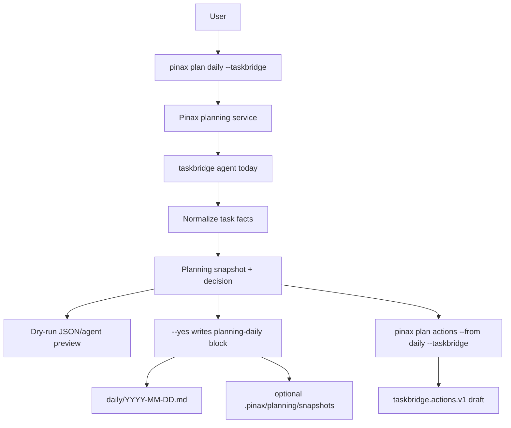

# Pinax TaskBridge 每日 Markdown TodoList 设计

## 方案

Pinax 通过 CLI-backed adapter 调用 `taskbridge agent today`，把 `taskbridge.today.v1` 结果规范化为 planning snapshot 和 decision，再由 Pinax journal/planning 服务写入 daily note 的 `planning-daily` managed block。TaskBridge 继续拥有任务事实和执行控制面，Pinax 继续拥有 Markdown vault 写入。

## 关键决策

- `planning-daily` 是唯一新增 managed block 名称，符合现有 parser 的 `[A-Za-z0-9_.:-]+` 限制。
- `captured_at` 使用命令运行时的 UTC RFC3339 时间，并同时写入 JSON facts、snapshot 和 Markdown block。
- 每日承诺选择规则为 `must_do -> next -> at_risk` 去重后取 `MaxCommitments(daily)` 条。
- 已存在 daily note 但缺少 `planning-daily` block 时，`--yes` 在文件末尾追加该 block；重复、未闭合或解析失败时 fail closed。
- 新增 JSON/agent facts 均为 additive，不删除或重命名既有字段。

## 错误和安全边界

- TaskBridge 不存在、执行失败或输出无法解析时返回 `TASKBRIDGE_UNAVAILABLE`。
- TaskBridge schema/status 不符合预期时返回 `TASKBRIDGE_CONTRACT_UNSUPPORTED`。
- managed block 冲突返回 `PLANNING_BLOCK_CONFLICT`，不写 Markdown、`.pinax`、Git、TaskBridge 或远端 provider。
- 复杂协议转换、managed block 写入和非显然 fixture 必须有中文注释说明恢复边界。

## 验证策略

- 单元测试覆盖 TaskBridge payload 规范化、选择规则、Markdown 渲染和 managed block 冲突。
- CLI/process 测试使用 fake `taskbridge` executable，不依赖真实 TaskBridge store、真实 Provider、真实 token 或公网。
- 运行 `task test:integration` 时继续写入 `temp/integration-test-runs/<run-id>/` 证据。

## 延期项

- TaskBridge 原生命令级 Markdown 导出。
- 从 Markdown todolist 反向生成 action draft。
- TaskBridge 远端 Provider 写回和自动冲突解决。

