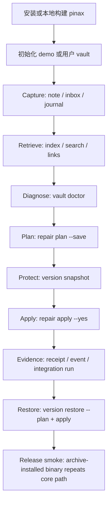
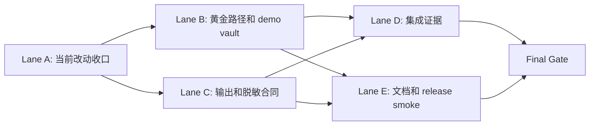
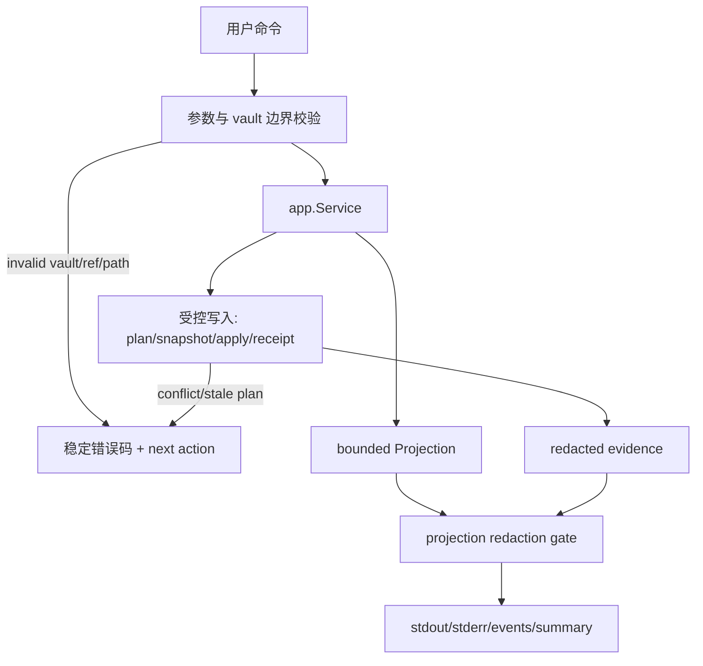

# Pinax 首次用户 Proof Loop Readiness 设计

## 设计原则

- **单一主线**：本变更只证明本地 agent-safe proof loop，不扩展平台能力。
- **真实命令**：文档、测试和 release smoke 必须使用用户可直接运行的 `pinax`、`task`、`go test`、`openspec` 命令。
- **证据优先**：每个写入步骤必须留下可审计证据，失败路径也必须保留 redacted evidence。
- **边界不变**：Markdown vault 是真源，`.pinax/**` 是 CLI-authored structured assets，agent 不手写结构化资产。
- **默认安全**：bounded projection 默认不输出完整正文；Cloud、provider、TaskBridge、release smoke 不得泄漏 token、Authorization、raw prompt 或 provider payload。

## 总体流程

## 并行工作流

## 责任边界

| 区域 | 归属 | 规则 |
| --- | --- | --- |
| CLI 入口 | `cmd/pinax` / `internal/cli` | 只做参数、命令 wiring、输出模式选择，不绕过 app service。 |
| 应用编排 | `internal/app` | Proof Loop、repair、version、restore、planning 收口在 service/facade 或 capability 包。 |
| 输出合同 | `internal/output` | JSON、agent、events、explain 从同一 projection 渲染并经过 redaction gate。 |
| E2E 测试 | `tests/e2e` | 使用 testscript、fixture vault、fake executable，不依赖真实 token 和用户 vault。 |
| 集成证据 | `temp/integration-test-runs/<run-id>/` | 由项目 runner 生成，agent 不手写 summary。 |
| 文档 | `README*`、`docs/**` | 人类说明中文优先，命令和协议字段英文稳定。 |

## 数据流和失败路径

需要重点测试的失败路径：

- vault 不存在、空 vault、已有 legacy `notes/` 布局。
- `repair plan --save` 生成空计划或只包含 manual review。
- `repair apply --yes` 收到过期 plan。
- `version snapshot` 不可用或 Git backend 不可用。
- `version restore apply` 收到过期 restore plan。
- `task test:integration` 子命令失败但 evidence 缺失。
- release archive 缺 asset、checksum 不匹配或二进制不可执行。

## 注释要求

实现时，以下非显然逻辑必须写中文注释：

- demo vault fixture 为什么包含某个问题类型。
- proof loop 中 plan、snapshot、apply、restore 的状态门禁。
- projection body-leak 递归扫描规则。
- integration evidence 的失败保留与 exit code 透传。
- release smoke 中 archive 安装路径、checksum 和临时 vault 隔离规则。

