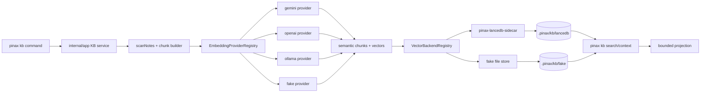
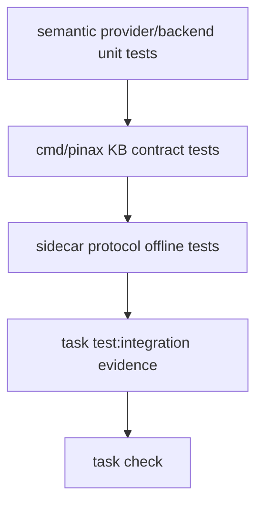

# Pinax KB Provider Expansion 设计

## 设计原则

- **两条扩展轴分离**：embedding provider 负责文本到向量，vector backend 负责存储和搜索；两者不能互相读取凭据或直接写 vault。
- **默认行为不变**：`gemini`、`fake`、`lancedb`、`fake backend` 的现有命令行为和输出合同保持兼容。
- **sidecar 只管 LanceDB**：Go CLI 继续纯 Go；LanceDB Python dependency 只在 `tools/pinax-lancedb-sidecar` 内。
- **凭据不上屏不入库**：provider doctor 只能显示配置状态、来源类型、模型、维度和下一步，不显示 token、Authorization、raw request/response。
- **projection 可重建**：`.pinax/kb/**` 是本地 artifact，Cloud Sync 不把它当作权威数据。

## 总体架构



## 文件责任

| 文件 | 责任 |
| --- | --- |
| `internal/semantic/provider.go` | 定义 `Provider`、`BatchProvider`、provider metadata、registry 和 factory。 |
| `internal/semantic/provider_fake.go` | 承载 deterministic fake provider。 |
| `internal/semantic/provider_gemini.go` | 从现有 `semantic.go` 拆出 Gemini provider。 |
| `internal/semantic/provider_openai.go` | 新增 OpenAI embedding provider 和 redacted error handling。 |
| `internal/semantic/provider_ollama.go` | 新增 Ollama local embedding provider 和 base URL 配置。 |
| `internal/semantic/backend.go` | 定义 vector backend registry、`Save`、`Search`、`Doctor` 分发。 |
| `internal/semantic/sidecar.go` | 承载 LanceDB sidecar request/response 和 protocol additive 字段。 |
| `internal/app/kb.go` | 只调用 semantic registry，不直接判断 provider/backend 细节。 |
| `internal/cli/kb_cmd.go` | 新增 `kb provider list/doctor` 子命令和 completion。 |
| `internal/config/config.go` | 新增可选 KB provider config 键，保留 `kb.sidecar.*`。 |
| `tools/pinax-lancedb-sidecar/**` | 接受 sidecar metadata 可选字段并保持旧请求兼容。 |
| `docs/commands/kb.md` | 说明 provider/backend 边界、凭据来源和真实命令。 |

## Provider Registry

`internal/semantic` 应提供一个默认 registry：

```go
type ProviderFactory func(Config) (Provider, error)

type ProviderInfo struct {
    ID string
    DefaultModel string
    CredentialSource string
    LocalOnly bool
}
```

实现要求：

- `NewProvider(name, model string)` 保留作为兼容 wrapper，内部走 registry。
- `BatchProvider` 是可选接口；OpenAI/Ollama 如果实现 batch，`BuildChunks` 使用 batch，否则逐条 fallback。
- provider error 必须转换为稳定 `domain.CommandError`，例如 `embedding_provider_failed`、`provider_invalid`、`provider_not_configured`。
- `ProviderInfo` 不得包含 secret 值，只能包含 `configured`、`credential_source`、`default_model`、`local_only`。

## Backend Registry

Backend registry 只承载存储和查询：

- `lancedb`：调用 sidecar，store path 仍是 `.pinax/kb/lancedb/`。
- `fake`：使用现有 deterministic file store，只用于测试和本地验证。

禁止事项：

- backend 不读取 `OPENAI_API_KEY`、`GEMINI_API_KEY` 或 Ollama config。
- provider 不直接写 `.pinax/kb/lancedb/`。
- CLI 命令不直接调用 sidecar。

## Sidecar Protocol

`pinax.kb.sidecar.v1` 继续兼容。新增字段只能是 optional：

```json
{
  "schema_version": "pinax.kb.sidecar.v1",
  "backend": "lancedb",
  "provider": "openai",
  "model": "text-embedding-3-small",
  "embedding_dim": 1536,
  "distance_metric": "cosine",
  "collection": "default"
}
```

旧 sidecar 忽略未知字段时仍能 rebuild/search；新 sidecar 也必须接受旧请求中没有这些字段的情况。

## 输出合同

新增命令只走现有 projection/rendering：

```bash
pinax kb provider list --vault ./my-notes --json
pinax kb provider doctor --provider ollama --model nomic-embed-text --vault ./my-notes --agent
```

输出规则：

- `--json` 顶层 envelope 不变。
- `--agent` 只新增 `fact.kb.provider.*`、`fact.kb.backend.*` key。
- provider doctor 不输出 raw token、Authorization、full URL with credential、raw provider payload、raw note body。
- search/context 继续只返回 bounded preview，不返回完整 note body。

## 测试和证据



必须验证：

- provider registry list/doctor 不依赖真实 token。
- fake provider 和 fake backend 保持 deterministic。
- OpenAI/Ollama 使用 fake HTTP server 或 fake executable，不访问公网。
- sidecar protocol tests 覆盖新字段缺失和存在两种请求。
- integration evidence redaction 不保存 token、Authorization、provider payload 或 note body。

## 回滚

本变更只新增 provider/backend registry、命令和可选配置键。若发布后出问题：

1. 隐藏 `openai`、`ollama` provider id 和 `kb provider` 子命令。
2. 保留 `gemini`、`fake`、`lancedb`、`fake backend` 旧路径。
3. 用户可删除 `.pinax/kb/lancedb/` 后运行 `pinax kb rebuild --backend lancedb --provider gemini --vault ./my-notes --json` 重建。
4. 不需要迁移 Markdown vault；不删除或重命名现有 config key。
