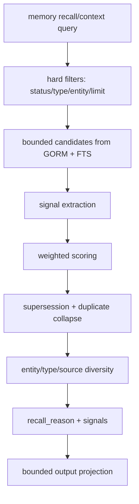
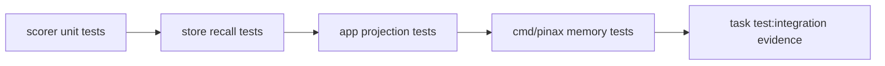

# Pinax Memory Recall Ranking 设计

## 设计原则

- **非向量**：Memory recall 继续不使用 embeddings、LanceDB 或 semantic reranker。
- **可解释**：每个入选 record 都必须能说明命中的信号和加权来源。
- **稳定优先**：相同 ledger、相同 query、相同 clock bucket 下排序稳定，测试可复现。
- **生命周期优先**：默认只召回 `confirmed`；`draft`、`superseded`、`expired`、`rejected` 不进入 agent context。
- **输出有界**：`memory context --agent` 只输出 key=value facts，不输出完整私有正文。

## 总体流程



## 文件责任

| 文件 | 责任 |
| --- | --- |
| `internal/memory/store.go` | 保留 GORM persistence、candidate query、FTS access，不承载复杂 scorer。 |
| `internal/memory/recall.go` | 定义 `RecallFilter`、`RecallHit`、candidate loading orchestration。 |
| `internal/memory/scorer.go` | 实现 signal extraction、weights、score、reason 和 deterministic sorting。 |
| `internal/memory/scorer_test.go` | 覆盖 ranking 行为、tie-break、dedupe、supersession、freshness。 |
| `internal/app/memory.go` | 将 `signals` 放入 JSON data，可选新增 agent facts。 |
| `internal/cli/memory_cmd.go` | 保持现有 flags；如新增 `--explain-ranking` 必须是 optional。 |
| `cmd/pinax/memory_command_test.go` | 覆盖 CLI JSON/agent 输出、redaction 和兼容字段。 |
| `docs/commands/memory.md` | 说明 recall ranking、与 KB 的边界、真实命令示例。 |

## Ranking Pipeline

### 1. Hard filters

默认过滤：

- status: 只包含 `confirmed`。
- type: 用户指定 `--type` 时精确过滤。
- entity: 用户指定 `--entity` 时通过 normalized entity link 过滤。
- limit: candidate loading 可大于输出 limit，但必须有上限，例如 `max(limit*20, 200)` 的受控值。

### 2. Signals

每个候选提取以下信号：

| Signal | 说明 |
| --- | --- |
| `keyword` | FTS rank、exact phrase、fallback scan；字段命中优先级 subject/predicate/object/body。 |
| `entity` | 显式 entity filter、subject entity、linked entity。 |
| `type` | 用户指定 type 或 query 推断出的 type affinity。 |
| `source` | `openspec`、`docs`、`github_actions`、`file` 的 source authority。 |
| `confidence` | `confirmed/high/medium/low` 等 label 映射为权重；未知值低权重。 |
| `freshness` | event/task 更重视新鲜度；fact/decision 不因旧而强惩罚。 |
| `lifecycle` | confirmed 加分；superseded/expired/rejected 默认被 hard filter 排除。 |
| `task_fitness` | query 词如 release/test/provider/cloud/kb/memory 匹配 subject、predicate、source path。 |

### 3. Weights

第一版使用代码内置常量，不暴露复杂调参 UI：

```text
entity: 30
keyword_fts: 24
keyword_field: 18
source_openspec: 12
source_docs: 8
confidence_high: 10
confidence_medium: 5
freshness_event_or_task: 0..8
lifecycle_confirmed: 7
type_match: 8
task_fitness: 0..10
```

如后续需要配置，新增 `memory.recall.weights.*` 可选键，但本 change 不要求用户配置。

### 4. Collapse and diversity

- 同一 `subject + predicate` 的 confirmed record 默认只保留最高分。
- 如果 record A 的 `supersedes_id` 指向 record B，默认只保留 A；B 仍可通过 list include flags 审计。
- 当多个 record 分数相同，按 score、source authority、created_at desc、id asc 稳定排序。
- 输出 limit 前保留类型多样性：在不牺牲明显高分记录的前提下，避免全是同一个 source 或同一 predicate。

## 输出合同

JSON 保留现有字段，并新增可选 `signals`：

```json
{
  "id": "mem_001",
  "type": "decision",
  "score": 87,
  "recall_reason": "status:confirmed + entity_match:pinax + source:openspec",
  "signals": {
    "keyword": 24,
    "entity": 30,
    "source": 12
  }
}
```

Agent 输出只允许低 token facts：

```text
fact.memory.matches=3
fact.memory.top_score=87
fact.memory.reason.1=status:confirmed,entity_match:pinax,source:openspec
```

禁止输出：完整 note body、raw prompt、provider payload、Authorization header、cookies、token、private tool arguments、full chain-of-thought。

## 数据库边界

实现优先不改 schema，使用现有 `memory_records`、`memory_entities`、`memory_record_entities`、`memory_sources`、`memory_fts`。如果需要性能优化，只能 additive：

- 新增 nullable column。
- 新增 index。
- 新增 projection table。

不得 drop/rename/narrow 现有列或改变 status/type 语义。

## 测试矩阵



必须覆盖：

- confirmed record 默认胜过 draft/superseded/expired/rejected。
- OpenSpec source 在同等匹配下高于普通 file source。
- exact field match 高于 body fallback scan。
- event/task freshness 加分不会压过 explicit entity mismatch。
- superseded old record 默认不进入 context。
- `signals` breakdown 加总和 score 规则一致。
- `--agent` 不输出 body 或敏感 sentinel。

## 回滚

本变更保留现有 memory store 和命令合同。若 ranking 行为有问题：

1. 保留新增测试 fixture，临时切回旧 scorer 路径。
2. 不删除 SQLite ledger 和 Markdown 真源。
3. 不删除新增 optional `signals` 字段；可停止填充或置空。
4. 修复后再重新启用 scorer pipeline。
