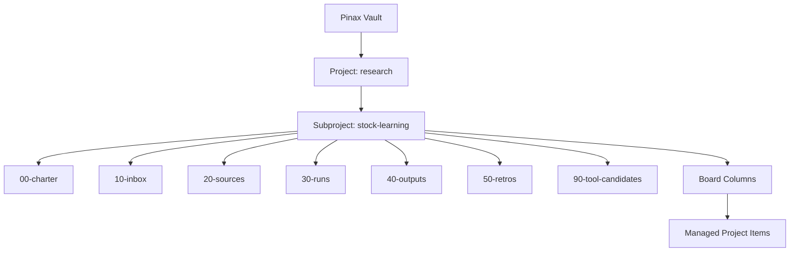
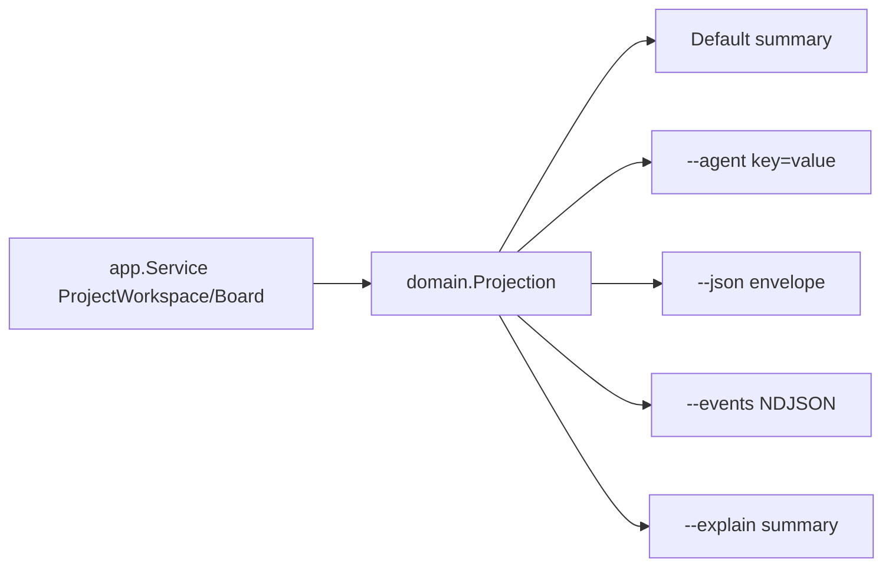
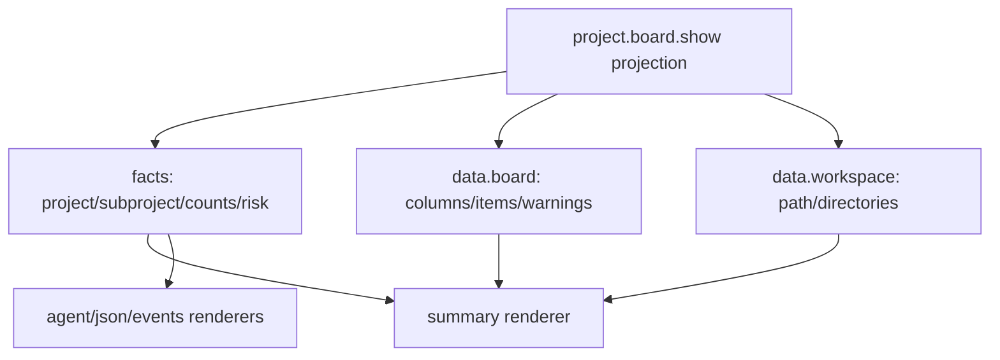
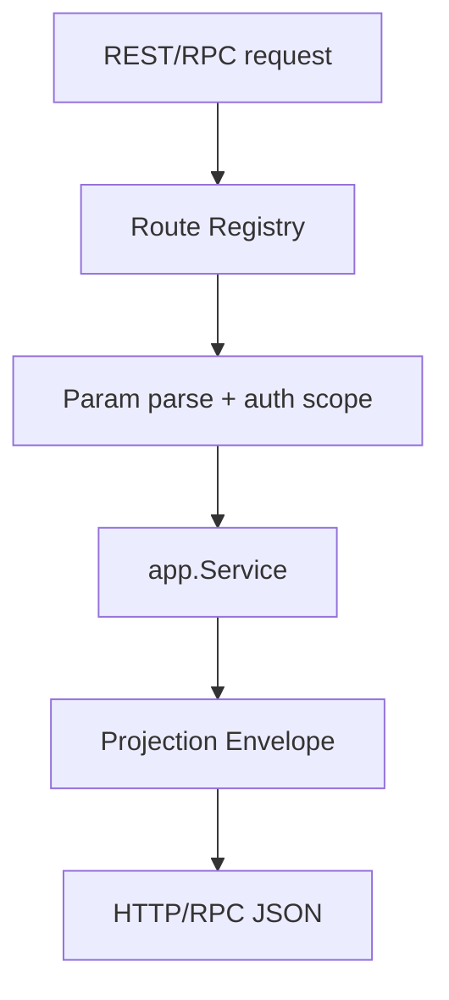
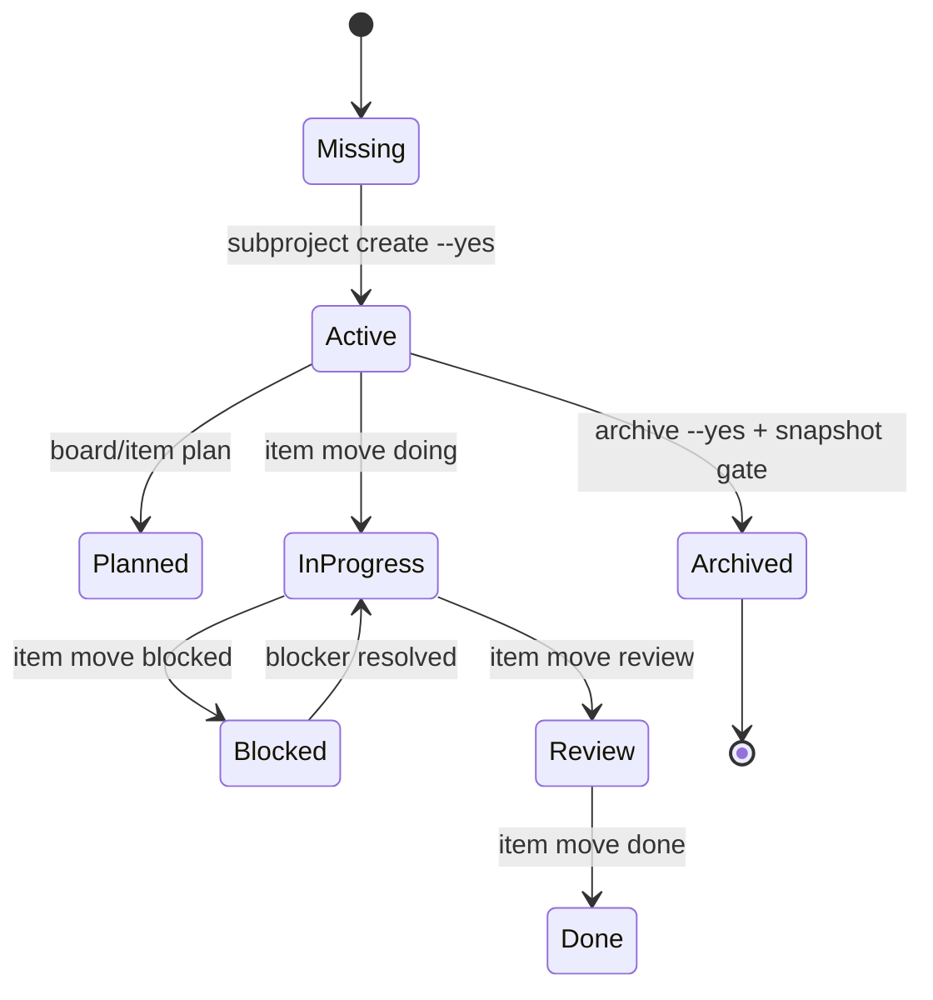

# Pinax 项目工作区层级、API 与 CLI 输出美化设计

## 定位

`subproject` 是 Pinax vault 内的工作单元，用来承载一个特殊需求、研究主题、学习路径、客户项目、内容系列或工具候选。它不是 Git 仓库，不是 Yeisme 工程项目，不拥有独立 runtime。它继承父 project 的上下文，并提供标准目录、看板、item 和 API projection。

## 信息架构



默认目录：

```text
notes/projects/<project>/<subproject>/
  00-charter/
  10-inbox/
  20-sources/
  30-runs/
  40-outputs/
  50-retros/
  90-tool-candidates/
```

## 命令设计

Project 继续是一级边界；Subproject 是 project 内 scoped workspace：

```bash
pinax project subproject create research stock-learning \
  --title "Stock Learning" \
  --template scenario \
  --vault yeisme-notes \
  --json

pinax project subproject list research --vault yeisme-notes --json
pinax project subproject show research stock-learning --vault yeisme-notes --json
```

看板按 project + optional subproject 过滤：

```bash
pinax project board configure research \
  --subproject stock-learning \
  --columns inbox,next,doing,blocked,review,done \
  --vault yeisme-notes \
  --json

pinax project board show research \
  --subproject stock-learning \
  --vault yeisme-notes
```

Item 写入仍走 app service，并写入 Markdown/frontmatter 或 managed item block：

```bash
pinax project item add research "跑第一次真实研究" \
  --subproject stock-learning \
  --column next \
  --labels research,learning \
  --milestone phase-1 \
  --priority medium \
  --body "输入一个公司或行业问题，输出研究笔记、反证清单、复盘问题。不写工具。" \
  --vault yeisme-notes \
  --json

pinax project item move <item_id> doing --vault yeisme-notes --json
pinax project item archive <item_id> --yes --vault yeisme-notes --json
```

## 数据模型

Markdown note frontmatter 是用户可读事实来源：

```yaml
project: research
subproject: stock-learning
item_id: item_abc123
item_type: task
board_column: next
status: active
priority: medium
labels: [research, learning]
milestone: phase-1
due_at: 2026-07-01
blocked_by: []
```

CLI-authored structured assets：

```text
.pinax/projects.json
.pinax/project-workspaces/research/stock-learning.json
.pinax/project-boards/research.json
.pinax/project-boards/research/stock-learning.json
.pinax/events/project-workspace.jsonl
```

这些 structured assets 必须由 CLI/application service 创建和修改。用户和 agent 可以编辑 note 正文，但不能手写 registry、board config、events、receipts。

## Projection 与输出

所有输出从同一 projection 渲染：



## Board Structure View

默认 human 输出采用分栏摘要，不采用宽表矩阵。目标是在普通终端中同时看清工作区层级、目录结构、列状态和下一步动作。实现必须把结构信息放进 shared projection，再由 `internal/output` 的 `project.board.show` 专用 summary renderer 渲染；command 层不得手拼 human text。

结构规则：

- Header 固定展示 `Project: <project> / <subproject>`；没有 subproject 时展示 `Project: <project>`。
- `Path:` 展示相对 vault 的 workspace path，例如 `notes/projects/research/stock-learning`。
- `Structure:` 展示标准目录状态，顺序固定为 `00-charter`、`10-inbox`、`20-sources`、`30-runs`、`40-outputs`、`50-retros`、`90-tool-candidates`；存在显示 `ok`，缺失显示 `missing`。
- `Board:` 一行展示所有配置列计数，默认顺序为 `inbox,next,doing,blocked,review,done`。
- 分栏只展开 `Inbox`、`Next`、`Doing`、`Blocked`、`Review`；`Done` 默认只显示计数，避免已完成项淹没活跃工作。
- 每个展开列最多显示 5 条 item；超出时追加 `... N more, use --json for full list`。
- item 行固定优先级顺序：`[priority] title id=<item_id> due=<date> labels=<csv> milestone=<value> blocked_by=<csv>`，没有值的字段省略。
- `Risks` 只汇总 blocked/review/warning/stale index，不展示 note body。
- `Recommended next step` 只展示一个真实可执行命令。

Projection 到 renderer 的字段来源：



`data.workspace` 是 additive optional payload：

```json
{
  "workspace": {
    "project": "research",
    "subproject": "stock-learning",
    "path": "notes/projects/research/stock-learning",
    "directories": [
      {"name": "00-charter", "path": "notes/projects/research/stock-learning/00-charter", "status": "ok"},
      {"name": "10-inbox", "path": "notes/projects/research/stock-learning/10-inbox", "status": "ok"}
    ]
  }
}
```

## CLI 看板 Demo 合同

实现必须提供一个固定 demo fixture，便于文档、golden tests 和人工评审使用。建议 demo 数据如下：

| 字段 | 值 |
| --- | --- |
| vault | 临时测试 vault，不依赖用户真实 `yeisme-notes` |
| project | `research` |
| subproject | `stock-learning` |
| columns | `inbox,next,doing,blocked,review,done` |
| labels | `research`、`learning`、`source`、`template`、`risk` |
| milestone | `phase-1` |
| items | 至少 8 个，覆盖 next/doing/blocked/review/done 和 due/risk/blocked_by |

Demo 初始化命令应使用真实 CLI：

```bash
pinax project create research --name "Research" --notes-prefix notes/research --vault ./demo-vault --json
pinax project subproject create research stock-learning --title "Stock Learning" --template scenario --vault ./demo-vault --json
pinax project board configure research --subproject stock-learning --columns inbox,next,doing,blocked,review,done --vault ./demo-vault --json
pinax project item add research "跑第一次真实研究" --subproject stock-learning --column next --labels research,learning --milestone phase-1 --priority high --due-at 2026-07-01 --vault ./demo-vault --json
pinax project item add research "整理资料来源模板" --subproject stock-learning --column doing --labels source,template --milestone phase-1 --priority medium --vault ./demo-vault --json
pinax project item add research "等待经纪业务术语反证清单" --subproject stock-learning --column blocked --labels risk,research --blocked-by item_source_review --vault ./demo-vault --json
```

默认 human summary demo：

```text
Project: research / stock-learning
Path: notes/projects/research/stock-learning
Structure: 00-charter ok | 10-inbox ok | 20-sources ok | 30-runs ok | 40-outputs ok | 50-retros ok | 90-tool-candidates ok

Board: inbox 0 | next 3 | doing 1 | blocked 1 | review 2 | done 5
Milestone: phase-1    Priority: high 1 | medium 3 | low 7

Next
- [high] 跑第一次真实研究 id=item_001 due=2026-07-01 labels=research,learning
- [medium] 阅读行业报告并做来源卡 id=item_002 labels=source,research
- [low] 设计复盘问题清单 id=item_003 labels=template

Doing
- [medium] 整理资料来源模板 id=item_004 labels=source,template

Blocked
- 等待经纪业务术语反证清单 id=item_005 blocked_by=item_source_review labels=risk,research

Review
- 第一次研究输出草稿 id=item_006 labels=output
- 工具候选清单初稿 id=item_007 labels=tool-candidate

Risks
- 1 blocked item needs owner review.
- 2 review items may become reusable templates.

Recommended next step:
pinax project item move item_001 doing --vault ./demo-vault --json
```

紧凑输出 demo 固定入口为 `pinax project board show research --subproject stock-learning --compact --vault ./demo-vault`，用于 `--compact` 或终端宽度不足时的目标形态：

```text
Project: research / stock-learning
Path: notes/projects/research/stock-learning
Board: inbox 0 | next 3 | doing 1 | blocked 1 | review 2 | done 5
Top: [high] 跑第一次真实研究 id=item_001 due=2026-07-01
Risk: 1 blocked, 2 review
Next: pinax project board show research --subproject stock-learning --vault ./demo-vault --json
```

空看板 demo：

```text
Project: research / stock-learning
Path: notes/projects/research/stock-learning
Structure: 00-charter ok | 10-inbox ok | 20-sources ok | 30-runs ok | 40-outputs ok | 50-retros ok | 90-tool-candidates ok

Board: inbox 0 | next 0 | doing 0 | blocked 0 | review 0 | done 0

No project items yet.

Recommended next step:
pinax project item add research "<title>" --subproject stock-learning --column next --vault ./demo-vault --json
```

`--agent` 示例：

```text
spec_version=1.0
mode=agent
command=project.board.show
status=success
fact.project=research
fact.subproject=stock-learning
fact.workspace_path=notes/projects/research/stock-learning
fact.column.next=3
fact.column.doing=1
fact.column.blocked=1
fact.items.total=11
fact.item.top.id=item_001
fact.item.top.title="跑第一次真实研究"
fact.item.top.priority=high
fact.item.top.due_at=2026-07-01
fact.risk.blocked=1
fact.risk.review=2
action.add_item="pinax project item add research <title> --subproject stock-learning --column next --vault ./demo-vault --json"
```

`--json` demo 必须保持 envelope 单对象，复杂数据放在 `data`：

```json
{
  "spec_version": "1.0",
  "mode": "json",
  "command": "project.board.show",
  "status": "success",
  "facts": {
    "project": "research",
    "subproject": "stock-learning",
    "workspace_path": "notes/projects/research/stock-learning",
    "items": "11",
    "blocked": "1"
  },
  "data": {
    "workspace": {
      "project": "research",
      "subproject": "stock-learning",
      "path": "notes/projects/research/stock-learning",
      "directories": [
        {"name": "00-charter", "path": "notes/projects/research/stock-learning/00-charter", "status": "ok"},
        {"name": "10-inbox", "path": "notes/projects/research/stock-learning/10-inbox", "status": "ok"},
        {"name": "20-sources", "path": "notes/projects/research/stock-learning/20-sources", "status": "ok"},
        {"name": "30-runs", "path": "notes/projects/research/stock-learning/30-runs", "status": "ok"},
        {"name": "40-outputs", "path": "notes/projects/research/stock-learning/40-outputs", "status": "ok"},
        {"name": "50-retros", "path": "notes/projects/research/stock-learning/50-retros", "status": "ok"},
        {"name": "90-tool-candidates", "path": "notes/projects/research/stock-learning/90-tool-candidates", "status": "ok"}
      ]
    },
    "project": {"slug": "research", "name": "Research"},
    "subproject": {"slug": "stock-learning", "title": "Stock Learning"},
    "columns": [
      {"name": "next", "count": 3},
      {"name": "doing", "count": 1},
      {"name": "blocked", "count": 1}
    ],
    "items": [
      {
        "item_id": "item_001",
        "title": "跑第一次真实研究",
        "column": "next",
        "priority": "high",
        "labels": ["research", "learning"],
        "milestone": "phase-1",
        "due_at": "2026-07-01"
      }
    ]
  },
  "actions": [
    {"name": "add_item", "command": "pinax project item add research \"<title>\" --subproject stock-learning --column next --vault ./demo-vault --json"}
  ]
}
```

`--events` demo：

```jsonl
{"type":"start","spec_version":"1.0","mode":"events","seq":1,"command":"project.board.show","project":"research","subproject":"stock-learning"}
{"type":"board.summary","spec_version":"1.0","mode":"events","seq":2,"command":"project.board.show","project":"research","subproject":"stock-learning","workspace_path":"notes/projects/research/stock-learning","items":11,"blocked":1,"review":2}
{"type":"end","spec_version":"1.0","mode":"events","seq":3,"command":"project.board.show","status":"success"}
```

## Local API/RPC

REST/RPC 是 projection adapter，不拥有独立业务模型：



新增 read endpoints：

```text
GET /v1/projects
GET /v1/projects/{project}
GET /v1/projects/{project}/subprojects
GET /v1/projects/{project}/subprojects/{subproject}
GET /v1/projects/{project}/board?subproject=stock-learning&note_display=card
GET /v1/project-items/{item_id}
```

新增 controlled write plan endpoints：

```text
POST /v1/projects/{project}/subprojects?yes=true
POST /v1/project-items?project=research&subproject=stock-learning&yes=true
POST /v1/project-items/{item_id}:move?column=doing&yes=true
POST /v1/project-items/{item_id}:archive?yes=true
```

默认 `pinax api serve` readonly；写入必须同时满足：

- server 启动时使用 `--allow-write`。
- 请求带 `yes=true`。
- 高风险写入有 fresh version snapshot，否则返回 `snapshot_required`。
- handler 只做参数、status mapping、projection serialization，不直接读写 Markdown、GORM、`.pinax` 或 Git。

## 状态机



## 兼容与迁移

- 旧 project 没有 subproject 时，`subproject` 字段为空，board 按 project-wide 模式返回。
- 现有 `.pinax/project-boards/<project>.json` 继续有效。
- 新 `.pinax/project-boards/<project>/<subproject>.json` 只在用户配置 subproject board 时创建。
- API route registry 新增 route，不删除旧 route。
- JSON/agent/events 只新增 optional 字段。

## 非显然实现注释要求

以下逻辑实现时必须写中文注释解释不变量：

- `project/subproject` path 边界和 reserved directory 拒绝规则。
- project-wide board 与 subproject board 的兼容 fallback。
- managed item 与 unmanaged Markdown checklist 的写入边界。
- REST/RPC write gate、snapshot gate、readonly server gate。
- output projection 到 human/agent/json/events 的字段映射。
- fake vault/testscript fixture 中 GitHub/Gitea 风格字段的取舍原因。
