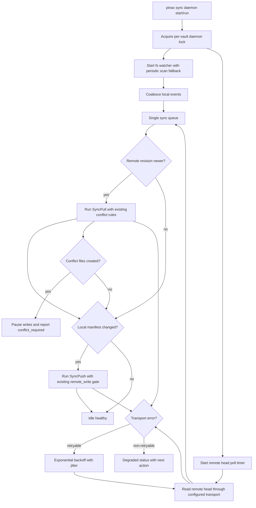

# pinax-realtime-sync-daemon Design

## 架构决策

Pinax 后台实时同步继续属于 `cli/pinax` Go 子项目，由纯 Go 实现，默认保持 `CGO_ENABLED=0` 可构建。原因是能力边界是长运行进程、文件系统 watcher、信号处理、锁、重试和 sync engine 编排，Go 已是 Pinax 主语言，也适合这个 daemon/worker 场景；不引入 Rust、cgo 或额外 sidecar。

首版采用显式本地进程模型：

- `pinax sync daemon run --target cloud --vault ./my-notes --yes` 在前台运行同步循环，适合 systemd、launchd、Windows Task Scheduler、开发调试和 e2e 测试。
- `pinax sync daemon start --target cloud --vault ./my-notes --yes` 以后台子进程方式启动同一个 runner，并写入 CLI-authored 运行态证据。
- `pinax sync daemon status|stop|logs --vault ./my-notes` 读取或控制该 vault 的后台进程。
- 每个 vault 同一时间只允许一个 daemon runner；显式 `pinax sync push|pull` 遇到 daemon 正在同步时应返回可诊断 partial/error，或等待后重试，具体等待策略由实现任务锁定。

## 组件边界

新增组件遵循现有分层：

- `internal/cli/sync_daemon_cmd.go`：Cobra 命令、flag、help、completion、projection 渲染，不直接操作文件锁或执行 sync。
- `internal/app/syncdaemon/`：daemon app service，负责 lifecycle、watcher、poller、debounce、backoff、state projection、redacted event。
- `internal/app/service_sync_daemon.go`：把 daemon service 接到现有 `app.Service`，复用 `SyncDiff`、`SyncPull`、`SyncPush`。
- `internal/sync/lock.go` 或现有 sync package 邻近文件：per-vault sync lock，保护 CLI 和 daemon 不并发写同一 vault/remote revision。
- `.pinax/sync-daemon/`：CLI-authored runtime state，包含 PID/control/status/events/log receipts；永远不进入 Cloud Sync manifest。

## 同步循环

Daemon 不创建新同步协议，只调度现有 Cloud Sync engine。默认本地事件延迟目标是 debounce 后 2 秒内开始一次 sync attempt；远端变化发现默认每 30 秒 poll 一次 head。远端“实时”在 S3/rclone/server 当前 MLP 下定义为轮询近实时，而不是服务端 push。



同步顺序必须满足：

1. 串行执行，任一时刻只有一个 sync attempt。
2. 如果远端 head 比本地已知 base 新，先 pull 再考虑 push，避免 daemon 盲目覆盖远端。
3. `revision_conflict` 进入 pull/rebase/retry 分支；超过 retry budget 后状态为 `degraded`，并给出 `pinax sync pull --target cloud --vault <vault> --yes --json` next action。
4. Pull 产生 conflict copy 后状态为 `conflict_required`；daemon 可以继续只读 status/poll，但不得自动 resolve 或删除 conflict copy。
5. Push 的 `remote_write=true` 仍只来自既有 durable commit 结果；daemon 不根据 blob upload、manifest upload 或本地 queue 成功伪造 remote write。

## Watcher 和扫描策略

本地变化检测使用 `github.com/fsnotify/fsnotify`，该依赖已在现有依赖图中出现；实现时应把它作为直接依赖记录到 `go.mod`。Watcher 递归监听 vault 内未 hard-deny 的目录，忽略 `.git/`、`.pinax/`、Cloud Sync blob cache、LanceDB projection、临时 conflict merge 文件和 provider cache。

如果平台 watcher 不可用、目录数量超过系统限制、事件溢出或 watcher 返回不可恢复错误，daemon 进入 `watch_degraded`，退回周期性 manifest scan。状态输出必须说明当前 detection mode 是 `watcher`、`scan_fallback` 或 `disabled`，并给出可运行 next action。

## 运行态和输出

Daemon state 只由 CLI/service 写入，禁止用户或 Agent 手写：

```text
.pinax/sync-daemon/
  daemon.json          # current process/status projection
  control.json         # stop request / desired state, if needed
  events.jsonl         # redacted daemon lifecycle and sync events
  runs/<run-id>/       # per-run evidence for integration/e2e when test harness enables it
```

机器输出遵守既有 envelope：

- `command`: `sync.daemon.start`、`sync.daemon.run`、`sync.daemon.status`、`sync.daemon.stop`、`sync.daemon.logs`
- `status`: `success`、`partial`、`failed`
- facts 示例：`running`、`pid`、`vault`、`target`、`backend_kind`、`detection_mode`、`sync_state`、`last_success_at`、`last_error_code`、`local_pending`、`remote_revision`、`conflict_count`
- events 示例：`sync.daemon.started`、`sync.daemon.local_change_detected`、`sync.daemon.remote_change_detected`、`sync.daemon.sync_started`、`sync.daemon.sync_succeeded`、`sync.daemon.sync_failed`、`sync.daemon.conflict_required`、`sync.daemon.stopped`

这些字段都是新增合同。不得删除、重命名或改变现有 `pinax sync` 输出字段。Daemon 输出和 event 不得包含 note body、plaintext object keys derived from note paths、raw secret refs、Authorization headers、provider stderr、provider payloads、raw prompts、hidden system prompts 或 private tool arguments。

## 资源预算

- 默认 poll interval：30s，可通过 `--poll-interval` 调整，下限 5s。
- 默认 debounce：2s，可通过 `--debounce` 调整，下限 500ms。
- 默认 retry：指数退避 2s、5s、15s、30s、60s，上限 5 分钟，带 jitter。
- 单次 sync attempt 超时默认 2 分钟，可通过 `--sync-timeout` 调整。
- 空闲 CPU 应接近 0；内存应主要由 watcher、manifest scan 和现有 sync engine 决定，不常驻 note body 缓存。

## 风险和缓解

- 文件事件丢失：通过周期性 scan fallback 兜底，状态中暴露 `detection_mode` 和 `last_scan_at`。
- 多进程竞争：per-vault daemon lock + sync operation lock；显式 CLI 写同步和 daemon 同步必须互斥。
- 远端冲突：pull-first、CAS conflict retry、conflict copy pause，禁止自动合并正文。
- 远端 provider 限流：指数退避、稳定 error code、next action，不隐藏失败。
- 用户误以为服务端保存明文：文档继续强调 Cloud Sync 只协调密文，daemon 只是本地进程。

## 验证策略

- 命令合同：`go test ./cmd/pinax -run 'SyncDaemon|SyncOutputContract' -count=1`
- Daemon service：`go test ./internal/app ./internal/sync -run 'SyncDaemon|SyncLock|Backoff|Debounce' -count=1`
- Transport 复用：`go test ./internal/cloudsync ./internal/cloudclient ./internal/remote -run 'Cloud|Sync|Transport|ObjectStore|Direct|Conflict|Redaction' -count=1`
- E2E：`go test ./tests/e2e -run 'TestSyncDaemon' -count=1`
- 全量门禁：`task check`
- OpenSpec：`openspec validate pinax-realtime-sync-daemon --strict` 与 `openspec validate --all --strict`

