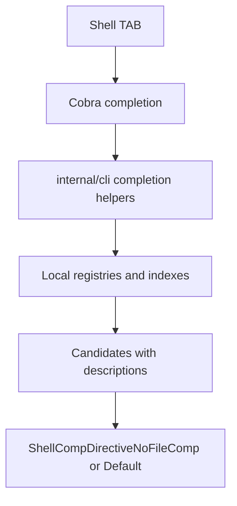

## 设计

补全逻辑放在 Cobra 命令层和 `internal/cli` 只读 helper 中。helper 只读取本地 registry、轻量索引文件或 vault 目录，不通过 app service 写入，不触发 index rebuild，不访问网络或 secret store。

## 覆盖策略

- 枚举 flag：用静态候选，例如 `--color auto|always|never`、`--display card|detail|context|body`、`--provider gemini|openai|ollama|fake`。
- vault 对象：从本地 registry 或轻量索引读取，例如 projects、subprojects、folders、views、templates、notes、assets、prompts、plugins、collections、backends、sync conflicts。
- 用户 profile：只返回 profile 名和非敏感摘要，不输出 endpoint token、secret value 或 Authorization。
- 路径输入：保留文件补全，例如 `--from`、`--api-token-file`、`--root`、`--merged`、`init <path>`。

## 回滚

移除新增 completion 注册和 helper 后，命令运行行为不受影响；补全会退回 Cobra 默认行为或 shell 文件补全。新增测试和文档可一起回退。
