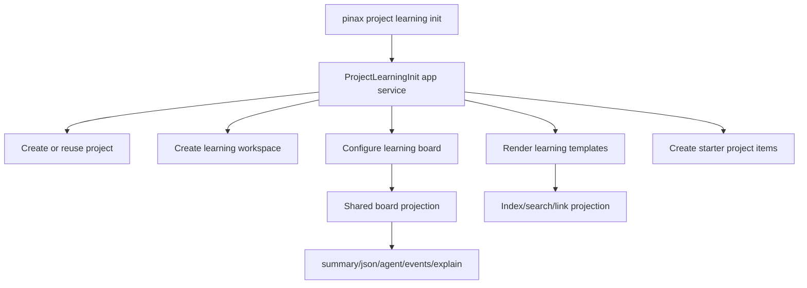

## 设计

本变更复用 Pinax 现有 project workspace、board、template 和 note service。`learning init` 是一个编排型 app service，不在 CLI 层手写 `.pinax/**` 资产。



## 命令形状

新增命令：

```bash
pinax project learning init investing stock-learning --title "学习炒股的全部笔记" --project-name "学习炒股" --notes-prefix notes/investing --preset stock-learning --vault ./stock-learning-notes --json
```

默认行为：

- project 不存在时创建；存在且定义兼容时复用；存在但定义冲突时返回 `project_conflict`。
- workspace template 写为 `long-term-learning`。
- board 列为 `inbox,planned,learning,practice,review,retrospective,done`。
- starter notes 和 starter items 可重复运行，重复运行不制造重复文件或重复 task。
- `--dry-run` 只返回计划操作，不写 Markdown、`.pinax`、Git 或远端。

## Board 配置修复

当前 `project board configure` 能保存配置，但 `board show` 仍使用默认列。实现需要新增 `loadProjectBoardConfig(root, project, subproject)`：

- `ProjectBoardShow/Plan/Export` 使用配置列排序和渲染。
- `ProjectItemAdd/Move/Plan` 读取对应 project/subproject 配置后校验列。
- `ProjectBoardFacts` 保留旧固定字段，同时增加可选 `ColumnCounts map[string]int`。
- human summary 动态渲染所有配置列，不再只渲染固定列。

## 模板与边界

通用模板：`learning.term`、`learning.source`、`learning.practice_log`、`learning.weekly_review`、`learning.case_review`。

股票学习预设模板：`learning.stock.term`、`learning.stock.indicator`、`learning.stock.case_review`、`learning.stock.trade_journal`、`learning.stock.risk_rule`、`learning.stock.weekly_review`。

股票模板必须包含学习边界提示：用于历史复盘、知识整理、模拟练习和风险原则，不构成投资建议。

## 风险与回滚

- 风险：自定义列会改变 board 排序和 human 输出。
- 缓解：旧固定 facts 保留；新增动态 facts 是可选字段；没有配置时保持默认列。
- 回滚：恢复代码后，用户可删除或重配 `.pinax/project-boards/<project>/<subproject>.json`；Markdown notes 仍是普通文件，索引可用 `pinax index rebuild --vault ./my-notes --json` 重建。
