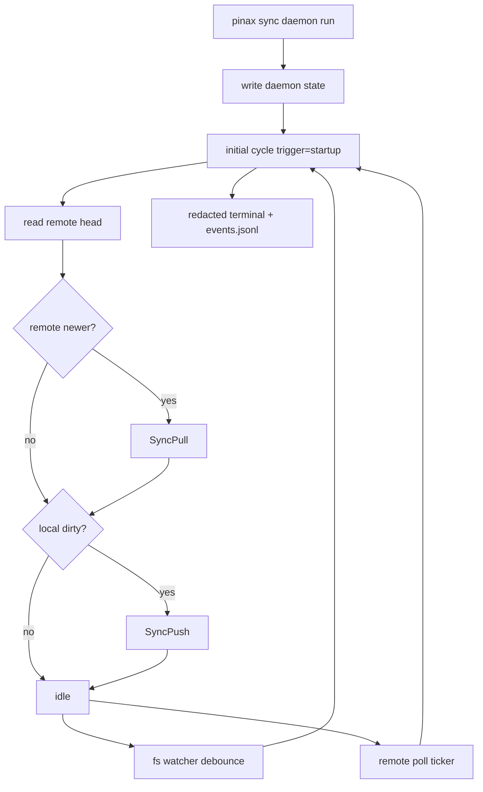

# pinax-sync-daemon-observability-initial-sync Design

## 架构

本变更只改 `cli/pinax` 本地 daemon 编排，不新增远端服务。Cobra 层负责 flag 和输出 sink；`internal/app` 负责 daemon 生命周期；`internal/app/syncdaemon` 负责状态、事件、watcher、debounce、backoff 和锁；同步动作继续复用现有 `SyncPull` / `SyncPush`。

## 输出策略

- default human：`sync daemon run` 持续打印短英文事件行，适合人看和 supervisor 日志。
- `--events`：stdout 是 NDJSON 流，包含 start、daemon event、end/error。
- `--json` / `--agent` / `--explain`：保持最终 projection，不输出中间 stdout。
- 所有模式共用同一份 redacted `SyncDaemonEvent`，禁止散落脱敏逻辑。

## 同步循环

- 启动后不等 ticker，立即执行 `trigger=startup` 的 cycle。
- 每个 cycle 都先 poll remote head；如果远端 revision 更新，先 pull；随后再检查本地 manifest hash，dirty 时 push。
- watcher 事件、poll ticker 和 stop request 进入同一个串行 select loop，不并发执行 sync。
- watcher 失败时写 `watch_degraded`，切到 scan/poll fallback；不要静默停止 daemon。

## 事件持久化

事件写入 `.pinax/sync-daemon/events.jsonl`，字段保持可选 additive：`seq`、`cycle_id`、`trigger`、`direction`、`duration_ms`、`local_dirty`、`remote_revision`、`revision_id`、`sync_run_id`、`remote_write`、`local_write`。无变化 poll 不刷日志，避免长期运行产生噪声。

## 风险

- 工作区已有未提交 daemon 首版改动，实施时必须增量修改，不回滚用户改动。
- CLI 机器输出是稳定合同，只允许新增事件和可选字段。
- 长运行测试必须可控，`--once` 和 fake cloud e2e 必须继续支持。
