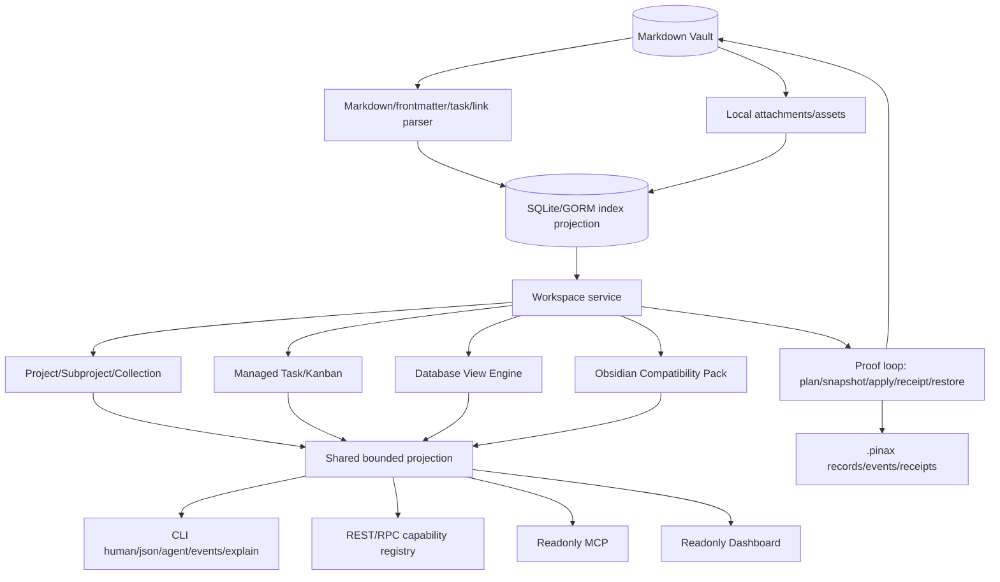
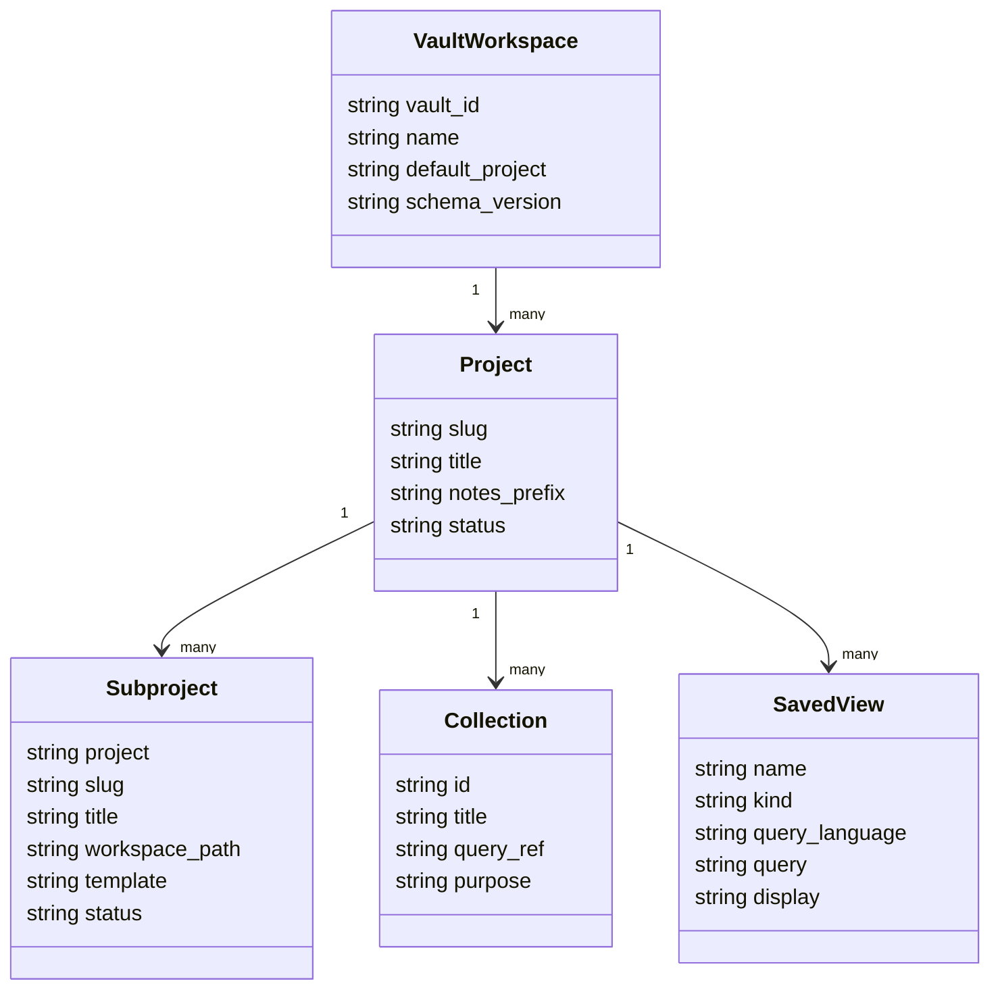
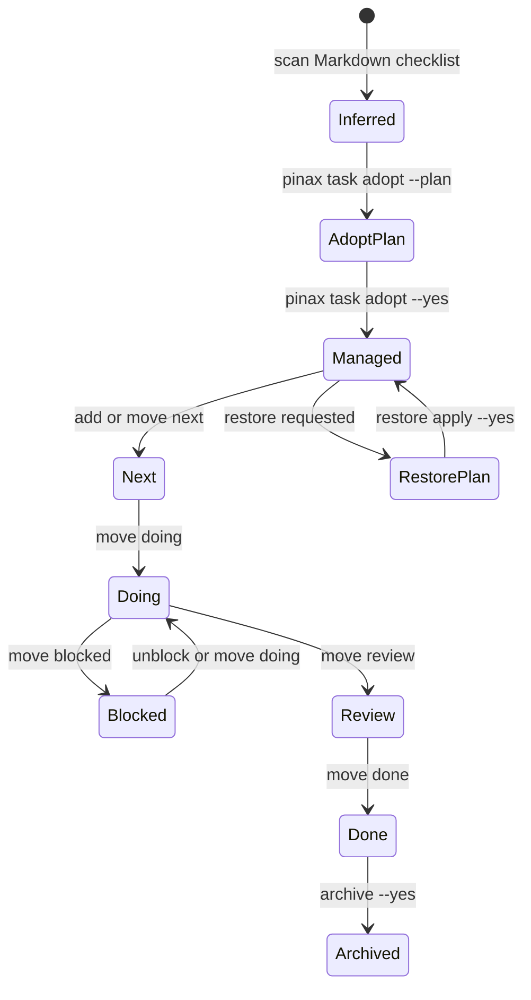
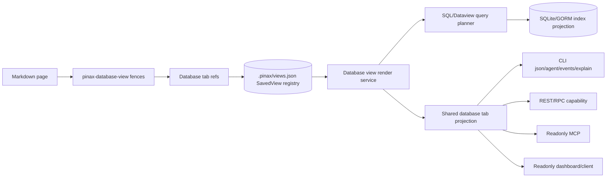

# Pinax 统一 Vault 工作区、Todo Kanban 与数据库设计

## 产品定位

Pinax 应该成为本地优先、agent-safe 的个人知识与项目操作系统，而不是另一个笔记编辑器。用户可以继续用 Obsidian 或任意 Markdown 编辑器写正文；Pinax 负责更高价值的操作层：结构化投影、项目推进、任务看板、数据库视图、双链维护、整理修复、发布同步和 agent 安全写入。

## 总体架构



## 数据分层

### 真源

- 用户正文、附件和普通 Markdown 结构继续存放在 vault 内。
- 用户可以用 Obsidian、编辑器或 Git 查看和编辑普通 Markdown 正文。
- Pinax 不把 SQLite、Cloud Sync、dashboard 或 API 变成笔记真源。

### CLI-authored 结构化资产

`.pinax/**` 下的 workspace registry、project registry、board config、database view registry、schema registry、task adoption record、events、receipts、sync state 和 publish profile 必须由 CLI/application service 写入。agent 不得手写这些资产。

建议新增或扩展的资产边界：

```text
.pinax/workspaces/current.json
.pinax/projects.json
.pinax/project-workspaces/<project>/<subproject>.json
.pinax/project-boards/<project>/<view>.json
.pinax/database/schemas.json
.pinax/database/views/<view>.json
.pinax/tasks/adoptions.jsonl
.pinax/events/workspace.jsonl
```

### 可重建投影

SQLite/GORM index 保存 note、task、link、backlink、asset、property、view row、relation-lite 和 graph facts。它是查询和 dashboard 的性能层，不是不可替代真源。

## 统一 Workspace 模型

Workspace 是一个 vault 内的组织层，不是新的 Git 仓库或子项目 runtime。

Project Manager 里的“子项目”必须被解释为 **vault-local workspace directory**：如果 vault 是 `~/data/yeisme-notes`，那么子项目真实目录必须落在 `~/data/yeisme-notes/` 下面，具体路径为 `vault_root + workspace_path`，例如 `~/data/yeisme-notes/notes/projects/research/stock-learning/`。OD、dashboard 和未来 client 必须在创建/预览/详情界面展示这个路径预览和说明，避免用户误以为会在仓库根目录、Pinax CLI 子项目、独立 Git repository 或 `.pinax/**` metadata 目录中创建子项目。

Project Manager UI 注释要求：

- 创建子项目表单必须显示 `Vault root`、`Workspace path` 和 `Full path preview`，并标注 full path 是普通 Markdown 工作区目录。
- `.pinax/project-workspaces/<project>/<subproject>.json` 只是 CLI-authored registry；用户内容、任务 note、资料和 managed blocks 位于 `workspace_path` 指向的 vault 子目录。
- 子项目不是 Yeisme monorepo subproject，不需要 `AGENTS.md`、`CLAUDE.md`、独立 remote、submodule 或开发工具链 bootstrap。
- 如果 OD 用示例路径，统一使用 `~/data/yeisme-notes` 作为 vault 示例，避免混用 repo path、临时目录和用户级 config path。
- Project Manager 的空状态、创建按钮、危险操作确认和详情页都必须重复这个路径语义；只写 “Create subproject” 不足以说明写入位置。
- 新建子项目默认目录必须使用语义名称：`charter`、`inbox`、`sources`、`runs`、`outputs`、`retros`、`tool-candidates`。不要默认创建 `00-charter`、`10-inbox`、`20-sources` 等数字前缀目录；数字前缀只作为旧 vault 兼容或用户显式模板选择存在，避免把个人笔记管理固定成单一排序结构。



## Todo Kanban 策略

Pinax 必须区分三种 task 来源：

1. **Managed task**：由 `pinax project item add`、`pinax task add` 或 adopt flow 创建，可移动、归档、审计。
2. **Adopted checklist**：原本是用户 Markdown checklist，经 `pinax task adopt` 显式确认后进入 managed task registry。
3. **Inferred checklist**：从普通 Markdown 扫描得到，只读展示，不能被 `move/archive` 直接修改。



写入规则：

- 未 adopt 的 checklist move/archive 必须返回 `project_item_unmanaged` 或 `task_unmanaged`。
- 批量移动、归档、删除、跨项目迁移、rewrite managed block 必须要求 approval；高风险写入还要 snapshot evidence。
- daily task review 只更新 Pinax managed block；没有 marker 时只输出 plan。

## Notion 风格数据库边界

Pinax database 应该覆盖 Notion 最常用的本地知识组织能力，但不做云协作数据库。

首批能力：

- property schema：`text`、`number`、`checkbox`、`date`、`select`、`multi_select`、`url`、`email`、`person_text`、`relation`、`rollup`、`formula` 的本地安全子集。
- view display：`table`、`board`、`list`、`calendar`。
- tab model：一个 CLI-authored saved database view 对应一个可发现 tab；Markdown 页面只引用和组合这些 tab，不把渲染结果当真源。
- query：filter、sort、group、limit、typed comparison、Dataview-compatible subset、Pinax SQL safe subset。
- relation-lite：只允许 vault 内 note/task/project/view reference，不允许跨 remote workspace 明文关系。
- rollup-lite：只允许 count、min、max、latest、status summary 等可在本地 index 上计算的聚合。

禁止能力：

- 不执行任意 JavaScript、DataviewJS、SQL write、PRAGMA、文件/网络/环境访问函数。
- 不让 formula 读取 secret、provider payload、raw prompt、hidden system prompt 或完整 note body。
- 不把 table cell 直接变成绕过 proof loop 的任意 Markdown rewrite。

## Database View 可视化与多 Tab 合同

Pinax 采用 SavedView 即 Tab 的模型：`pinax database view save <name>` 创建的每个 saved database view 都是一个稳定 tab。Markdown 笔记、dashboard、MCP 和未来 client 可以按名称引用这些 tab，但不能直接写 `.pinax/**` view registry 或把渲染结果保存成新的真源。



设计规则：

- 一个 tab 的稳定 ID 来自 saved view name；可选显示属性放在 `display.*`，例如 `display.mode`、`display.tab_label`、`display.tab_order`、`display.icon`。
- `--display table|board|list|calendar` 是查询型 database view 的 canonical display 参数；现有 `--kind` 继续作为兼容输入，不删除、不重定义。
- `pinax database view render <name>` 默认读取 saved view 的 display 配置；命令行 `--display`、`--group-by`、`--calendar-field`、`--board-column` 只能临时覆盖本次 render，不能隐式写回 registry。
- Markdown 使用 `pinax-database-view <saved-view-name>` fence 引用 tab；同一 note 内多个 fence 按文档顺序组成多 tab 页面。现有 `pinax-sql` 和 `pinax-dataview` fence 继续作为临时单查询块兼容，不要求先保存成 view。
- Render projection 复用同一输出核心，新增 optional `data.database_view`、`data.database_tab`、`fact.database.*` 和 `fact.database_tab.*`；不得删除现有 `data.result`、`facts.rows`、`facts.columns`、`facts.view` 等字段。
- `table` 输出 bounded rows；`board` 输出按 group/board column 聚合的 bounded cards；`list` 输出标题、路径、状态和少量摘要字段；`calendar` 必须有 date property，缺失时返回 `calendar_field_required` 和 next action。
- 所有 render 路径默认只读，不写 Markdown、`.pinax/**`、SQLite index、Git、provider、sync state 或远端服务；写入 Markdown managed block 仍只能通过显式 refresh/apply 命令并遵守 proof loop。

## Obsidian 兼容能力矩阵

Pinax 参考 Obsidian，但优先实现 agent 和自动化最需要的维护层。

| 能力 | Pinax 目标形态 | 当前计划姿态 |
| --- | --- | --- |
| Markdown vault | 本地 Markdown 真源 | 成熟能力继续强化 |
| Wikilink/backlink | 解析、诊断、修复、冲突处理 | P1/P2 |
| Graph | bounded graph facts、collection graph、dashboard 只读 | P2 |
| Properties | schema infer/set、typed validation、database view | P2 |
| Daily notes | journal templates、daily review、managed blocks | P2 |
| Templates | 内置模板、vault-local override、preview | P2 |
| Attachments | vault 内 asset manifest、missing/orphan doctor | P2 |
| Dataview | safe subset、saved database view | P2/P3 |
| Plugins | manifest、permission、dry-run runner | P3 |
| Publish | static site/wiki/profile/receipt | P3 |
| Sync | local-first encrypted sync daemon | P0/P3 |
| Canvas/editor UI | 不进 CLI 当前范围 | 后续独立 client |

## 客户端与 API 边界

新增 workspace/database/task 能力必须走现有 capability registry：

- CLI 是主要入口。
- REST/RPC 是 projection adapter。
- MCP/dashboard 默认只读。
- Remote API Mode 不支持通用远程命令执行。
- Cloud Sync daemon 负责多设备实时收敛，不替代 Remote API Mode。

## 兼容性与回滚

合同分类：当前计划为 additive。

- CLI 输出：新增 optional `data.workspace`、`data.task_view`、`data.database_view`、`fact.workspace.*`、`fact.task.*`、`fact.database.*`；不删除旧字段。
- API/RPC：新增 route/method/capability；不改旧 path/method/status 语义。
- DB/index：新增 GORM model/table/nullable columns/index；不 drop/rename/narrow。
- Config/registry：新增 schema version 和 optional keys；旧 registry 继续可读。

回滚策略：

1. 可通过隐藏新命令 help、禁用 registry capability 或返回 `feature_disabled` 回退用户入口。
2. 旧 view/project/task registry 继续可读；新增 optional 字段被旧代码忽略。
3. index projection 可删除并重建；不得删除 Markdown 真源。
4. 任何已经写入 Markdown 的 managed block 必须能通过 `pinax version restore ... --plan` 和 `pinax version restore apply ... --yes` 回退。

## 验证策略

- Focused unit tests 覆盖 workspace path、task adoption、database schema、query planner、view render 和 Obsidian graph/link repair。
- Command tests 固定 CLI human/json/agent/events/explain 输出合同。
- Testscript e2e 覆盖一个真实 vault：project/subproject、managed task、adopted checklist、database table/board/calendar、wikilink/backlink、daily review、asset doctor。
- 集成入口使用 `task test:integration`，证据写入 `temp/integration-test-runs/<run-id>/` 并脱敏。
- 完成前运行 `task check`、`openspec validate pinax-unified-vault-workspace-database --strict` 和 `openspec validate --all --strict`。
