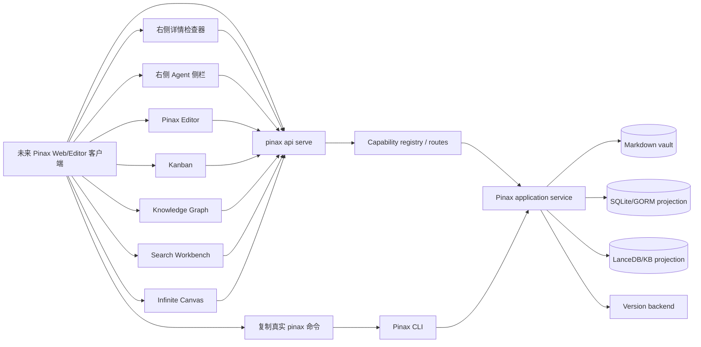

# Pinax Web 开放设计客户端合同设计

## 架构

Pinax Web 先作为未来客户端设计目标存在；`cli/pinax` 在本变更中只负责稳定 Local REST/RPC、CLI JSON、bounded projection、provider status、proof gate 和命令发现合同。

## 设计原则

1. **客户端只消费 projection**：Web 不直接读 `.pinax/**`、SQLite、LanceDB、token 文件、provider config 或 sync state。
2. **Agent 不是 shell**：右侧 Agent 只能调用 registered capability、展示真实 `pinax ...` 命令、生成 plan/diff，不执行任意命令。
3. **BYOK 不等于 Web 保存 key**：Web 只显示 provider configured、credential source、local-only 和 doctor next action，不显示或提交真实 key。
4. **Editor 不绕过 proof loop**：source 编辑只改用户打开的 Markdown note；Agent rewrite、managed block refresh、批量 replace 和危险变更必须走 diff、snapshot、apply gate。
5. **同一数据多视图**：Kanban、图谱、搜索、画布和 Editor 都从同一套 note/project/database/link/KB projection 派生，避免各自解析 vault。

## Capability 分组

| 分组 | 服务能力 | UI 使用方 |
| --- | --- | --- |
| `workbench.status` | vault、index、sync、write mode、API/profile/token 状态 | 顶栏、状态栏、Agent 侧栏 |
| `settings.control` | config source、theme、keymap、Cloud Sync、Publish、security、advanced diagnostics | Settings 设置中心 |
| `agent.context` | note/card/search/entity/canvas/editor selection 的 bounded context | 右侧 Agent 侧栏 |
| `provider.status` | `kb provider list/doctor` projection、credential source、local-only 状态 | BYOK/local provider 面板 |
| `editor.note` | note read/show/edit plan、links/backlinks/attachments、managed block refresh、version snapshot | Pinax Editor |
| `board.view` | project board show/configure/view/item add/move/archive plan | Kanban |
| `graph.view` | link graph、entity search、一跳/二跳展开、证据和表格联动 | 知识图谱 |
| `search.view` | grouped results、snippets、filters、`rg` fallback diagnostics | 搜索侧边栏和全屏搜索页 |
| `canvas.view` | canvas layout metadata、object refs、frame/export plan | 无限画布 |
| `proof.gate` | dry-run、plan、snapshot requirement、receipt、restore hint | 所有写操作 |

## Capability gap matrix

| capability | 当前覆盖 | 状态 | 本变更后续任务 | 证据来源 |
| --- | --- | --- | --- | --- |
| `workbench.status` | `api.routes` 可发现 Local REST/RPC；vault、index、sync、profile/token 状态仍分散在独立命令。 | `covered-by-active-change` | 0.2、1.1 | `internal/app/remote.go`、`pinax api routes --vault ./my-notes --json`、`openspec/specs/pinax-cli-remote-api-mode/spec.md` |
| `agent.context` | note/project/search/graph 已有 bounded projection 片段，但缺统一 context shape 和 plan/diff/apply gate。 | `covered-by-active-change` | 2.1、2.2 | `openspec/specs/notebook-workflows/spec.md`、`openspec/specs/project-board-workspace/spec.md` |
| `provider.status` | `kb provider list/doctor` 已输出 provider、configured、credential source 和 local-only 状态，不回显 secret。 | `covered-by-active-change` | 3.1、3.2 | `openspec/specs/personal-kb/spec.md`、`cmd/pinax/kb_command_test.go`、`docs/product/web-open-design.md` |
| `editor.note` | `note read/show`、display/body exposure 和 version snapshot 已有基础；Editor diff、managed block refresh、attachment receipt 还需固化。 | `covered-by-active-change` | 4.1、4.2 | `openspec/specs/notebook-workflows/spec.md`、`docs/product/web-open-design.md` |
| `board.view` | project board show、subproject workspace、saved view、task adopt 和 project item plan 已由归档的 workspace/database change 合并进 specs。 | `covered-by-active-change` | 5.1 | `openspec/specs/project-board-workspace/spec.md`、`internal/app/remote.go` |
| `graph.view` | `graph.summary`、note links/backlinks、ambiguous/broken link evidence 已可发现；Web 图谱仍需一跳/二跳和 bounded entity projection。 | `covered-by-active-change` | 5.2 | `openspec/specs/notebook-index-search/spec.md`、`openspec/specs/notebook-workflows/spec.md` |
| `search.view` | search/query/database view 已有 index-backed projection；Web 搜索需要 grouped/snippet/index status 和 `rg` fallback 诊断合同。 | `covered-by-active-change` | 5.3 | `openspec/specs/notebook-index-search/spec.md`、`openspec/specs/database-views-query/spec.md` |
| `canvas.view` | 当前没有独立画布服务；只能引用现有 note/search/graph/project/evidence 对象。 | `future-client-only` | 5.4 | `docs/product/web-open-design.md`、本 change 的 `pinax-web-client-contracts` spec |
| `proof.gate` | `approval_required`、`write_disabled`、`snapshot_required`、receipt/restore hint 已在多个写路径出现；需要为 Agent/Web 统一 action shape。 | `covered-by-active-change` | 2.2、5.1、6.1 | `openspec/specs/pinax-cli-remote-api-mode/spec.md`、`internal/app/remote.go` |

`implemented` 表示当前 Pinax CLI/API 已足够支撑未来客户端直接消费；`covered-by-active-change` 表示本 OpenSpec 后续任务会把已有能力整理为 Web-facing 合同；`new-task` 表示审计发现但本计划尚未覆盖的缺口；`future-client-only` 表示 Pinax 只定义边界，具体 UI/客户端实现必须进入未来独立客户端子项目。当前审计没有发现未纳入本计划的 `new-task`。

## 数据流

1. Web 启动时调用 `pinax api routes --vault ./my-notes --json` 或等价 Local REST/RPC discovery，生成可用功能、只读/写入状态和本地控制命令提示。
2. 顶栏调用 workbench status projection，显示 vault、index、sync、write mode、body exposure 和 local API/profile/token 状态。
3. Settings 调用 settings/control projection，显示配置来源、保存 scope、secret reference 边界、Cloud Sync/Publish 诊断和危险操作状态。
4. 用户在 Search/Board/Graph/Canvas/Editor 中选择对象后，客户端构造 bounded context request；默认只请求 `card/detail/context`，完整正文只能由用户显式升级。
5. Agent 侧栏把 context chips、provider status 和 capability preview 组合成 ask/diagnose/plan；plan 输出 diff、snapshot requirement 和真实命令预览。
6. Apply 只能在 server allow-write、请求含 `yes=true`、危险写有 snapshot evidence、projection 返回 receipt/restore hint 时启用。

## 与现有 OpenSpec 的关系

- `pinax-client-cli-parity-realtime-sync` 负责 Remote API Mode、capability registry 和客户端 CLI parity 主线；本变更补充 Web/Editor/Agent 使用这些能力时需要的 UI-facing 合同。
- `pinax-unified-vault-workspace-database` 负责 workspace、project board、database view、Obsidian compatibility 等底层 projection；本变更引用这些 projection 作为 Web 工作台视图数据源。
- `pinax-kb-provider-expansion` 已交付 provider list/doctor/rebuild 等 KB provider 基础；本变更把它们纳入 BYOK/local provider UI 合同。

## 风险与缓解

| 风险 | 缓解 |
| --- | --- |
| Web 实现绕过 service 直接读结构化资产 | OpenSpec spec 明确 SHALL NOT；任务要求 API/routes/schema/contract tests 覆盖。 |
| Agent 侧栏变成任意命令执行入口 | 只展示 registered capability 和真实可复制命令；unsupported/local-only 必须有稳定错误。 |
| BYOK UI 收集明文 key | provider status 只输出 credential source 类型；缺凭据显示 doctor 命令。 |
| Editor 自动保存误 apply agent plan | Source autosave 与 Agent diff/apply 分离；agent rewrite 必须 snapshot + diff + receipt。 |
| 看板/图谱/画布各自建真源 | 所有布局和视图 metadata 通过 service 写入，业务对象引用 vault/projection id。 |

## 验证策略

- 每个 capability 分组先补 focused tests，再实现 registry/projection/doc updates。
- 所有新 integration/component/e2e 入口必须写入 `temp/integration-test-runs/<run-id>/`，并脱敏 token、Authorization、raw prompt、provider payload、hidden system prompt、private tool arguments 和完整 chain-of-thought。
- 文档命令示例必须是真实用户可运行命令，例如 `pinax api routes --vault ./my-notes --json`、`pinax kb provider doctor openai --vault ./my-notes --json`、`pinax note read "Research Log" --display card --vault ./my-notes --json`。
- 收口运行 `openspec validate pinax-web-open-design-client-contracts --strict` 和 `openspec validate --all --strict`；触及 Go 代码时运行 focused Go tests，最终运行 `task check` 或记录现有无关失败。
