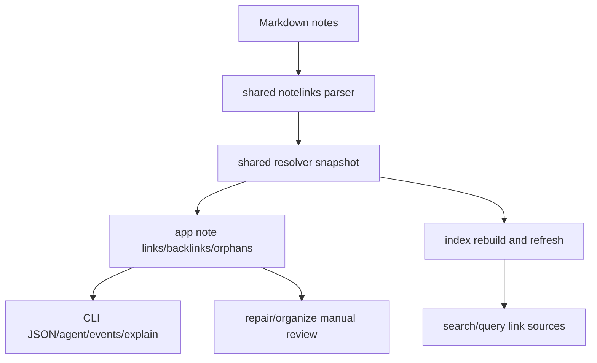

## 设计

本变更将 link graph 规则收敛为一个共享内部模块。Markdown 仍是真源，SQLite/GORM 只保存可重建 projection。

## 解析规则

- Wiki link 支持 `[[Title]]`、`[[Title|Alias]]`、`[[Title#Heading]]`、`[[Title#Heading|Alias]]`。
- Markdown note link 支持 `[label](relative-note.md)` 与 `[label](relative-note.md#heading)`。
- `![[...]]`、外部 URL、`mailto:`、纯 `#heading` 和非 Markdown 附件不进入 note graph；附件引用继续由 asset projection 处理。
- 同一 source note 内仅对完全相同的 `kind + raw target` 去重；不同 heading 或不同 alias 不能互相覆盖。

## 解析优先级

1. `note_id` 精确匹配。
2. vault-relative path 或相对 source note 的 `.md` 路径。
3. 唯一标题匹配，大小写不敏感。
4. frontmatter `alias` / `aliases`。
5. 文件 stem fallback。
6. 没有候选时标记 `broken`。

多候选命中必须标记 `ambiguous` 并返回 `candidates`，不得自动选目标。`target_alias` 只保存展示 alias，不参与目标解析。

## 索引一致性

- `internal/index` 的 `noteLinks` 不再维护自己的简化 wiki parser，而是调用共享 parser/resolver。
- full rebuild 与 incremental refresh 都写入一致的 `target_raw`、`target_alias`、`target_heading`、`status`、`line`、`evidence`。
- `note links` / `note backlinks` 在 index fresh 时可以报告 `facts.engine=index`，但输出必须与 scan fallback 保持一致。

## 修复策略

- `broken` link 生成 `link_resolution` review 操作。
- `ambiguous` link 生成 `link_rewrite` review 操作。
- 不提供自动改正文；用户必须先审查计划，再决定如何调整链接或 metadata。

## 风险与回滚

- 风险：旧 vault 中存在同名标题时，过去可能被错误解析为某个目标；修复后会变成 `ambiguous`。
- 缓解：这是正确性修复，并保留 `broken` 字段与 existing JSON envelope；用户可通过候选列表审查。
- 回滚：恢复本变更代码并运行 `pinax index rebuild --vault ./my-notes --json` 即可重建旧规则 projection。
