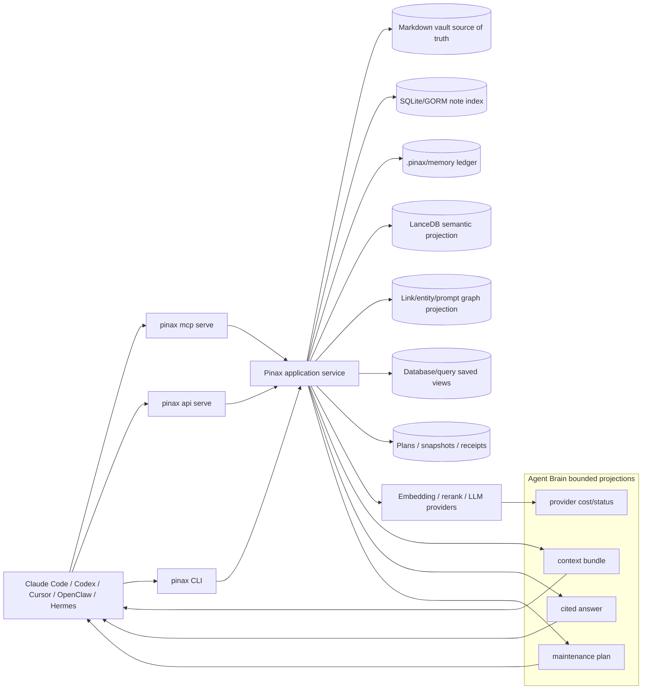

# Pinax Agent Brain Layer 设计

## 目标

Pinax Agent Brain Layer 的目标是把本地 Markdown vault、结构化 memory、semantic KB、关系图谱、query/database views、project board、briefing/proof receipts 和 MCP/Local API 能力组织成一个 agent 可消费的长期知识层。它不是一个新笔记 App，也不是 hosted brain；它是 Pinax 现有 local-first 控制平面的上层合同。

用户应该能让 agent 问：

- “明天见 Alice 前我需要知道什么？”
- “这个项目为什么卡住？”
- “Acme AI、Bob 和上一轮会议有什么关系？”
- “哪些记忆过期、矛盾或缺少引用？”
- “可以安全执行的下一步是什么？”

Pinax 的回答不能只是搜索结果列表，也不能是无来源 LLM 摘要。它必须返回 cited answer、evidence refs、freshness、confidence、open tasks、risk、cost/provider 状态和真实 next command。

## 架构



## 能力分层

| 层级 | 能力 | 当前基础 | 本计划输出 |
| --- | --- | --- | --- |
| Ingest | Markdown import、capture、journal、inbox、future email/calendar/webhook intake | `import markdown`、`note add`、`inbox`、`journal` | 统一 ingestion receipt、source identity、dedupe plan、权限/正文暴露边界。 |
| Memory | typed facts、decisions、events、tasks、lifecycle、source citation | `pinax memory` | Agent Brain context bundle 的结构化 memory 子集和 freshness/supersession 规则。 |
| Semantic KB | embeddings、provider status、semantic context、local/remote provider | `pinax kb`、LanceDB sidecar、provider doctor | provider/cost 可见、rerank/answer synthesis 输入边界。 |
| Graph | notes、links、backlinks、prompt graph、future people/company/entity graph | `note links/backlinks/orphans`、`graph query` | entity resolution plan、relationship evidence、anti-hairball bounded expansion。 |
| Answer | extractive preview、citations、confidence、staleness、open tasks；future LLM synthesis | `pinax brain answer` | 已实现 read-only extractive preview；LLM synthesis/provider rerank 仍需后续任务。 |
| MCP/API | stdio MCP、Local REST/RPC、future HTTP/OAuth/team scopes | `mcp serve`、`api serve`、token/profile | 工具分组、scope、rate/cost metadata、只读默认和 write gate。 |
| Maintenance | dream cycle、entity merge、citation repair、memory compression、contradiction detection | `proof loop`、repair/organize plan | 所有维护先生成 reviewable plan，不静默改写正文。 |

## Capability matrix

| 能力 | 当前入口 / planned 入口 | 状态 | Pinax owner 边界 |
| --- | --- | --- | --- |
| Ingest | `pinax import markdown ... --dry-run`、`pinax inbox capture`、`pinax journal daily append`、`pinax briefing run --dry-run` | `implemented contract baseline` | 现有导入/capture 可用；source identity、receipt、dedupe 和 body exposure 基线已文档化，future connectors 仍需独立实现。 |
| Memory | `pinax memory capture|recall|context` | `implemented` | 本地 structured memory ledger；Agent Brain 只消费 bounded `memory_refs`、lifecycle、freshness、source citation。 |
| Semantic KB | `pinax kb rebuild|refresh|search|context` | `implemented` + `needs-contract` | LanceDB/vector 是本地 rebuildable projection；provider/cost metadata 已有基础，answer/rerank 成本合同仍需实现。 |
| Search | `pinax search ...` | `implemented` | SQLite/GORM token index 或 native fallback；用于候选/snippet，不是综合答案。 |
| Graph | `pinax note links|backlinks|orphans`、`pinax graph summary|query` | `implemented` + `needs-contract` | link/prompt graph 可作为关系证据；entity graph、entity merge 和 anti-hairball expansion 仍需合同/实现。 |
| Query/database views | `pinax query run`、`pinax dataview run`、`pinax database view render` | `implemented` | 受控 query/view projection；Agent Brain 可引用 bounded rows，不直接读 SQLite。 |
| Answer synthesis | `pinax brain answer ...` | `implemented extractive preview` + `needs-contract` | 当前只读、body-safe、provider-free；LLM synthesis、rerank 和 provider cost confirmation 仍需后续任务。 |
| MCP/API | `pinax mcp serve`、`pinax api routes`、`pinax api serve` | `implemented` + `needs-contract` | 当前 stdio MCP/local REST/RPC 只读/受控；planned brain tools/routes 必须 additive discovery。 |
| Maintenance / dream cycle | `pinax proof loop run`；`pinax brain maintain ...` | `implemented plan-only preview` | 当前 proof loop 可做 reviewable maintenance；brain maintain 只能 plan-only，apply 走 proof loop。 |
| Team/scopes | No current team command | `future-owner` | `cli/pinax` 只定义 projection/scope 字段；hosted/team/OAuth/rate limit 由 future owner 实现。 |
| Provider/cost | `pinax kb provider list|doctor`；planned answer cost metadata | `implemented` + `needs-contract` | 现有 provider status 不泄密；answer/rerank/LLM 成本类和确认边界仍需实现。 |

## 核心合同

### Answer synthesis

`answer.synthesis` 先以 additive CLI preview 方式落地。当前 `pinax brain answer` 是 read-only extractive preview，复用 search bounded contexts，不调用 LLM provider、不写 vault；后续 LLM synthesis、rerank、MCP/API exposure 必须继续 additive 演进。

Current command example：

```bash
pinax brain answer "what should I know before meeting Alice?" --vault ./my-notes --json
```

如果后续决定新增其他 answer 入口，例如 `pinax kb answer` 或 `pinax memory brief`，必须先更新本 OpenSpec 或后续 OpenSpec，不能在实现时临时决定。

最小输出字段：

| 字段 | 说明 |
| --- | --- |
| `schema_version` | `pinax.agent_brain.answer.v1`。 |
| `answer` | 短综合答案；不得包含完整 note body。 |
| `claims[]` | 每条结论的 `text`、`confidence`、`freshness`、`evidence_refs[]`。 |
| `sources[]` | note path、memory id、graph edge、query row、receipt id、provider-safe citation。 |
| `open_questions[]` | 证据不足、冲突、过期或权限不足的项目。 |
| `next_actions[]` | 真实 `pinax ...` 命令，例如 `pinax index refresh --vault ./my-notes --json`。 |
| `cost` | provider/model、local-only、network call、estimated cost class。 |
| `body_exposure` | `none|snippet|context|explicit_body`；默认不得是 full body。 |

### MCP / HTTP exposure

P0 保持 stdio MCP 只读；P1 可以增加 answer/context tools；P2 才考虑 HTTP MCP、OAuth、scope 和 rate limiting。

工具分组建议：

| 分组 | MCP tools | 默认权限 |
| --- | --- | --- |
| Search | `pinax.search`、`pinax.kb.context`、`pinax.memory.context` | read-only |
| Graph | `pinax.note.links`、`pinax.note.backlinks`、`pinax.vault.graph_summary`、future `pinax.entity.context` | read-only |
| Answer | future `pinax.brain.answer`、`pinax.brain.sources` | read-only、cost visible |
| Maintenance | future `pinax.brain.maintenance_plan` | plan-only |
| Apply | future write tools | disabled by default；必须 explicit scope、snapshot 和 approval |

### Future-owner handoff: HTTP MCP / OAuth / scopes / rate limit

`cli/pinax` 当前只拥有 local CLI、stdio MCP、Local REST/RPC projection、proof loop 和本地 permission gate。以下能力必须由后续独立 owner 承接，不能在本变更里实现 hosted backend：

| Surface | 当前状态 | Future owner | Handoff 要求 |
| --- | --- | --- | --- |
| HTTP MCP | planned | `mcp/gateway` 或独立 gateway/backend OpenSpec | 复用 MCP capability schema；不得绕过 `cli/pinax` service/projection。 |
| OAuth provider | planned | hosted/backend 或 gateway owner | 管理 auth code/device flow、token refresh、keychain/secret refs 和 revocation；不把 raw token 写入 vault/docs/evidence。 |
| Team/company KB | planned | hosted/team backend owner | 负责 principal/workspace/source ACL/visibility/audit policy；无 scope proof 时不得跨用户合成。 |
| Rate limit backend | planned | gateway/backend owner | 按 principal/workspace/provider/cost class 限流；直接 S3/rclone transport 不提供 Pinax server-side rate limit。 |
| Cross-platform client | planned | future client subproject | 只消费 CLI/API/MCP projections；不拥有 vault parsing、graph construction、provider calls 或 proof-loop rules。 |

Pinax 文档或 discovery 可以标记这些能力为 `planned` 或 `future-owner`，但不得输出伪造 HTTP route、OAuth command 或 team production command。

### Dream cycle / maintenance

GBrain 的 dream cycle 在 Pinax 中不能是后台黑箱。它应该落为：

Planned command examples；当前维护闭环应继续使用 `pinax proof loop run --vault ./my-notes --json`：

```bash
pinax brain maintain --vault ./my-notes --dry-run --json
pinax brain maintain --vault ./my-notes --save-plan --json
pinax proof loop run --vault ./my-notes --json
```

维护任务类型：

- entity merge candidates
- broken citation repair
- memory duplicate/supersession plan
- stale fact review
- contradiction report
- summary compression candidate
- source freshness and provider-cost audit

所有 apply 必须延后到 proof loop 或专门 apply command，且需要 `--yes`、snapshot、receipt、restore hint。

## 数据与权限边界

- Markdown vault 是内容真源；`.pinax/**`、SQLite/GORM、LanceDB、events、receipts 和 memory ledger 是 CLI-authored structured assets。
- Agent、MCP、Web 和 Local API 默认只能消费 bounded projection。
- 团队/公司知识库场景不能默认读取所有人的资料；P2 之前只定义 scope model，不实现 hosted permission backend。
- Provider credentials 不进入 vault、docs、fixtures、screenshots、events、receipts、stdout/stderr 或 MCP payload。
- Embedding/rerank/LLM 调用必须显示 provider/model/source type；涉及付费或网络调用时必须有 cost class 或 user-visible next action。

### Team/company KB permission model

Single-user local mode 的 `principal` 可以是本地操作用户或本地 agent session；它只能读取当前 vault 的 bounded projection。Team/company mode 必须额外携带权限证明，且在没有 future owner 实现前只能返回 local-only 或 bounded failure。

| 字段 | 要求 |
| --- | --- |
| `principal` | 当前请求主体；本地模式可为 `local-user` 或本地 token subject，team 模式必须来自 OAuth/gateway/backend。 |
| `workspace` | 本地 vault/workspace id；team 模式必须是组织 workspace id。 |
| `source_acl` | 每条 evidence ref 的访问证明或 `unknown`。 |
| `visibility` | `private`、`shared`、`team`、`company`、`unknown`。 |
| `redaction_policy` | 应用到 snippet/claim 的策略，例如 `local_bounded`、`team_acl_bounded`、`deny_body`。 |
| `audit_ref` | 本地 receipt/API audit 或 future gateway audit id。 |

如果 `source_acl`、`visibility` 或 `audit_ref` 缺失，team/company answer synthesis 必须返回 `permission_unknown`、`scope_required`、`insufficient_scope` 或 `future_owner_required`，而不是跨用户合成公司知识。

## Brain projection sync / rebuild policy

| 数据产品 | 权威性 | Cloud Sync / rebuild 策略 |
| --- | --- | --- |
| Markdown notes / assets | source of truth | 进入 encrypted Cloud Sync content manifest；明文不离开本地设备。 |
| Import/proof/sync/maintenance receipts | service-owned evidence | 作为审计证据由 service 写入；同步策略必须脱敏并按对应 OpenSpec 执行。 |
| Memory ledger | local service-owned memory evidence | 不作为 plaintext cross-device content 直接上传；未来跨设备 memory sync 需要 encrypted contract。 |
| SQLite/GORM note index | rebuildable projection | 不上传；sync pull/import 后通过 `pinax index refresh --vault ./my-notes --json` 重建。 |
| KB/LanceDB vectors | rebuildable projection | 不上传 `.pinax/kb/lancedb/`、raw vectors、provider payload 或 credentials；每台设备运行 `pinax kb refresh --vault ./my-notes`。 |
| Graph projection | rebuildable projection | 不上传 `.pinax/graph/`；需要时运行 `pinax graph rebuild --vault ./my-notes --json`。 |
| Answer cache | rebuildable projection / optional cache | P1 之前不实现；未来若持久化，默认本地可丢弃，不同步 raw answer prompt/provider payload。 |
| Maintenance plan | reviewable plan evidence | `--save-plan` 写 service-owned plan/receipt；apply 仍需 proof loop、snapshot 和 restore hint。 |

## 兼容性策略

本计划涉及稳定合同面，但要求全部 additive：

- 新命令只能新增，不能重命名或删除现有命令。
- JSON/agent 输出只能新增 optional fields/keys，不能删除或改义现有字段。
- MCP tools 只能新增，不能改变现有 tool 的 read-only 和 body exposure 语义。
- API routes 只能新增或增加 optional metadata，不能改变现有 path/method/status。
- DB/GORM 只能 expand-first：新增 nullable table/field/index；不得在同一变更中 drop/rename/narrow。

## 阶段

| 阶段 | 目标 | 交付 |
| --- | --- | --- |
| P0 Agent Brain MLP | 用现有 `memory`、`kb context`、search、graph、MCP 和 proof loop 形成可验证闭环。 | docs、capability matrix、focused tests、MCP/read-only context bundle。 |
| P1 Answer + maintenance preview | 增加 answer synthesis preview 和 maintenance plan，不自动 apply。 | `answer.synthesis` projection、`maintenance.plan` projection、cost/provider metadata。已实现 extractive answer preview 和 plan-only maintenance preview。 |
| P2 Team/HTTP/scopes | 设计并实现 team/company KB 的 scope、HTTP MCP/OAuth/rate limit。 | 独立 hosted/team OpenSpec 或 gateway/backend owner handoff。 |

## 风险与缓解

| 风险 | 缓解 |
| --- | --- |
| Answer hallucination | claims 必须有 evidence refs；证据不足进入 `open_questions`。 |
| 私密正文泄漏 | 默认只允许 bounded snippets；MCP 不提供 full body；contract tests 递归扫描 body sentinel。 |
| Provider 成本失控 | provider/cost metadata 必须出现在 plan/answer；缺配置返回 doctor next action。 |
| Maintenance 静默改写 | dream cycle 只生成 plan/receipt；apply 走 proof loop。 |
| 公司知识库权限越界 | P2 先定义 scope model；无 scope proof 时只能 local single-user。 |
| 与 Web/Open Design 重叠 | 本变更只定义 brain projection；未来客户端仍由独立 client subproject 实现。 |

## 验证策略

- OpenSpec: `openspec validate pinax-agent-brain-layer --strict && openspec validate --all --strict`。
- P0 focused tests: memory/kb/search/graph/MCP/read-only output contract。
- P1 focused tests: answer claims evidence、cost metadata、body redaction、provider fake。
- P2 focused tests: auth/scope/rate-limit fake server、HTTP MCP compatibility、integration evidence under `temp/integration-test-runs/<run-id>/`。
