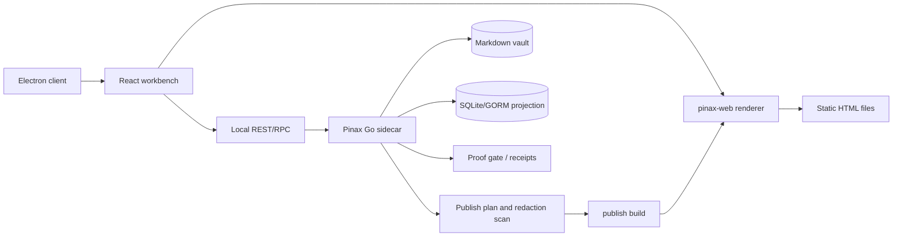

# Pinax Electron Canonical Renderer 设计

## 架构



## 决策

### 1. Electron 是唯一桌面客户端路线

Pinax desktop 采用 Electron。原因不是运行时最轻，而是它提供固定 Chromium 版本、稳定 Web 平台、成熟调试工具、成熟编辑器生态和跨平台一致性。

客户端源码由未来独立子项目拥有，例如 `client/pinax-desktop` 或等价子模块；`cli/pinax` 不承载 Electron main process、renderer app、preload bridge 或前端 bundle。

### 2. Go sidecar 继续拥有业务边界

Electron 不直接读 vault 文件、`.pinax/**`、SQLite、LanceDB、token 文件、provider config、sync state 或 publish receipts。所有数据来自 `pinax api serve`、Local REST/RPC、CLI JSON projection 或用户可复制的真实 `pinax ...` 命令。

写操作必须继续通过 Go application service，并保留 `write_disabled`、`approval_required`、`snapshot_required`、receipt、restore hint 和 redaction 合同。

### 3. `pinax-web` 是唯一 canonical renderer

Pinax 渲染不再分成客户端 preview 和发布 output 两套语义。canonical renderer 是 TypeScript 包组：

```text
@pinax/render-core
  unified / remark / rehype pipeline
  frontmatter normalization
  wikilink and attachment token model
  Pinax managed block placeholders

@pinax/render-react
  AST -> React components
  Electron preview and web workbench

@pinax/render-static
  AST -> static HTML files
  publish build output
```

渲染器不直接读 vault。`pinax-dataview`、database view、backlinks、graph、search snippets 和 managed block 内容必须先由 Go sidecar 生成 bounded projection，再交给 renderer 展示。

### 4. 静态发布复用同一渲染包

`pinax publish build` 的目标输出仍是普通静态文件，HTML 由 `@pinax/render-static` 生成。发布流程为：

```text
Pinax vault
  -> publish profile / plan / selection / redaction gate
  -> publish-safe projection bundle
  -> @pinax/render-static
  -> dist/site HTML + assets + pinax-data
  -> output scan + receipt
```

输出目录示例：

```text
dist/site/
  index.html
  notes/<slug>/index.html
  tags/<tag>/index.html
  assets/
  pinax-data/
    manifest.json
    graph.json
    search-index.json
```

### 5. Markdown 语义受控，不使用 MDX 作为主格式

Pinax Markdown 支持 GFM、wikilink、frontmatter、attachments、managed blocks、Pinax Dataview/database view placeholders。主格式不使用 MDX，因为 MDX 会把可执行组件能力带进用户笔记，扩大安全边界。

### 6. Electron 内存约束

Electron 路线必须接受内存成本，但要约束实现：

- 单主窗口，避免多 BrowserWindow 默认常驻。
- Editor、Graph、Canvas、Agent 侧栏按需加载。
- CodeMirror 6 作为 MVP 编辑器，不引入 Monaco 作为默认。
- 图谱按一跳/二跳和分页加载，不把全 vault 图谱常驻前端 store。
- 完整正文只在用户显式 body exposure 后请求。
- Go sidecar 承担索引、搜索、proof、sync、publish、provider 诊断等后台任务。

## 迁移说明

Pinax profile renderer enum 采用 additive 迁移：`pinax-web` 是新的 canonical renderer 值，旧 `hugo` 和 `none` 值继续 read-compatible。`pinax publish profile init` 默认生成 `pinax-web` profile；已有 GitHub Pages/Hugo profile 在 `publish profile validate` 中保持有效，并通过 profile service 输出可审查的 `migration_plan`，而不是要求用户手写 `.pinax/publish/profiles/*.yaml`。

renderer package contract 和 Electron/static export fixture 归未来 Electron/client 子项目拥有；`cli/pinax` 在该子项目出现前不伪造 fixture 完成状态，只维护 bounded projection/API contract。

## 验证

设计变更验证：

```bash
openspec validate pinax-electron-canonical-renderer --strict
openspec validate --all --strict
```

实现阶段还必须增加 renderer contract tests，覆盖 Electron preview 与 static HTML 对同一 fixture 输出一致的 AST semantics。
