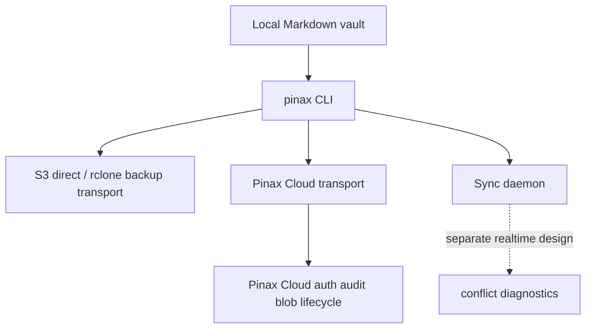

## Design

Pinax 的本地 Markdown vault 仍是真源。S3 direct transport 由 CLI 使用用户 provider credentials 直接写对象存储；Pinax Cloud transport 由 server 处理设备授权、加密 blob/object lifecycle、CAS 和 audit；sync daemon 是实时/后台同步路径，不能被当作普通 backup mirror。

## Evidence From Inventory

- `internal/remote/s3_backend.go` 是 CLI 侧 S3 BlobStore。
- `docs/architecture/cloud-sync-design.md` 说明 S3 direct 无 server-side auth/audit。
- `docs/commands/sync.md` 区分 S3 direct 和 Cloud Sync。

## Non-goals

- 不改 Cloud Sync API。
- 不新增 Pinax server-side generic backup service。
- 不把 daemon/realtime sync 混入 backup mirror。
