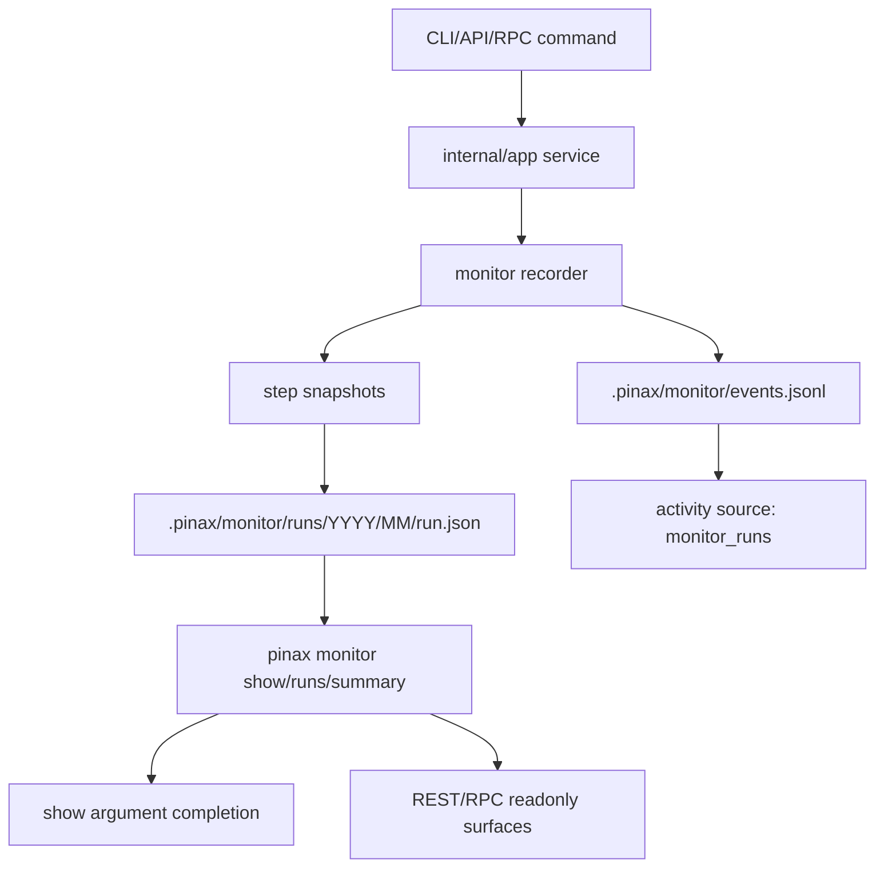

# 设计

## 数据流

## 结构

- `internal/app/monitor.go` 负责 recorder、资源采样、run/event 写入和只读查询。
- `internal/cli/monitor_cmd.go` 只负责 Cobra flags 和 projection render。
- `internal/cli/completion.go` 提供只读动态补全，`monitor show <run-id>` 从近期 monitor runs 补全 run id，`activity show <event-id>` 从 activity entries 补全 event id。
- `internal/app/activity.go` 新增 `monitor_runs` reader，将 monitor event 映射到 activity entry。
- `internal/api/http.go`、`internal/api/rpc.go`、`internal/app/remote.go` 只新增 readonly list/show/summary surface。

## 指标策略

- wall time 使用 monotonic duration。
- Go runtime 指标来自 `runtime.ReadMemStats` 和 `runtime.NumGoroutine`。
- CPU 使用 `syscall.Getrusage(RUSAGE_SELF)` 读取当前 Pinax 进程 user/system CPU time；不可用时通过 `cpu_supported=false` 表示。
- RSS 优先读取 Linux `/proc/self/status` 的 `VmRSS`，peak RSS 使用 `getrusage.Maxrss`；不可用时通过 `rss_supported=false` 表示。
- recorder 以低频 ticker 更新 run/step peak，默认只保存 start/end/delta/peak，不保存全量采样序列。

## 隐私与脱敏

- 搜索词、SQL 和 Dataview source 只记录长度和 SHA-256 前缀，不记录原文。
- 复用 activity fact 脱敏规则过滤 token、secret、Authorization、cookie、password、raw_prompt、provider_payload、system_prompt 等字段。
- CLI 输出继续走统一 projection redaction。
- shell completion 描述只使用 command、status、duration、source、kind 等安全字段，不使用 raw query、note body、evidence 或 provider payload。

## 失败处理

- 监控写入失败不阻断主命令；主命令仍按原有语义返回。
- 读取 monitor 资产时，单个坏文件产生 warning，projection 变为 `partial`。
- 业务失败会写入 `status=failed`、`error_code` 和脱敏 `error_message`，便于 Workbench 展示失败 trace。
