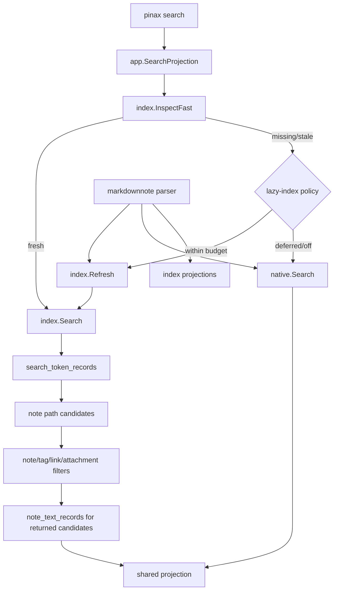

# 设计：SQLite SQL 搜索、懒加载索引和 Markdown AST

## 数据流

## 关键决策

- `--engine auto|index|native`：`auto` 保持默认兼容，fresh index 优先；`index` 明确只读 SQLite/GORM SQL 索引；`native` 明确走内置正文搜索。
- `--lazy-index auto|off|sync`：`auto` 只允许预算内懒刷新；`off` 搜索不写 `.pinax/index.sqlite`；`sync` 明确允许阻塞刷新。
- `SearchTokenRecord` 是 v1 SQL 搜索主倒排表：查询词先归一化为 token，通过 GORM 查询缩小候选 note path，再加载候选的 note/text/tag/link/attachment 投影。
- 普通 token 表优先于 SQLite FTS5；只有 benchmark 证明普通 SQL token index 不足时，才单独设计 FTS adapter 和 raw SQL/virtual table 例外。
- CLI 进程短生命周期内不启动脱离命令的后台 writer；并发只用于当前命令内的有界 parsing/search workers，SQLite 写入保持单 writer。
- `markdownnote` 提供 `ParseFrontmatter`、`ParseSummary`、`ParseFull` 三层，避免只需要 metadata 时做完整 AST。
- 现有 `internal/search` shell-out fallback 改为内置 native 搜索，不新增外部工具依赖。
- `search pick` / TUI picker 不进入本轮核心范围；后续若需要，应基于 SQL 搜索结果做内置 TUI，不包装外部 `fzf`。

## 性能约束

- 默认懒刷新预算：最多 500 个 changed notes、2 秒 wall time、batch size 500；超出预算时返回 native search 结果和 refresh action。
- worker 数默认 `min(runtime.GOMAXPROCS(0), 8)`，所有 worker 通过 `context.Context` 取消。
- warm index search 不应全量读取 `NoteTextRecord.BodyText` 做 contains 扫描；正文投影只用于候选结果的 snippet。
- 性能结论必须使用同一 workload 的 before/after 证据，不能只用单次最快结果。
