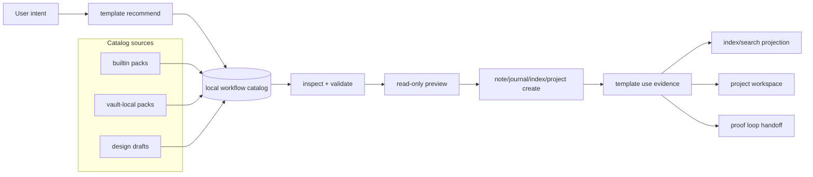
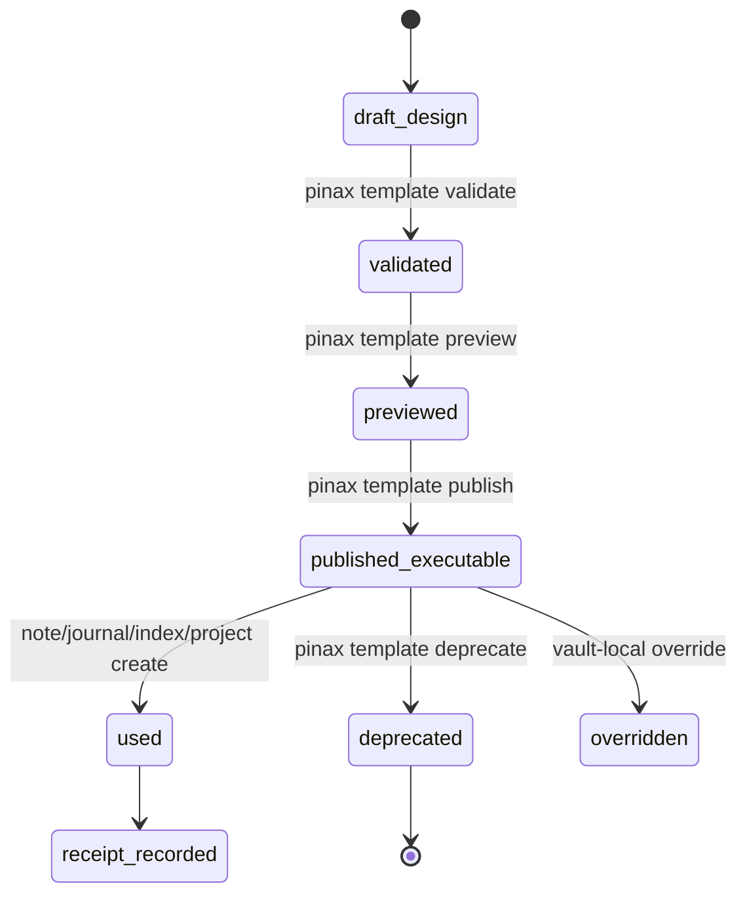

# pinax-template-workflow-catalog 设计

## 目标

把 Pinax 模板从“可渲染 Markdown 文件”提升为本地 workflow catalog。用户输入 intent 后，Pinax 通过本地 catalog metadata 推荐合适 workflow starter，用户可以 inspect/validate/preview，确认写入路径和变量，再用 `note add --template`、journal/index/project workspace 命令创建内容，并获得可检索、可审查、可继续推进的 evidence/receipt/next action。

本设计采用 Selective Expansion：扩展模板入口层和使用证据，不扩展成远程模板市场、GUI 模板中心或云团队模板平台。

## 架构

## 核心模型

### Workflow starter metadata

模板 catalog metadata 是模板推荐和 inspect 的唯一事实来源。第一版只扩展 metadata，不要求独立数据库表。

| 字段 | 类型 | 说明 |
| --- | --- | --- |
| `schema_version` | string | 例如 `pinax.template.workflow.v1`；新增字段必须 additive。 |
| `name` | string | 模板稳定名，例如 `meeting.notes`。 |
| `template_kind` | string | 复用既有 kind，如 `note_template`、`journal_template`、`index_template`。 |
| `scenario_id` | string | 场景标识，例如 `meeting-notes`、`learning-stock-risk-rule`。 |
| `intents[]` | string | 本地匹配词和 alias，不调用 LLM/provider。 |
| `variable_schema` | object | 必填/可选变量、类型、示例、是否 secret-like；用于 completion 和 preview。 |
| `output_policy` | object | 默认路径、是否允许 override、写入边界、legacy path 兼容说明。 |
| `after_create_actions[]` | array | 真实 `pinax ...` 命令，例如 index refresh、proof loop、project board show。 |
| `maturity` | enum | `exploratory`、`first-support`、`mature`。 |
| `proof_gate` | object | 是否需要 review、snapshot、receipt、restore hint、manual check。 |
| `pack` | object | pack id、source、version、readiness；只支持 builtin 和 vault-local。 |
| `lifecycle` | enum | `draft_design`、`validated`、`previewed`、`published_executable`、`deprecated`、`overridden`。 |
| `metrics` | object | time-to-first-useful-note、reuse、proof pass、rework、discoverability、project advancement 的统计入口。 |

### 生命周期

第一阶段可以不实现 `publish/deprecate` 子命令，但必须在 metadata/spec 中预留 lifecycle 字段和兼容策略。设计草稿不得被推荐为 primary executable create path，除非输出明确标记为 draft/design-only。

## CLI/API 合同

### Recommendation

`pinax template recommend --intent "..." --vault ./my-notes --json` 继续是主入口，新增 optional workflow fields：

- `data.recommendations[].scenario_id`
- `data.recommendations[].maturity`
- `data.recommendations[].pack`
- `data.recommendations[].fit_reason`
- `data.recommendations[].preview_command`
- `data.recommendations[].create_command`
- `data.recommendations[].evidence_path`
- `data.recommendations[].proof_gate`
- `data.recommendations[].after_create_actions[]`

默认 human output 可以中文说明推荐理由，但 command、field、error code 保持英文。`--agent` 新增 `recommendation.0.*` key，不删除旧 `fact.template` 等 key。

### Inspect and preview

`pinax template inspect <name> --json` 新增 workflow metadata，仍然只读。`pinax template preview <name> --json` 必须说明：

- 所需变量和缺失变量。
- 预期写入路径和是否进入 `notes/index/` 或模板声明路径。
- 是否需要 proof loop、snapshot、manual review。
- 预览正文 body exposure，不泄露 raw prompt/provider payload。
- 下一条真实命令，例如 `pinax note add "Client Meeting" --template meeting.notes --dir index --vault ./my-notes --json`。

### Create/use evidence

模板被 `note add --template`、journal、index page 或 project learning/workspace 消费后，JSON/agent projection 新增 optional evidence fields：

- `template_use_id`
- `template`
- `template_pack`
- `scenario_id`
- `maturity`
- `effective_path`
- `receipt_path` 或 `receipt_ref`
- `proof_gate.status`
- `next_actions[]`

持久 receipt/event 必须通过 app service 写入 CLI-authored structured assets。失败时保留原始错误码和 stdout/stderr 分离，不把 raw provider payload、hidden prompts、token 或 full chain-of-thought 写入 evidence。

## Template pack 边界

第一阶段只支持：

- `builtin`：随 Pinax 发布的内置模板包。
- `vault-local`：用户 vault 内由 Pinax CLI 管理或用户显式安装的本地包。

不支持：远程 marketplace、云同步、评分、公开发布、团队策略中心。若后续需要远程包，必须新建 OpenSpec，定义 trust、签名、版本、撤销、兼容和 rollback。

## Scenario matrix

| scenario_id | 目标用户 | Job-to-be-done | 必需 artifacts | Gate/review | Evidence path | Export/handoff | Validation command | Readiness |
| --- | --- | --- | --- | --- | --- | --- | --- | --- |
| `capture-sticky` | 快速记录用户 | 把临时线索放入 inbox，后续分拣。 | `sticky.capture` note、template use projection。 | preview read-only；写入 index/inbox。 | template use receipt 或 command JSON evidence。 | search/index/proof loop。 | `go test ./cmd/pinax -run TestTemplateRecommend -count=1` | mature |
| `idea-research-seed` | 内容研究者 | 把“以后调查”的想法停放为 parked idea。 | `idea.research_seed` note、`index.ideas`。 | no task/board auto-create。 | note path + recommendation evidence。 | ideas index/search。 | `go test ./cmd/pinax -run TestTemplateRecommend -count=1` | first-support |
| `meeting-decision` | 项目协作者 | 创建会议/决策记录并生成后续 action。 | `meeting.notes`、`decision.record`。 | after-create action review。 | template use id + note id。 | project board/proof loop。 | `go test ./cmd/pinax -run TestTemplatePreview -count=1` | mature |
| `learning-pack` | 长期学习用户 | 初始化长期学习项目中的资料、术语、复盘模板。 | learning templates、project workspace refs。 | project workspace preview/dry-run。 | receipt + board projection。 | project board/export。 | `go test ./cmd/pinax -run 'TestTemplate|TestProject' -count=1` | first-support |
| `stock-learning` | 金融学习用户 | 记录学习、模拟、风险规则，避免投资建议。 | stock learning pack templates。 | safety copy and no advice assertions。 | template use receipt + risk disclaimer evidence。 | learning project workspace。 | `go test ./cmd/pinax -run 'Stock|Template' -count=1` | exploratory |
| `index-page` | vault 维护用户 | 用 index template 创建/刷新托管索引页。 | `index.*` template、managed block。 | preview before create/refresh。 | managed index receipt。 | local index/search。 | `go test ./cmd/pinax -run TestIndexPage -count=1` | mature |

## 结果指标

模板 catalog 不以模板数量为成功指标。实现和后续 dogfood 应采集或至少能在 evidence 中推导：

- time-to-first-useful-note：从 recommend 到 note/index/project artifact 的时间。
- template reuse rate：同一模板被重复使用的次数。
- proof loop pass rate：模板产物进入 proof loop 后通过比例。
- rework count：因变量、路径、分类、proof gate 不清导致的返工次数。
- index discoverability：产物是否能被 search/index/project view 找到。
- project advancement：是否产生真实 next action、board item 或 review artifact。

## 兼容性与回滚

- 合同分类：additive。新增 optional JSON/agent fields、metadata fields、内置模板包字段和 receipt refs。
- 破坏性变更：不允许。不能删除或改义既有 template command、facts、actions、template_kind、path_pattern、source。
- 回滚：隐藏或禁用新的 workflow metadata/recommendation scoring，保留既有模板和笔记；已创建 Markdown notes 仍可读，receipt/event 可被旧版本忽略。
- Deprecation：模板弃用只能在 metadata 中标记 `lifecycle=deprecated` 并推荐替代模板，不删除用户本地模板。

## 风险

| 风险 | 缓解 |
| --- | --- |
| 模板市场化导致选择成本上升 | 限制为本地 catalog，recommend 只返回 primary + 最多三个 alternatives。 |
| 模板写入绕过 index intake | agent-authored 默认继续使用 `--dir index`，显式 template output policy 必须可 inspect。 |
| workflow metadata 变成不受控 schema | 只新增 optional fields，contract tests 固定 JSON/agent shape。 |
| AI 直接发布低质量模板 | draft lifecycle 与 publish gate；AI 草稿不能直接成为 executable primary。 |
| 证据写入泄露敏感内容 | receipt/event 走 redaction，禁止 raw prompts/provider payload/full chain-of-thought。 |
| 与 project workspace 互相侵入 | template 只做 starter 和 after-create actions；project workspace 拥有 board/item 状态。 |
