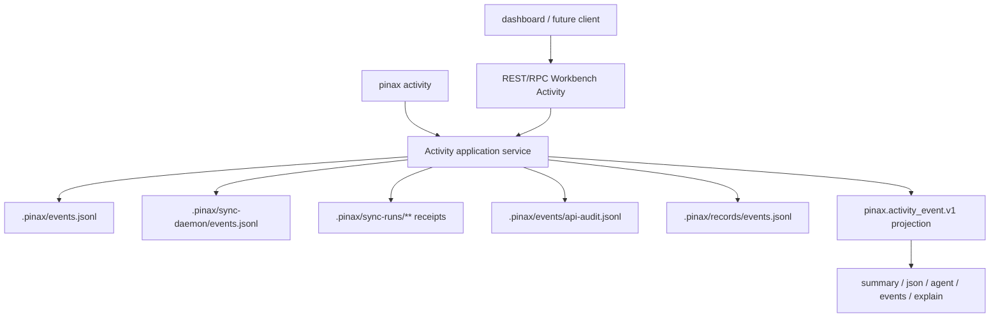

# Pinax Workbench Activity/Logs 设计

## 架构

## 数据模型

Activity service 将不同来源归一为 `pinax.activity_event.v1` entry：`event_id`、`source`、`kind`、`status`、`severity`、`summary`、`object_ref`、`path`、`run_id`、`ts`、`duration_ms`、`facts`、`evidence` 和 `actions`。字段为空时省略；`facts` 只保留字符串化且脱敏后的安全事实。

来源 ID 固定为 `vault_events`、`sync_runs`、`sync_daemon`、`api_audit`、`record_ledger`。`source=all` 是查询输入，不作为 entry source 输出。

## 查询语义

- 默认 `limit=50`，最大 `limit=200`，默认按 `ts` 新到旧排序。
- `--source` 支持单个来源或 `all`；`--query` 对 `kind`、`summary`、`path`、`run_id` 和安全 facts 做大小写不敏感包含匹配。
- `--status`、`--since`、`--until`、`--object` 为可选过滤条件；时间使用 RFC3339。
- 腐坏 JSONL 行或不可读的可选来源不会让整个查询失败；projection 返回 `partial` 和 warning。vault 根目录不可用等基础错误仍返回 `failed`。
- `show <event-id>` 在同一统一索引中查找归一化事件，找不到返回 `activity_event_not_found`。

## CLI/API 边界

CLI 命令只解析参数并调用 service。REST/RPC handler 只做 query/param 映射和 projection 序列化，不直接读取 `.pinax/**`。

新增 REST：`GET /v1/workbench/activity` 和 `GET /v1/workbench/activity/{event_id}`。新增 RPC：`Pinax.Workbench.Activity.List` 和 `Pinax.Workbench.Activity.Show`。capability registry 标记 readonly、`body_allowed=false`、`write_gate=readonly`。

## 管理面

`pinax activity manage` 返回每个来源的可用性、entry count、warning count、估算大小和建议 action。v1 不删除 API audit、record ledger 或 vault events；sync receipt 清理继续建议用户运行现有 `pinax sync logs prune ...`。

## 兼容性

本变更只新增命令、route、RPC method、capability 和 optional projection data，不改变已发布命令输出或持久 schema。若后续要加入控制台写入或跨来源 prune，需要单独 OpenSpec 变更。
